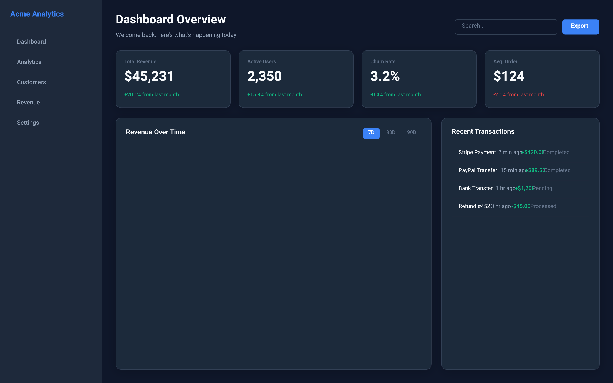

# Design Handover Document



## Overview

| Property | Value |
|----------|-------|
| Canvas | 1440 x 900 |
| Theme | dark |
| Background | `#0f172a` |
| Default Font | `400 14px Inter` |
| Frames | 33 |
| Text Nodes | 43 |
| Edges | 0 |

## Design Tokens

| Token | Value |
|-------|-------|
| `$color.bg.card` | `#1e293b` |
| `$color.bg.input` | `#0f172a` |
| `$color.bg.page` | `#0f172a` |
| `$color.danger` | `#ef4444` |
| `$color.primary` | `#3b82f6` |
| `$color.secondary` | `#8b5cf6` |
| `$color.success` | `#10b981` |
| `$color.text.muted` | `#64748b` |
| `$color.text.primary` | `#f8fafc` |
| `$color.text.secondary` | `#94a3b8` |
| `$color.warning` | `#f59e0b` |
| `$radius.lg` | `16` |
| `$radius.md` | `12` |
| `$radius.sm` | `6` |
| `$shadow.card` | `0 4 24 rgba(0,0,0,0.2)` |

### CSS Variables

```css
:root {
  --color-bg-card: #1e293b;
  --color-bg-input: #0f172a;
  --color-bg-page: #0f172a;
  --color-danger: #ef4444;
  --color-primary: #3b82f6;
  --color-secondary: #8b5cf6;
  --color-success: #10b981;
  --color-text-muted: #64748b;
  --color-text-primary: #f8fafc;
  --color-text-secondary: #94a3b8;
  --color-warning: #f59e0b;
  --radius-lg: 16;
  --radius-md: 12;
  --radius-sm: 6;
  --shadow-card: 0 4 24 rgba(0,0,0,0.2);
}
```

## Components

### `nav-item`

**Parameters:**

| Param | Default |
|-------|---------|
| `active` | `false` |
| `label` | `Item` |

**Base CSS:**

```css
border-radius: 6px;
padding: 10px 16px;
gap: 10px;
```

### `stat-card`

**Parameters:**

| Param | Default |
|-------|---------|
| `label` | `Metric` |
| `trend` | `` |
| `trend-color` | `#10b981` |
| `value` | `0` |

**Base CSS:**

```css
background-color: #1e293b;
border-radius: 12px;
padding: 20px;
gap: 8px;
border: 1px solid #334155;
```

### `table-row`

**Parameters:**

| Param | Default |
|-------|---------|
| `col1` | `-` |
| `col2` | `-` |
| `col3` | `-` |
| `col4` | `-` |

**Base CSS:**

```css
padding: 12px 16px;
```

## Component Tree

```
root (1440 x 900 @ 0, 0)
  fill: #0f172a | direction: row
  css: { display: flex; flex-direction: row; background-color: #0f172a; width: 1440px; height: 900px; }
  |
+-- frame#sidebar (240 x 900 @ 0, 0)
|       fill: #1e293b | padding: 24px | gap: 8px
|       css: { display: flex; flex-direction: column; gap: 8px; padding: 24px; background-color: #1e293b; width: 240px; }
|       |
|     +-- frame#logo (192 x 49 @ 24, 24)
|     |       padding: 0px 0px 24px 0px
|     |       css: { display: flex; flex-direction: column; padding: 0px 0px 24px 0px; }
|     |       |
|     |     +-- text "Acme Analytics" (192 x 25 @ 0, 0)
|     |             font: 700 18px Inter | color: #3b82f6
|     +-- [nav-item] (192 x 40 @ 24, 81)
|     |       padding: 10px 16px | gap: 10px | direction: row | align: center | radius: 6px
|     |       css: { display: flex; flex-direction: row; align-items: center; gap: 10px; padding: 10px 16px; border-radius: 6px; }
|     |       |
|     |     +-- text "Dashboard" (68 x 20 @ 16, 10)
|     |             font: 500 14px Inter | color: #94a3b8
|     +-- [nav-item] (192 x 40 @ 24, 129)
|     |       padding: 10px 16px | gap: 10px | direction: row | align: center | radius: 6px
|     |       css: { display: flex; flex-direction: row; align-items: center; gap: 10px; padding: 10px 16px; border-radius: 6px; }
|     |       |
|     |     +-- text "Analytics" (60 x 20 @ 16, 10)
|     |             font: 500 14px Inter | color: #94a3b8
|     +-- [nav-item] (192 x 40 @ 24, 176)
|     |       padding: 10px 16px | gap: 10px | direction: row | align: center | radius: 6px
|     |       css: { display: flex; flex-direction: row; align-items: center; gap: 10px; padding: 10px 16px; border-radius: 6px; }
|     |       |
|     |     +-- text "Customers" (69 x 20 @ 16, 10)
|     |             font: 500 14px Inter | color: #94a3b8
|     +-- [nav-item] (192 x 40 @ 24, 224)
|     |       padding: 10px 16px | gap: 10px | direction: row | align: center | radius: 6px
|     |       css: { display: flex; flex-direction: row; align-items: center; gap: 10px; padding: 10px 16px; border-radius: 6px; }
|     |       |
|     |     +-- text "Revenue" (52 x 20 @ 16, 10)
|     |             font: 500 14px Inter | color: #94a3b8
|     +-- [nav-item] (192 x 40 @ 24, 272)
|             padding: 10px 16px | gap: 10px | direction: row | align: center | radius: 6px
|             css: { display: flex; flex-direction: row; align-items: center; gap: 10px; padding: 10px 16px; border-radius: 6px; }
|             |
|           +-- text "Settings" (56 x 20 @ 16, 10)
|                   font: 500 14px Inter | color: #94a3b8
+-- frame#main (1200 x 900 @ 240, 0)
        padding: 32px | gap: 24px | flex: 1
        css: { display: flex; flex-direction: column; gap: 24px; padding: 32px; flex: 1; }
        |
      +-- frame#header (1136 x 63 @ 32, 32)
      |       direction: row | justify: between | align: center
      |       css: { display: flex; flex-direction: row; justify-content: space-between; align-items: center; }
      |       |
      |     +-- frame (288 x 63 @ 0, 0)
      |     |       gap: 4px
      |     |       css: { display: flex; flex-direction: column; gap: 4px; }
      |     |       |
      |     |     +-- text "Dashboard Overview" (288 x 39 @ 0, 0)
      |     |     |       font: 700 28px Inter | color: #f8fafc
      |     |     +-- text "Welcome back, here's what's happening..." (288 x 20 @ 0, 43)
      |     |             font: 400 14px Inter | color: #94a3b8
      |     +-- frame#header-actions (339 x 36 @ 797, 14)
      |             gap: 12px | direction: row
      |             css: { display: flex; flex-direction: row; gap: 12px; }
      |             |
      |           +-- frame#search (240 x 36 @ 0, 0)
      |           |       fill: #0f172a | padding: 8px 16px | radius: 6px | border: 1px solid #334155
      |           |       css: { display: flex; flex-direction: column; padding: 8px 16px; background-color: #0f172a; border-radius: 6px; border: 1px solid #334155; width: 240px; }
      |           |       |
      |           |     +-- text "Search..." (208 x 20 @ 16, 8)
      |           |             font: 400 14px Inter | color: #64748b
      |           +-- frame#btn-export (87 x 36 @ 252, 0)
      |                   fill: #3b82f6 | padding: 8px 20px | justify: center | align: center | radius: 6px
      |                   css: { display: flex; flex-direction: column; justify-content: center; align-items: center; padding: 8px 20px; background-color: #3b82f6; border-radius: 6px; }
      |                   |
      |                 +-- text "Export" (47 x 20 @ 20, 8)
      |                         font: 600 14px Inter | color: white
      +-- frame#stats (1136 x 134 @ 32, 119)
      |       grid: 4 cols
      |       css: { display: grid; grid-template-columns: repeat(4, 1fr); column-gap: 20px; row-gap: 20px; }
      |       |
      |     +-- [stat-card] (269 x 134 @ 0, 0)
      |     |       fill: #1e293b | padding: 20px | gap: 8px | radius: 12px | border: 1px solid #334155 | shadow: yes
      |     |       css: { display: flex; flex-direction: column; gap: 8px; padding: 20px; background-color: #1e293b; border-radius: 12px; border: 1px solid #334155; box-shadow: 0px 4px 24px rgba(0,0,0,0.2); }
      |     |       |
      |     |     +-- text "Total Revenue" (229 x 17 @ 20, 20)
      |     |     |       font: 500 12px Inter | color: #64748b
      |     |     +-- text "$45,231" (229 x 45 @ 20, 45)
      |     |     |       font: 700 32px Inter | color: #f8fafc
      |     |     +-- text "+20.1% from last month" (229 x 17 @ 20, 98)
      |     |             font: 500 12px Inter | color: #10b981
      |     +-- [stat-card] (269 x 134 @ 289, 0)
      |     |       fill: #1e293b | padding: 20px | gap: 8px | radius: 12px | border: 1px solid #334155 | shadow: yes
      |     |       css: { display: flex; flex-direction: column; gap: 8px; padding: 20px; background-color: #1e293b; border-radius: 12px; border: 1px solid #334155; box-shadow: 0px 4px 24px rgba(0,0,0,0.2); }
      |     |       |
      |     |     +-- text "Active Users" (229 x 17 @ 20, 20)
      |     |     |       font: 500 12px Inter | color: #64748b
      |     |     +-- text "2,350" (229 x 45 @ 20, 45)
      |     |     |       font: 700 32px Inter | color: #f8fafc
      |     |     +-- text "+15.3% from last month" (229 x 17 @ 20, 98)
      |     |             font: 500 12px Inter | color: #10b981
      |     +-- [stat-card] (269 x 134 @ 578, 0)
      |     |       fill: #1e293b | padding: 20px | gap: 8px | radius: 12px | border: 1px solid #334155 | shadow: yes
      |     |       css: { display: flex; flex-direction: column; gap: 8px; padding: 20px; background-color: #1e293b; border-radius: 12px; border: 1px solid #334155; box-shadow: 0px 4px 24px rgba(0,0,0,0.2); }
      |     |       |
      |     |     +-- text "Churn Rate" (229 x 17 @ 20, 20)
      |     |     |       font: 500 12px Inter | color: #64748b
      |     |     +-- text "3.2%" (229 x 45 @ 20, 45)
      |     |     |       font: 700 32px Inter | color: #f8fafc
      |     |     +-- text "-0.4% from last month" (229 x 17 @ 20, 98)
      |     |             font: 500 12px Inter | color: #10b981
      |     +-- [stat-card] (269 x 134 @ 867, 0)
      |             fill: #1e293b | padding: 20px | gap: 8px | radius: 12px | border: 1px solid #334155 | shadow: yes
      |             css: { display: flex; flex-direction: column; gap: 8px; padding: 20px; background-color: #1e293b; border-radius: 12px; border: 1px solid #334155; box-shadow: 0px 4px 24px rgba(0,0,0,0.2); }
      |             |
      |           +-- text "Avg. Order" (229 x 17 @ 20, 20)
      |           |       font: 500 12px Inter | color: #64748b
      |           +-- text "$124" (229 x 45 @ 20, 45)
      |           |       font: 700 32px Inter | color: #f8fafc
      |           +-- text "-2.1% from last month" (229 x 17 @ 20, 98)
      |                   font: 500 12px Inter | color: #ef4444
      +-- frame#content-row (1136 x 591 @ 32, 277)
              gap: 24px | direction: row | flex: 1
              css: { display: flex; flex-direction: row; gap: 24px; flex: 1; }
              |
            +-- frame#chart-card (741 x 591 @ 0, 0)
            |       fill: #1e293b | padding: 24px | gap: 16px | radius: 12px | border: 1px solid #334155 | shadow: yes | flex: 2
            |       css: { display: flex; flex-direction: column; gap: 16px; padding: 24px; background-color: #1e293b; border-radius: 12px; border: 1px solid #334155; box-shadow: 0px 4px 24px rgba(0,0,0,0.2); flex: 2; }
            |       |
            |     +-- frame#chart-header (693 x 25 @ 24, 24)
            |     |       direction: row | justify: between | align: center
            |     |       css: { display: flex; flex-direction: row; justify-content: space-between; align-items: center; }
            |     |       |
            |     |     +-- text "Revenue Over Time" (145 x 22 @ 0, 1)
            |     |     |       font: 600 16px Inter | color: #f8fafc
            |     |     +-- frame#chart-tabs (136 x 25 @ 557, 0)
            |     |             gap: 4px | direction: row
            |     |             css: { display: flex; flex-direction: row; gap: 4px; }
            |     |             |
            |     |           +-- frame (39 x 25 @ 0, 0)
            |     |           |       fill: #3b82f6 | padding: 4px 12px | radius: 4px
            |     |           |       css: { display: flex; flex-direction: column; padding: 4px 12px; background-color: #3b82f6; border-radius: 4px; }
            |     |           |       |
            |     |           |     +-- text "7D" (15 x 17 @ 12, 4)
            |     |           |             font: 500 12px Inter | color: white
            |     |           +-- frame (45 x 25 @ 43, 0)
            |     |           |       padding: 4px 12px
            |     |           |       css: { display: flex; flex-direction: column; padding: 4px 12px; }
            |     |           |       |
            |     |           |     +-- text "30D" (21 x 17 @ 12, 4)
            |     |           |             font: 500 12px Inter | color: #64748b
            |     |           +-- frame (45 x 25 @ 92, 0)
            |     |                   padding: 4px 12px
            |     |                   css: { display: flex; flex-direction: column; padding: 4px 12px; }
            |     |                   |
            |     |                 +-- text "90D" (21 x 17 @ 12, 4)
            |     |                         font: 500 12px Inter | color: #64748b
            |     +-- frame#chart-placeholder (693 x 0 @ 24, 65)
            |             fill: gradient | radius: 6px | flex: 1
            |             css: { background: linear-gradient(180deg, rgba(59,130,246,0.1) 0%, rgba(59,130,246,0) 100%); border-radius: 6px; flex: 1; }
            +-- frame#activity-card (371 x 591 @ 765, 0)
                    fill: #1e293b | padding: 24px | gap: 16px | radius: 12px | border: 1px solid #334155 | shadow: yes | flex: 1
                    css: { display: flex; flex-direction: column; gap: 16px; padding: 24px; background-color: #1e293b; border-radius: 12px; border: 1px solid #334155; box-shadow: 0px 4px 24px rgba(0,0,0,0.2); flex: 1; }
                    |
                  +-- text "Recent Transactions" (323 x 22 @ 24, 24)
                  |       font: 600 16px Inter | color: #f8fafc
                  +-- frame#table (323 x 169 @ 24, 62)
                          css: { display: flex; flex-direction: column; }
                          |
                        +-- [table-row] (323 x 42 @ 0, 0)
                        |       padding: 12px 16px | direction: row | align: center
                        |       css: { display: flex; flex-direction: row; align-items: center; padding: 12px 16px; }
                        |       |
                        |     +-- text "Stripe Payment" (93 x 18 @ 16, 12)
                        |     |       font: 400 13px Inter | color: #f8fafc
                        |     +-- text "2 min ago" (54 x 18 @ 109, 12)
                        |     |       font: 400 13px Inter | color: #94a3b8
                        |     +-- text "+$420.00" (51 x 18 @ 163, 12)
                        |     |       font: 500 13px Inter | color: #10b981
                        |     +-- text "Completed" (61 x 18 @ 214, 12)
                        |             font: 400 13px Inter | color: #64748b
                        +-- [table-row] (323 x 42 @ 0, 42)
                        |       padding: 12px 16px | direction: row | align: center
                        |       css: { display: flex; flex-direction: row; align-items: center; padding: 12px 16px; }
                        |       |
                        |     +-- text "PayPal Transfer" (98 x 18 @ 16, 12)
                        |     |       font: 400 13px Inter | color: #f8fafc
                        |     +-- text "15 min ago" (58 x 18 @ 114, 12)
                        |     |       font: 400 13px Inter | color: #94a3b8
                        |     +-- text "+$89.50" (44 x 18 @ 172, 12)
                        |     |       font: 500 13px Inter | color: #10b981
                        |     +-- text "Completed" (61 x 18 @ 216, 12)
                        |             font: 400 13px Inter | color: #64748b
                        +-- [table-row] (323 x 42 @ 0, 84)
                        |       padding: 12px 16px | direction: row | align: center
                        |       css: { display: flex; flex-direction: row; align-items: center; padding: 12px 16px; }
                        |       |
                        |     +-- text "Bank Transfer" (87 x 18 @ 16, 12)
                        |     |       font: 400 13px Inter | color: #f8fafc
                        |     +-- text "1 hr ago" (45 x 18 @ 103, 12)
                        |     |       font: 400 13px Inter | color: #94a3b8
                        |     +-- text "+$1,200" (41 x 18 @ 148, 12)
                        |     |       font: 500 13px Inter | color: #10b981
                        |     +-- text "Pending" (45 x 18 @ 189, 12)
                        |             font: 400 13px Inter | color: #64748b
                        +-- [table-row] (323 x 42 @ 0, 127)
                                padding: 12px 16px | direction: row | align: center
                                css: { display: flex; flex-direction: row; align-items: center; padding: 12px 16px; }
                                |
                              +-- text "Refund #4521" (76 x 18 @ 16, 12)
                              |       font: 400 13px Inter | color: #f8fafc
                              +-- text "3 hr ago" (48 x 18 @ 92, 12)
                              |       font: 400 13px Inter | color: #94a3b8
                              +-- text "-$45.00" (44 x 18 @ 140, 12)
                              |       font: 500 13px Inter | color: #10b981
                              +-- text "Processed" (62 x 18 @ 184, 12)
                                      font: 400 13px Inter | color: #64748b
```

## Implementation Notes

### DSL → CSS Property Mapping

| DSL Property | CSS Equivalent |
|-------------|----------------|
| `direction: row` | `flex-direction: row` |
| `direction: column` | `flex-direction: column` |
| `justify: start` | `justify-content: flex-start` |
| `justify: center` | `justify-content: center` |
| `justify: end` | `justify-content: flex-end` |
| `justify: between` | `justify-content: space-between` |
| `justify: around` | `justify-content: space-around` |
| `align: start` | `align-items: flex-start` |
| `align: center` | `align-items: center` |
| `align: end` | `align-items: flex-end` |
| `align: stretch` | `align-items: stretch` |
| `layout: grid` + `columns: N` | `display: grid; grid-template-columns: repeat(N, 1fr)` |
| `fill: #color` | `background-color: #color` |
| `fill: linear-gradient(...)` | `background: linear-gradient(...)` |
| `border: W solid C` | `border: Wpx solid C` |
| `shadow: X Y B C` | `box-shadow: Xpx Ypx Bpx C` |
| `radius: N` | `border-radius: Npx` |
| `clip: true` | `overflow: hidden` |
| `truncate: true` | `overflow: hidden; text-overflow: ellipsis; white-space: nowrap` |
| `gap: N` | `gap: Npx` |
| `flex: N` | `flex: N` |
| `opacity: N` | `opacity: N` |

