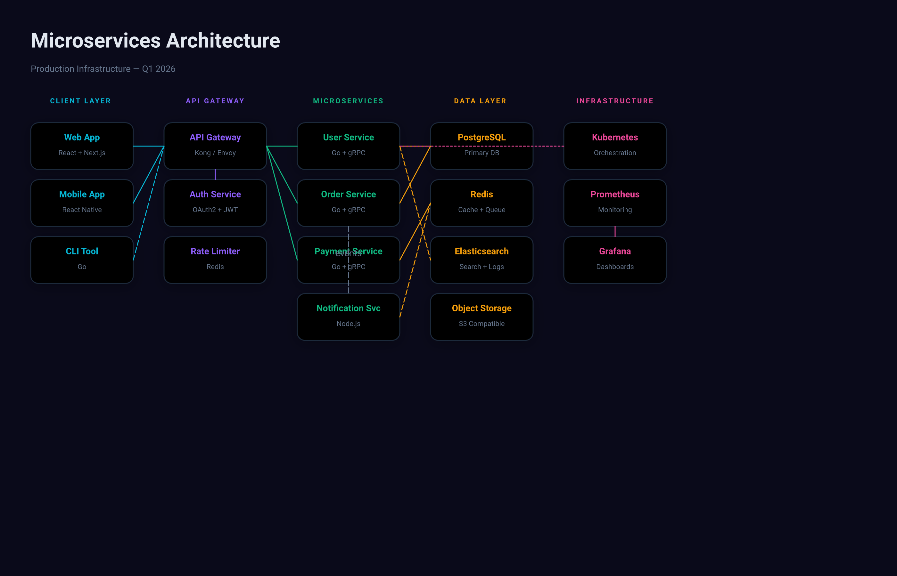

# Design Handover Document



## Overview

| Property | Value |
|----------|-------|
| Canvas | 1400 x 900 |
| Theme | custom |
| Background | `#0a0a1a` |
| Default Font | `400 14px Inter` |
| Frames | 30 |
| Text Nodes | 41 |
| Edges | 15 |

## Design Tokens

| Token | Value |
|-------|-------|
| `$color.blue` | `#3b82f6` |
| `$color.cyan` | `#06b6d4` |
| `$color.green` | `#10b981` |
| `$color.node-bg` | `#111827` |
| `$color.orange` | `#f59e0b` |
| `$color.pink` | `#ec4899` |
| `$color.purple` | `#8b5cf6` |
| `$color.zone-bg` | `rgba(6,182,212,0.05)` |
| `$color.zone-border` | `rgba(6,182,212,0.2)` |

### CSS Variables

```css
:root {
  --color-blue: #3b82f6;
  --color-cyan: #06b6d4;
  --color-green: #10b981;
  --color-node-bg: #111827;
  --color-orange: #f59e0b;
  --color-pink: #ec4899;
  --color-purple: #8b5cf6;
  --color-zone-bg: rgba(6,182,212,0.05);
  --color-zone-border: rgba(6,182,212,0.2);
}
```

## Components

### `db-node`

**Parameters:**

| Param | Default |
|-------|---------|
| `name` | `Database` |
| `tech` | `` |

**Base CSS:**

```css
background-color: $color.node-bg;
border-radius: 12px;
padding: 16px;
gap: 6px;
border: 1.5px solid #1e293b;
```

### `service-node`

**Parameters:**

| Param | Default |
|-------|---------|
| `color` | `#06b6d4` |
| `name` | `Service` |
| `tech` | `` |

**Base CSS:**

```css
background-color: $color.node-bg;
border-radius: 12px;
padding: 16px;
gap: 6px;
border: 1.5px solid #1e293b;
```

## Component Tree

```
root (1400 x 900 @ 0, 0)
  fill: #0a0a1a | padding: 48px
  css: { display: flex; flex-direction: column; padding: 48px; background-color: #0a0a1a; width: 1400px; height: 900px; }
  |
+-- frame#title-area (1304 x 104 @ 48, 48)
|       padding: 0px 0px 32px 0px | gap: 8px
|       css: { display: flex; flex-direction: column; gap: 8px; padding: 0px 0px 32px 0px; }
|       |
|     +-- text "Microservices Architecture" (1304 x 45 @ 0, 0)
|     |       font: 700 32px Inter | color: #e2e8f0
|     +-- text "Production Infrastructure — Q1 2026" (1304 x 20 @ 0, 53)
|             font: 400 14px Inter | color: #64748b
+-- frame#diagram (1304 x 379 @ 48, 152)
        gap: 48px | direction: row | align: start | flex: 1
        css: { display: flex; flex-direction: row; align-items: flex-start; gap: 48px; flex: 1; }
        |
      +-- frame#client-layer (160 x 290 @ 0, 0)
      |       gap: 24px | align: center
      |       css: { display: flex; flex-direction: column; align-items: center; gap: 24px; }
      |       |
      |     +-- text "CLIENT LAYER" (100 x 15 @ 30, 0)
      |     |       font: 700 11px Inter | color: #06b6d4
      |     +-- frame#clients (160 x 251 @ 0, 39)
      |             gap: 16px
      |             css: { display: flex; flex-direction: column; gap: 16px; }
      |             |
      |           +-- [service-node]#web-app (160 x 73 @ 0, 0)
      |           |       fill: $color.node-bg | padding: 16px | gap: 6px | align: center | radius: 12px | border: 1.5px solid #1e293b | shadow: yes
      |           |       css: { display: flex; flex-direction: column; align-items: center; gap: 6px; padding: 16px; background-color: $color.node-bg; border-radius: 12px; border: 1.5px solid #1e293b; box-shadow: 0px 4px 20px rgba(0,0,0,0.3); width: 160px; }
      |           |       |
      |           |     +-- text "Web App" (54 x 20 @ 53, 16)
      |           |     |       font: 600 14px Inter | color: #06b6d4 | text-align: center
      |           |     +-- text "React + Next.js" (77 x 15 @ 41, 42)
      |           |             font: 400 11px Inter | color: #64748b | text-align: center
      |           +-- [service-node]#mobile-app (160 x 73 @ 0, 89)
      |           |       fill: $color.node-bg | padding: 16px | gap: 6px | align: center | radius: 12px | border: 1.5px solid #1e293b | shadow: yes
      |           |       css: { display: flex; flex-direction: column; align-items: center; gap: 6px; padding: 16px; background-color: $color.node-bg; border-radius: 12px; border: 1.5px solid #1e293b; box-shadow: 0px 4px 20px rgba(0,0,0,0.3); width: 160px; }
      |           |       |
      |           |     +-- text "Mobile App" (70 x 20 @ 45, 16)
      |           |     |       font: 600 14px Inter | color: #06b6d4 | text-align: center
      |           |     +-- text "React Native" (65 x 15 @ 47, 42)
      |           |             font: 400 11px Inter | color: #64748b | text-align: center
      |           +-- [service-node]#cli (160 x 73 @ 0, 178)
      |                   fill: $color.node-bg | padding: 16px | gap: 6px | align: center | radius: 12px | border: 1.5px solid #1e293b | shadow: yes
      |                   css: { display: flex; flex-direction: column; align-items: center; gap: 6px; padding: 16px; background-color: $color.node-bg; border-radius: 12px; border: 1.5px solid #1e293b; box-shadow: 0px 4px 20px rgba(0,0,0,0.3); width: 160px; }
      |                   |
      |                 +-- text "CLI Tool" (54 x 20 @ 53, 16)
      |                 |       font: 600 14px Inter | color: #06b6d4 | text-align: center
      |                 +-- text "Go" (12 x 15 @ 74, 42)
      |                         font: 400 11px Inter | color: #64748b | text-align: center
      +-- frame#gateway-layer (160 x 290 @ 208, 0)
      |       gap: 24px | align: center
      |       css: { display: flex; flex-direction: column; align-items: center; gap: 24px; }
      |       |
      |     +-- text "API GATEWAY" (92 x 15 @ 34, 0)
      |     |       font: 700 11px Inter | color: #8b5cf6
      |     +-- frame#gateways (160 x 251 @ 0, 39)
      |             gap: 16px
      |             css: { display: flex; flex-direction: column; gap: 16px; }
      |             |
      |           +-- [service-node]#api-gw (160 x 73 @ 0, 0)
      |           |       fill: $color.node-bg | padding: 16px | gap: 6px | align: center | radius: 12px | border: 1.5px solid #1e293b | shadow: yes
      |           |       css: { display: flex; flex-direction: column; align-items: center; gap: 6px; padding: 16px; background-color: $color.node-bg; border-radius: 12px; border: 1.5px solid #1e293b; box-shadow: 0px 4px 20px rgba(0,0,0,0.3); width: 160px; }
      |           |       |
      |           |     +-- text "API Gateway" (83 x 20 @ 38, 16)
      |           |     |       font: 600 14px Inter | color: #8b5cf6 | text-align: center
      |           |     +-- text "Kong / Envoy" (65 x 15 @ 47, 42)
      |           |             font: 400 11px Inter | color: #64748b | text-align: center
      |           +-- [service-node]#auth (160 x 73 @ 0, 89)
      |           |       fill: $color.node-bg | padding: 16px | gap: 6px | align: center | radius: 12px | border: 1.5px solid #1e293b | shadow: yes
      |           |       css: { display: flex; flex-direction: column; align-items: center; gap: 6px; padding: 16px; background-color: $color.node-bg; border-radius: 12px; border: 1.5px solid #1e293b; box-shadow: 0px 4px 20px rgba(0,0,0,0.3); width: 160px; }
      |           |       |
      |           |     +-- text "Auth Service" (87 x 20 @ 36, 16)
      |           |     |       font: 600 14px Inter | color: #8b5cf6 | text-align: center
      |           |     +-- text "OAuth2 + JWT" (70 x 15 @ 45, 42)
      |           |             font: 400 11px Inter | color: #64748b | text-align: center
      |           +-- [service-node]#rate-limit (160 x 73 @ 0, 178)
      |                   fill: $color.node-bg | padding: 16px | gap: 6px | align: center | radius: 12px | border: 1.5px solid #1e293b | shadow: yes
      |                   css: { display: flex; flex-direction: column; align-items: center; gap: 6px; padding: 16px; background-color: $color.node-bg; border-radius: 12px; border: 1.5px solid #1e293b; box-shadow: 0px 4px 20px rgba(0,0,0,0.3); width: 160px; }
      |                   |
      |                 +-- text "Rate Limiter" (86 x 20 @ 37, 16)
      |                 |       font: 600 14px Inter | color: #8b5cf6 | text-align: center
      |                 +-- text "Redis" (27 x 15 @ 67, 42)
      |                         font: 400 11px Inter | color: #64748b | text-align: center
      +-- frame#service-layer (160 x 379 @ 416, 0)
      |       gap: 24px | align: center
      |       css: { display: flex; flex-direction: column; align-items: center; gap: 24px; }
      |       |
      |     +-- text "MICROSERVICES" (111 x 15 @ 25, 0)
      |     |       font: 700 11px Inter | color: #10b981
      |     +-- frame#services (160 x 340 @ 0, 39)
      |             gap: 16px
      |             css: { display: flex; flex-direction: column; gap: 16px; }
      |             |
      |           +-- [service-node]#user-svc (160 x 73 @ 0, 0)
      |           |       fill: $color.node-bg | padding: 16px | gap: 6px | align: center | radius: 12px | border: 1.5px solid #1e293b | shadow: yes
      |           |       css: { display: flex; flex-direction: column; align-items: center; gap: 6px; padding: 16px; background-color: $color.node-bg; border-radius: 12px; border: 1.5px solid #1e293b; box-shadow: 0px 4px 20px rgba(0,0,0,0.3); width: 160px; }
      |           |       |
      |           |     +-- text "User Service" (87 x 20 @ 36, 16)
      |           |     |       font: 600 14px Inter | color: #10b981 | text-align: center
      |           |     +-- text "Go + gRPC" (50 x 15 @ 55, 42)
      |           |             font: 400 11px Inter | color: #64748b | text-align: center
      |           +-- [service-node]#order-svc (160 x 73 @ 0, 89)
      |           |       fill: $color.node-bg | padding: 16px | gap: 6px | align: center | radius: 12px | border: 1.5px solid #1e293b | shadow: yes
      |           |       css: { display: flex; flex-direction: column; align-items: center; gap: 6px; padding: 16px; background-color: $color.node-bg; border-radius: 12px; border: 1.5px solid #1e293b; box-shadow: 0px 4px 20px rgba(0,0,0,0.3); width: 160px; }
      |           |       |
      |           |     +-- text "Order Service" (96 x 20 @ 32, 16)
      |           |     |       font: 600 14px Inter | color: #10b981 | text-align: center
      |           |     +-- text "Go + gRPC" (50 x 15 @ 55, 42)
      |           |             font: 400 11px Inter | color: #64748b | text-align: center
      |           +-- [service-node]#payment-svc (160 x 73 @ 0, 178)
      |           |       fill: $color.node-bg | padding: 16px | gap: 6px | align: center | radius: 12px | border: 1.5px solid #1e293b | shadow: yes
      |           |       css: { display: flex; flex-direction: column; align-items: center; gap: 6px; padding: 16px; background-color: $color.node-bg; border-radius: 12px; border: 1.5px solid #1e293b; box-shadow: 0px 4px 20px rgba(0,0,0,0.3); width: 160px; }
      |           |       |
      |           |     +-- text "Payment Service" (113 x 20 @ 24, 16)
      |           |     |       font: 600 14px Inter | color: #10b981 | text-align: center
      |           |     +-- text "Go + gRPC" (50 x 15 @ 55, 42)
      |           |             font: 400 11px Inter | color: #64748b | text-align: center
      |           +-- [service-node]#notify-svc (160 x 73 @ 0, 267)
      |                   fill: $color.node-bg | padding: 16px | gap: 6px | align: center | radius: 12px | border: 1.5px solid #1e293b | shadow: yes
      |                   css: { display: flex; flex-direction: column; align-items: center; gap: 6px; padding: 16px; background-color: $color.node-bg; border-radius: 12px; border: 1.5px solid #1e293b; box-shadow: 0px 4px 20px rgba(0,0,0,0.3); width: 160px; }
      |                   |
      |                 +-- text "Notification Svc" (111 x 20 @ 25, 16)
      |                 |       font: 600 14px Inter | color: #10b981 | text-align: center
      |                 +-- text "Node.js" (36 x 15 @ 62, 42)
      |                         font: 400 11px Inter | color: #64748b | text-align: center
      +-- frame#data-layer (160 x 379 @ 624, 0)
      |       gap: 24px | align: center
      |       css: { display: flex; flex-direction: column; align-items: center; gap: 24px; }
      |       |
      |     +-- text "DATA LAYER" (87 x 15 @ 37, 0)
      |     |       font: 700 11px Inter | color: #f59e0b
      |     +-- frame#databases (160 x 340 @ 0, 39)
      |             gap: 16px
      |             css: { display: flex; flex-direction: column; gap: 16px; }
      |             |
      |           +-- [db-node]#postgres (160 x 73 @ 0, 0)
      |           |       fill: $color.node-bg | padding: 16px | gap: 6px | align: center | radius: 12px | border: 1.5px solid #1e293b | shadow: yes
      |           |       css: { display: flex; flex-direction: column; align-items: center; gap: 6px; padding: 16px; background-color: $color.node-bg; border-radius: 12px; border: 1.5px solid #1e293b; box-shadow: 0px 4px 20px rgba(0,0,0,0.3); width: 160px; }
      |           |       |
      |           |     +-- text "PostgreSQL" (83 x 20 @ 39, 16)
      |           |     |       font: 600 14px Inter | color: #f59e0b | text-align: center
      |           |     +-- text "Primary DB" (58 x 15 @ 51, 42)
      |           |             font: 400 11px Inter | color: #64748b | text-align: center
      |           +-- [db-node]#redis (160 x 73 @ 0, 89)
      |           |       fill: $color.node-bg | padding: 16px | gap: 6px | align: center | radius: 12px | border: 1.5px solid #1e293b | shadow: yes
      |           |       css: { display: flex; flex-direction: column; align-items: center; gap: 6px; padding: 16px; background-color: $color.node-bg; border-radius: 12px; border: 1.5px solid #1e293b; box-shadow: 0px 4px 20px rgba(0,0,0,0.3); width: 160px; }
      |           |       |
      |           |     +-- text "Redis" (36 x 20 @ 62, 16)
      |           |     |       font: 600 14px Inter | color: #f59e0b | text-align: center
      |           |     +-- text "Cache + Queue" (72 x 15 @ 44, 42)
      |           |             font: 400 11px Inter | color: #64748b | text-align: center
      |           +-- [db-node]#elastic (160 x 73 @ 0, 178)
      |           |       fill: $color.node-bg | padding: 16px | gap: 6px | align: center | radius: 12px | border: 1.5px solid #1e293b | shadow: yes
      |           |       css: { display: flex; flex-direction: column; align-items: center; gap: 6px; padding: 16px; background-color: $color.node-bg; border-radius: 12px; border: 1.5px solid #1e293b; box-shadow: 0px 4px 20px rgba(0,0,0,0.3); width: 160px; }
      |           |       |
      |           |     +-- text "Elasticsearch" (94 x 20 @ 33, 16)
      |           |     |       font: 600 14px Inter | color: #f59e0b | text-align: center
      |           |     +-- text "Search + Logs" (71 x 15 @ 45, 42)
      |           |             font: 400 11px Inter | color: #64748b | text-align: center
      |           +-- [db-node]#s3 (160 x 73 @ 0, 267)
      |                   fill: $color.node-bg | padding: 16px | gap: 6px | align: center | radius: 12px | border: 1.5px solid #1e293b | shadow: yes
      |                   css: { display: flex; flex-direction: column; align-items: center; gap: 6px; padding: 16px; background-color: $color.node-bg; border-radius: 12px; border: 1.5px solid #1e293b; box-shadow: 0px 4px 20px rgba(0,0,0,0.3); width: 160px; }
      |                   |
      |                 +-- text "Object Storage" (104 x 20 @ 28, 16)
      |                 |       font: 600 14px Inter | color: #f59e0b | text-align: center
      |                 +-- text "S3 Compatible" (70 x 15 @ 45, 42)
      |                         font: 400 11px Inter | color: #64748b | text-align: center
      +-- frame#infra-layer (160 x 290 @ 832, 0)
              gap: 24px | align: center
              css: { display: flex; flex-direction: column; align-items: center; gap: 24px; }
              |
            +-- text "INFRASTRUCTURE" (121 x 15 @ 19, 0)
            |       font: 700 11px Inter | color: #ec4899
            +-- frame#infra (160 x 251 @ 0, 39)
                    gap: 16px
                    css: { display: flex; flex-direction: column; gap: 16px; }
                    |
                  +-- [service-node]#k8s (160 x 73 @ 0, 0)
                  |       fill: $color.node-bg | padding: 16px | gap: 6px | align: center | radius: 12px | border: 1.5px solid #1e293b | shadow: yes
                  |       css: { display: flex; flex-direction: column; align-items: center; gap: 6px; padding: 16px; background-color: $color.node-bg; border-radius: 12px; border: 1.5px solid #1e293b; box-shadow: 0px 4px 20px rgba(0,0,0,0.3); width: 160px; }
                  |       |
                  |     +-- text "Kubernetes" (78 x 20 @ 41, 16)
                  |     |       font: 600 14px Inter | color: #ec4899 | text-align: center
                  |     +-- text "Orchestration" (74 x 15 @ 43, 42)
                  |             font: 400 11px Inter | color: #64748b | text-align: center
                  +-- [service-node]#prometheus (160 x 73 @ 0, 89)
                  |       fill: $color.node-bg | padding: 16px | gap: 6px | align: center | radius: 12px | border: 1.5px solid #1e293b | shadow: yes
                  |       css: { display: flex; flex-direction: column; align-items: center; gap: 6px; padding: 16px; background-color: $color.node-bg; border-radius: 12px; border: 1.5px solid #1e293b; box-shadow: 0px 4px 20px rgba(0,0,0,0.3); width: 160px; }
                  |       |
                  |     +-- text "Prometheus" (80 x 20 @ 40, 16)
                  |     |       font: 600 14px Inter | color: #ec4899 | text-align: center
                  |     +-- text "Monitoring" (54 x 15 @ 53, 42)
                  |             font: 400 11px Inter | color: #64748b | text-align: center
                  +-- [service-node]#grafana (160 x 73 @ 0, 178)
                          fill: $color.node-bg | padding: 16px | gap: 6px | align: center | radius: 12px | border: 1.5px solid #1e293b | shadow: yes
                          css: { display: flex; flex-direction: column; align-items: center; gap: 6px; padding: 16px; background-color: $color.node-bg; border-radius: 12px; border: 1.5px solid #1e293b; box-shadow: 0px 4px 20px rgba(0,0,0,0.3); width: 160px; }
                          |
                        +-- text "Grafana" (55 x 20 @ 53, 16)
                        |       font: 600 14px Inter | color: #ec4899 | text-align: center
                        +-- text "Dashboards" (59 x 15 @ 50, 42)
                                font: 400 11px Inter | color: #64748b | text-align: center
```

## Edges

| From | To | Style | Arrow | Curve | Label |
|------|----|-------|-------|-------|-------|
| `web-app` | `api-gw` | solid | end | straight | - |
| `mobile-app` | `api-gw` | solid | end | straight | - |
| `cli` | `api-gw` | dashed | end | straight | - |
| `api-gw` | `auth` | solid | end | straight | - |
| `api-gw` | `user-svc` | solid | end | straight | - |
| `api-gw` | `order-svc` | solid | end | straight | - |
| `api-gw` | `payment-svc` | solid | end | straight | - |
| `order-svc` | `notify-svc` | dashed | end | straight | `events` |
| `user-svc` | `postgres` | solid | end | straight | - |
| `order-svc` | `postgres` | solid | end | straight | - |
| `payment-svc` | `redis` | solid | end | straight | - |
| `notify-svc` | `redis` | dashed | end | straight | - |
| `user-svc` | `elastic` | dashed | end | straight | - |
| `k8s` | `user-svc` | dotted | end | straight | - |
| `prometheus` | `grafana` | solid | end | straight | - |

### Edge Paths

**web-app → api-gw**
- Stroke: `#06b6d4` 1.5px solid
- Path: (208, 228) → (256, 228)

**mobile-app → api-gw**
- Stroke: `#06b6d4` 1.5px solid
- Path: (208, 317) → (256, 228)

**cli → api-gw**
- Stroke: `#06b6d4` 1.5px dashed
- Path: (208, 406) → (256, 228)

**api-gw → auth**
- Stroke: `#8b5cf6` 1.5px solid
- Path: (336, 265) → (336, 281)

**api-gw → user-svc**
- Stroke: `#10b981` 1.5px solid
- Path: (416, 228) → (464, 228)

**api-gw → order-svc**
- Stroke: `#10b981` 1.5px solid
- Path: (416, 228) → (464, 317)

**api-gw → payment-svc**
- Stroke: `#10b981` 1.5px solid
- Path: (416, 228) → (464, 406)

**order-svc → notify-svc** (events)
- Stroke: `#64748b` 1.5px dashed
- Path: (544, 354) → (544, 459)

**user-svc → postgres**
- Stroke: `#f59e0b` 1.5px solid
- Path: (624, 228) → (672, 228)

**order-svc → postgres**
- Stroke: `#f59e0b` 1.5px solid
- Path: (624, 317) → (672, 228)

**payment-svc → redis**
- Stroke: `#f59e0b` 1.5px solid
- Path: (624, 406) → (672, 317)

**notify-svc → redis**
- Stroke: `#f59e0b` 1.5px dashed
- Path: (624, 495) → (672, 317)

**user-svc → elastic**
- Stroke: `#f59e0b` 1.5px dashed
- Path: (624, 228) → (672, 406)

**k8s → user-svc**
- Stroke: `#ec4899` 1.5px dotted
- Path: (880, 228) → (624, 228)

**prometheus → grafana**
- Stroke: `#ec4899` 1.5px solid
- Path: (960, 354) → (960, 370)

## Implementation Notes

### DSL → CSS Property Mapping

| DSL Property | CSS Equivalent |
|-------------|----------------|
| `direction: row` | `flex-direction: row` |
| `direction: column` | `flex-direction: column` |
| `justify: start` | `justify-content: flex-start` |
| `justify: center` | `justify-content: center` |
| `justify: end` | `justify-content: flex-end` |
| `justify: between` | `justify-content: space-between` |
| `justify: around` | `justify-content: space-around` |
| `align: start` | `align-items: flex-start` |
| `align: center` | `align-items: center` |
| `align: end` | `align-items: flex-end` |
| `align: stretch` | `align-items: stretch` |
| `layout: grid` + `columns: N` | `display: grid; grid-template-columns: repeat(N, 1fr)` |
| `fill: #color` | `background-color: #color` |
| `fill: linear-gradient(...)` | `background: linear-gradient(...)` |
| `border: W solid C` | `border: Wpx solid C` |
| `shadow: X Y B C` | `box-shadow: Xpx Ypx Bpx C` |
| `radius: N` | `border-radius: Npx` |
| `clip: true` | `overflow: hidden` |
| `truncate: true` | `overflow: hidden; text-overflow: ellipsis; white-space: nowrap` |
| `gap: N` | `gap: Npx` |
| `flex: N` | `flex: N` |
| `opacity: N` | `opacity: N` |

