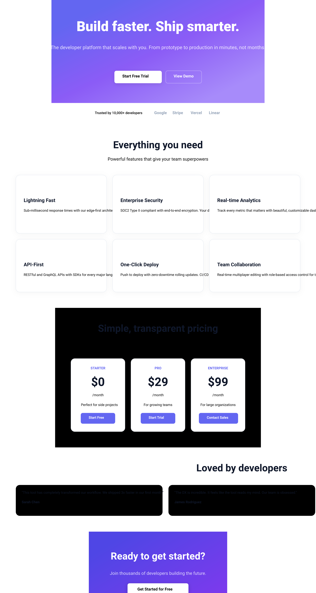

# Design Handover Document



## Overview

| Property | Value |
|----------|-------|
| Canvas | 1280 x 2400 |
| Theme | light |
| Background | `#ffffff` |
| Default Font | `400 14px Inter` |
| Frames | 38 |
| Text Nodes | 59 |
| Edges | 0 |

## Design Tokens

| Token | Value |
|-------|-------|
| `$color.bg` | `#ffffff` |
| `$color.bg-alt` | `#f8fafc` |
| `$color.border` | `#e2e8f0` |
| `$color.brand` | `#6366f1` |
| `$color.brand-dark` | `#4f46e5` |
| `$color.brand-light` | `#818cf8` |
| `$color.success` | `#059669` |
| `$color.text` | `#0f172a` |
| `$color.text-secondary` | `#475569` |
| `$radius.full` | `9999` |
| `$radius.lg` | `16` |
| `$radius.md` | `12` |
| `$radius.sm` | `8` |
| `$radius.xl` | `24` |

### CSS Variables

```css
:root {
  --color-bg: #ffffff;
  --color-bg-alt: #f8fafc;
  --color-border: #e2e8f0;
  --color-brand: #6366f1;
  --color-brand-dark: #4f46e5;
  --color-brand-light: #818cf8;
  --color-success: #059669;
  --color-text: #0f172a;
  --color-text-secondary: #475569;
  --radius-full: 9999;
  --radius-lg: 16;
  --radius-md: 12;
  --radius-sm: 8;
  --radius-xl: 24;
}
```

## Components

### `feature-card`

**Parameters:**

| Param | Default |
|-------|---------|
| `desc` | `Description` |
| `icon` | `⚡` |
| `title` | `Feature` |

**Base CSS:**

```css
background-color: white;
border-radius: 16px;
padding: 32px;
gap: 16px;
border: 1px solid #e2e8f0;
```

### `pricing-card`

**Parameters:**

| Param | Default |
|-------|---------|
| `cta` | `Get Started` |
| `desc` | `For individuals` |
| `period` | `/month` |
| `plan` | `Plan` |
| `price` | `$0` |

**Base CSS:**

```css
background-color: white;
border-radius: 16px;
padding: 32px;
gap: 20px;
border: 1px solid #e2e8f0;
```

### `testimonial`

**Parameters:**

| Param | Default |
|-------|---------|
| `name` | `User` |
| `quote` | `Great product!` |
| `role` | `Engineer` |

**Base CSS:**

```css
background-color: #ffffff-alt;
border-radius: 16px;
padding: 24px;
gap: 16px;
```

## Component Tree

```
root (1280 x 2400 @ 0, 0)
  fill: #ffffff | align: center
  css: { display: flex; flex-direction: column; align-items: center; background-color: #ffffff; width: 1280px; height: 2400px; }
  |
+-- frame#hero (863 x 417 @ 208, 0)
|       fill: gradient | padding: 80px 64px | gap: 24px | align: center
|       css: { display: flex; flex-direction: column; align-items: center; gap: 24px; padding: 80px 64px; background: linear-gradient(135deg, #6366f1 0%, #8b5cf6 50%, #a78bfa 100%); }
|       |
|     +-- text "Build faster. Ship smarter." (735 x 78 @ 64, 80)
|     |       font: 800 56px Inter | color: white | text-align: center
|     +-- text "The developer platform that scales wi..." (640 x 64 @ 112, 182)
|     |       font: 400 20px Inter | color: rgba(255,255,255,0.85) | text-align: center | max-width: 640px
|     +-- frame#hero-cta (353 x 66 @ 255, 270)
|             padding: 16px 0px 0px 0px | gap: 16px | direction: row
|             css: { display: flex; flex-direction: row; gap: 16px; padding: 16px 0px 0px 0px; }
|             |
|           +-- frame (192 x 50 @ 0, 16)
|           |       fill: white | padding: 14px 32px | radius: 8px | shadow: yes
|           |       css: { display: flex; flex-direction: column; padding: 14px 32px; background-color: white; border-radius: 8px; box-shadow: 0px 4px 16px rgba(0,0,0,0.1); }
|           |       |
|           |     +-- text "Start Free Trial" (128 x 22 @ 32, 14)
|           |             font: 600 16px Inter | color: #6366f1-dark
|           +-- frame (145 x 50 @ 208, 16)
|                   padding: 14px 32px | radius: 8px | border: 2px solid rgba(255,255,255,0.3)
|                   css: { display: flex; flex-direction: column; padding: 14px 32px; border-radius: 8px; border: 2px solid rgba(255,255,255,0.3); }
|                   |
|                 +-- text "View Demo" (81 x 22 @ 32, 14)
|                         font: 600 16px Inter | color: white
+-- frame#social-proof (640 x 86 @ 320, 417)
|       padding: 32px 64px | gap: 48px | direction: row | justify: center | align: center
|       css: { display: flex; flex-direction: row; justify-content: center; align-items: center; gap: 48px; padding: 32px 64px; }
|       |
|     +-- text "Trusted by 10,000+ developers" (193 x 20 @ 64, 33)
|     |       font: 500 14px Inter | color: #0f172a-secondary
|     +-- frame (271 x 22 @ 305, 32)
|             gap: 24px | direction: row
|             css: { display: flex; flex-direction: row; gap: 24px; }
|             |
|           +-- text "Google" (50 x 22 @ 0, 0)
|           |       font: 700 16px Inter | color: #94a3b8
|           +-- text "Stripe" (50 x 22 @ 74, 0)
|           |       font: 700 16px Inter | color: #94a3b8
|           +-- text "Vercel" (50 x 22 @ 148, 0)
|           |       font: 700 16px Inter | color: #94a3b8
|           +-- text "Linear" (50 x 22 @ 221, 0)
|                   font: 700 16px Inter | color: #94a3b8
+-- frame#features (1280 x 743 @ 0, 503)
|       padding: 64px | gap: 48px | align: center
|       css: { display: flex; flex-direction: column; align-items: center; gap: 48px; padding: 64px; }
|       |
|     +-- frame (436 x 93 @ 422, 64)
|     |       gap: 12px | align: center
|     |       css: { display: flex; flex-direction: column; align-items: center; gap: 12px; }
|     |       |
|     |     +-- text "Everything you need" (389 x 56 @ 24, 0)
|     |     |       font: 700 40px Inter | color: #0f172a | text-align: center
|     |     +-- text "Powerful features that give your team..." (436 x 25 @ 0, 68)
|     |             font: 400 18px Inter | color: #0f172a-secondary | text-align: center
|     +-- frame#feature-grid (1152 x 474 @ 64, 205)
|             grid: 3 cols
|             css: { display: grid; grid-template-columns: repeat(3, 1fr); column-gap: 24px; row-gap: 24px; }
|             |
|           +-- [feature-card] (368 x 236 @ 0, 0)
|           |       fill: white | padding: 32px | gap: 16px | radius: 16px | border: 1px solid #e2e8f0 | shadow: yes
|           |       css: { display: flex; flex-direction: column; gap: 16px; padding: 32px; background-color: white; border-radius: 16px; border: 1px solid #e2e8f0; box-shadow: 0px 4px 24px rgba(0,0,0,0.04); }
|           |       |
|           |     +-- text "⚡" (304 x 45 @ 32, 32)
|           |     |       font: 400 32px Inter | color: #0f172a
|           |     +-- text "Lightning Fast" (304 x 28 @ 32, 93)
|           |     |       font: 700 20px Inter | color: #0f172a
|           |     +-- text "Sub-millisecond response times with o..." (304 x 67 @ 32, 137)
|           |             font: 400 14px Inter | color: #0f172a-secondary | max-width: 280px
|           +-- [feature-card] (368 x 236 @ 392, 0)
|           |       fill: white | padding: 32px | gap: 16px | radius: 16px | border: 1px solid #e2e8f0 | shadow: yes
|           |       css: { display: flex; flex-direction: column; gap: 16px; padding: 32px; background-color: white; border-radius: 16px; border: 1px solid #e2e8f0; box-shadow: 0px 4px 24px rgba(0,0,0,0.04); }
|           |       |
|           |     +-- text "🔒" (304 x 45 @ 32, 32)
|           |     |       font: 400 32px Inter | color: #0f172a
|           |     +-- text "Enterprise Security" (304 x 28 @ 32, 93)
|           |     |       font: 700 20px Inter | color: #0f172a
|           |     +-- text "SOC2 Type II compliant with end-to-en..." (304 x 45 @ 32, 137)
|           |             font: 400 14px Inter | color: #0f172a-secondary | max-width: 280px
|           +-- [feature-card] (368 x 236 @ 784, 0)
|           |       fill: white | padding: 32px | gap: 16px | radius: 16px | border: 1px solid #e2e8f0 | shadow: yes
|           |       css: { display: flex; flex-direction: column; gap: 16px; padding: 32px; background-color: white; border-radius: 16px; border: 1px solid #e2e8f0; box-shadow: 0px 4px 24px rgba(0,0,0,0.04); }
|           |       |
|           |     +-- text "📊" (304 x 45 @ 32, 32)
|           |     |       font: 400 32px Inter | color: #0f172a
|           |     +-- text "Real-time Analytics" (304 x 28 @ 32, 93)
|           |     |       font: 700 20px Inter | color: #0f172a
|           |     +-- text "Track every metric that matters with ..." (304 x 45 @ 32, 137)
|           |             font: 400 14px Inter | color: #0f172a-secondary | max-width: 280px
|           +-- [feature-card] (368 x 214 @ 0, 260)
|           |       fill: white | padding: 32px | gap: 16px | radius: 16px | border: 1px solid #e2e8f0 | shadow: yes
|           |       css: { display: flex; flex-direction: column; gap: 16px; padding: 32px; background-color: white; border-radius: 16px; border: 1px solid #e2e8f0; box-shadow: 0px 4px 24px rgba(0,0,0,0.04); }
|           |       |
|           |     +-- text "🔌" (304 x 45 @ 32, 32)
|           |     |       font: 400 32px Inter | color: #0f172a
|           |     +-- text "API-First" (304 x 28 @ 32, 93)
|           |     |       font: 700 20px Inter | color: #0f172a
|           |     +-- text "RESTful and GraphQL APIs with SDKs fo..." (304 x 45 @ 32, 137)
|           |             font: 400 14px Inter | color: #0f172a-secondary | max-width: 280px
|           +-- [feature-card] (368 x 214 @ 392, 260)
|           |       fill: white | padding: 32px | gap: 16px | radius: 16px | border: 1px solid #e2e8f0 | shadow: yes
|           |       css: { display: flex; flex-direction: column; gap: 16px; padding: 32px; background-color: white; border-radius: 16px; border: 1px solid #e2e8f0; box-shadow: 0px 4px 24px rgba(0,0,0,0.04); }
|           |       |
|           |     +-- text "🚀" (304 x 45 @ 32, 32)
|           |     |       font: 400 32px Inter | color: #0f172a
|           |     +-- text "One-Click Deploy" (304 x 28 @ 32, 93)
|           |     |       font: 700 20px Inter | color: #0f172a
|           |     +-- text "Push to deploy with zero-downtime rol..." (304 x 45 @ 32, 137)
|           |             font: 400 14px Inter | color: #0f172a-secondary | max-width: 280px
|           +-- [feature-card] (368 x 214 @ 784, 260)
|                   fill: white | padding: 32px | gap: 16px | radius: 16px | border: 1px solid #e2e8f0 | shadow: yes
|                   css: { display: flex; flex-direction: column; gap: 16px; padding: 32px; background-color: white; border-radius: 16px; border: 1px solid #e2e8f0; box-shadow: 0px 4px 24px rgba(0,0,0,0.04); }
|                   |
|                 +-- text "🤝" (304 x 45 @ 32, 32)
|                 |       font: 400 32px Inter | color: #0f172a
|                 +-- text "Team Collaboration" (304 x 28 @ 32, 93)
|                 |       font: 700 20px Inter | color: #0f172a
|                 +-- text "Real-time multiplayer editing with ro..." (304 x 45 @ 32, 137)
|                         font: 400 14px Inter | color: #0f172a-secondary | max-width: 280px
+-- frame#pricing (834 x 565 @ 223, 1246)
|       fill: #ffffff-alt | padding: 64px | gap: 48px | align: center
|       css: { display: flex; flex-direction: column; align-items: center; gap: 48px; padding: 64px; background-color: #ffffff-alt; }
|       |
|     +-- frame (532 x 93 @ 151, 64)
|     |       gap: 12px | align: center
|     |       css: { display: flex; flex-direction: column; align-items: center; gap: 12px; }
|     |       |
|     |     +-- text "Simple, transparent pricing" (532 x 56 @ 0, 0)
|     |     |       font: 700 40px Inter | color: #0f172a | text-align: center
|     |     +-- text "No hidden fees. Cancel anytime." (258 x 25 @ 137, 68)
|     |             font: 400 18px Inter | color: #0f172a-secondary
|     +-- frame#pricing-grid (706 x 296 @ 64, 205)
|             gap: 24px | direction: row
|             css: { display: flex; flex-direction: row; gap: 24px; }
|             |
|           +-- [pricing-card] (219 x 296 @ 0, 0)
|           |       fill: white | padding: 32px | gap: 20px | align: center | radius: 16px | border: 1px solid #e2e8f0 | shadow: yes | flex: 1
|           |       css: { display: flex; flex-direction: column; align-items: center; gap: 20px; padding: 32px; background-color: white; border-radius: 16px; border: 1px solid #e2e8f0; box-shadow: 0px 8px 32px rgba(0,0,0,0.06); flex: 1; }
|           |       |
|           |     +-- text "STARTER" (62 x 20 @ 79, 32)
|           |     |       font: 600 14px Inter | color: #6366f1 | text-align: center
|           |     +-- frame (52 x 89 @ 83, 72)
|           |     |       gap: 2px | align: center
|           |     |       css: { display: flex; flex-direction: column; align-items: center; gap: 2px; }
|           |     |       |
|           |     |     +-- text "$0" (52 x 67 @ 0, 0)
|           |     |     |       font: 700 48px Inter | color: #0f172a | text-align: center
|           |     |     +-- text "/month" (46 x 20 @ 3, 69)
|           |     |             font: 400 14px Inter | color: #0f172a-secondary | text-align: center
|           |     +-- text "Perfect for side projects" (167 x 20 @ 32, 180)
|           |     |       font: 400 14px Inter | color: #0f172a-secondary | text-align: center
|           |     +-- frame (139 x 44 @ 40, 220)
|           |             fill: #6366f1 | padding: 12px 32px | justify: center | align: center | radius: 8px
|           |             css: { display: flex; flex-direction: column; justify-content: center; align-items: center; padding: 12px 32px; background-color: #6366f1; border-radius: 8px; }
|           |             |
|           |           +-- text "Start Free" (75 x 20 @ 32, 12)
|           |                   font: 600 14px Inter | color: white
|           +-- [pricing-card] (219 x 296 @ 243, 0)
|           |       fill: white | padding: 32px | gap: 20px | align: center | radius: 16px | border: 1px solid #e2e8f0 | shadow: yes | flex: 1
|           |       css: { display: flex; flex-direction: column; align-items: center; gap: 20px; padding: 32px; background-color: white; border-radius: 16px; border: 1px solid #e2e8f0; box-shadow: 0px 8px 32px rgba(0,0,0,0.06); flex: 1; }
|           |       |
|           |     +-- text "PRO" (28 x 20 @ 96, 32)
|           |     |       font: 600 14px Inter | color: #6366f1 | text-align: center
|           |     +-- frame (79 x 89 @ 70, 72)
|           |     |       gap: 2px | align: center
|           |     |       css: { display: flex; flex-direction: column; align-items: center; gap: 2px; }
|           |     |       |
|           |     |     +-- text "$29" (79 x 67 @ 0, 0)
|           |     |     |       font: 700 48px Inter | color: #0f172a | text-align: center
|           |     |     +-- text "/month" (46 x 20 @ 16, 69)
|           |     |             font: 400 14px Inter | color: #0f172a-secondary | text-align: center
|           |     +-- text "For growing teams" (120 x 20 @ 50, 180)
|           |     |       font: 400 14px Inter | color: #0f172a-secondary | text-align: center
|           |     +-- frame (140 x 44 @ 40, 220)
|           |             fill: #6366f1 | padding: 12px 32px | justify: center | align: center | radius: 8px
|           |             css: { display: flex; flex-direction: column; justify-content: center; align-items: center; padding: 12px 32px; background-color: #6366f1; border-radius: 8px; }
|           |             |
|           |           +-- text "Start Trial" (76 x 20 @ 32, 12)
|           |                   font: 600 14px Inter | color: white
|           +-- [pricing-card] (219 x 296 @ 486, 0)
|                   fill: white | padding: 32px | gap: 20px | align: center | radius: 16px | border: 1px solid #e2e8f0 | shadow: yes | flex: 1
|                   css: { display: flex; flex-direction: column; align-items: center; gap: 20px; padding: 32px; background-color: white; border-radius: 16px; border: 1px solid #e2e8f0; box-shadow: 0px 8px 32px rgba(0,0,0,0.06); flex: 1; }
|                   |
|                 +-- text "ENTERPRISE" (83 x 20 @ 68, 32)
|                 |       font: 600 14px Inter | color: #6366f1 | text-align: center
|                 +-- frame (79 x 89 @ 70, 72)
|                 |       gap: 2px | align: center
|                 |       css: { display: flex; flex-direction: column; align-items: center; gap: 2px; }
|                 |       |
|                 |     +-- text "$99" (79 x 67 @ 0, 0)
|                 |     |       font: 700 48px Inter | color: #0f172a | text-align: center
|                 |     +-- text "/month" (46 x 20 @ 16, 69)
|                 |             font: 400 14px Inter | color: #0f172a-secondary | text-align: center
|                 +-- text "For large organizations" (152 x 20 @ 34, 180)
|                 |       font: 400 14px Inter | color: #0f172a-secondary | text-align: center
|                 +-- frame (159 x 44 @ 32, 220)
|                         fill: #6366f1 | padding: 12px 32px | justify: center | align: center | radius: 8px
|                         css: { display: flex; flex-direction: column; justify-content: center; align-items: center; padding: 12px 32px; background-color: #6366f1; border-radius: 8px; }
|                         |
|                       +-- text "Contact Sales" (95 x 20 @ 32, 12)
|                               font: 600 14px Inter | color: white
+-- frame#testimonials (1959 x 341 @ 0, 1811)
|       padding: 64px | gap: 32px | align: center
|       css: { display: flex; flex-direction: column; align-items: center; gap: 32px; padding: 64px; }
|       |
|     +-- text "Loved by developers" (389 x 56 @ 785, 64)
|     |       font: 700 40px Inter | color: #0f172a | text-align: center
|     +-- frame#testimonial-row (1831 x 125 @ 64, 152)
|             gap: 24px | direction: row
|             css: { display: flex; flex-direction: row; gap: 24px; }
|             |
|           +-- [testimonial] (594 x 125 @ 0, 0)
|           |       fill: #ffffff-alt | padding: 24px | gap: 16px | radius: 16px | flex: 1
|           |       css: { display: flex; flex-direction: column; gap: 16px; padding: 24px; background-color: #ffffff-alt; border-radius: 16px; flex: 1; }
|           |       |
|           |     +-- text ""This tool has completely transformed..." (608 x 22 @ 24, 24)
|           |     |       font: 400 14px Inter | color: #0f172a
|           |     +-- frame (546 x 38 @ 24, 62)
|           |             gap: 2px
|           |             css: { display: flex; flex-direction: column; gap: 2px; }
|           |             |
|           |           +-- text "Sarah Chen" (546 x 20 @ 0, 0)
|           |           |       font: 600 14px Inter | color: #0f172a
|           |           +-- text "CTO at Acme Inc" (546 x 17 @ 0, 22)
|           |                   font: 400 12px Inter | color: #0f172a-secondary
|           +-- [testimonial] (594 x 125 @ 618, 0)
|           |       fill: #ffffff-alt | padding: 24px | gap: 16px | radius: 16px | flex: 1
|           |       css: { display: flex; flex-direction: column; gap: 16px; padding: 24px; background-color: #ffffff-alt; border-radius: 16px; flex: 1; }
|           |       |
|           |     +-- text ""The DX is incredible. It feels like ..." (546 x 22 @ 24, 24)
|           |     |       font: 400 14px Inter | color: #0f172a
|           |     +-- frame (546 x 38 @ 24, 62)
|           |             gap: 2px
|           |             css: { display: flex; flex-direction: column; gap: 2px; }
|           |             |
|           |           +-- text "James Rodriguez" (546 x 20 @ 0, 0)
|           |           |       font: 600 14px Inter | color: #0f172a
|           |           +-- text "Lead Engineer at Startup" (546 x 17 @ 0, 22)
|           |                   font: 400 12px Inter | color: #0f172a-secondary
|           +-- [testimonial] (594 x 125 @ 1237, 0)
|                   fill: #ffffff-alt | padding: 24px | gap: 16px | radius: 16px | flex: 1
|                   css: { display: flex; flex-direction: column; gap: 16px; padding: 24px; background-color: #ffffff-alt; border-radius: 16px; flex: 1; }
|                   |
|                 +-- text ""We evaluated 12 tools before choosin..." (546 x 22 @ 24, 24)
|                 |       font: 400 14px Inter | color: #0f172a
|                 +-- frame (546 x 38 @ 24, 62)
|                         gap: 2px
|                         css: { display: flex; flex-direction: column; gap: 2px; }
|                         |
|                       +-- text "Emily Park" (546 x 20 @ 0, 0)
|                       |       font: 600 14px Inter | color: #0f172a
|                       +-- text "VP Engineering at BigCo" (546 x 17 @ 0, 22)
|                               font: 400 12px Inter | color: #0f172a-secondary
+-- frame#final-cta (560 x 344 @ 360, 2152)
        fill: gradient | padding: 80px 64px | gap: 24px | align: center
        css: { display: flex; flex-direction: column; align-items: center; gap: 24px; padding: 80px 64px; background: linear-gradient(135deg, #4f46e5 0%, #7c3aed 100%); }
        |
      +-- text "Ready to get started?" (432 x 56 @ 64, 80)
      |       font: 700 40px Inter | color: white | text-align: center
      +-- text "Join thousands of developers building..." (410 x 25 @ 75, 160)
      |       font: 400 18px Inter | color: rgba(255,255,255,0.8) | text-align: center
      +-- frame (247 x 54 @ 157, 209)
              fill: white | padding: 16px 40px | radius: 8px | shadow: yes
              css: { display: flex; flex-direction: column; padding: 16px 40px; background-color: white; border-radius: 8px; box-shadow: 0px 4px 16px rgba(0,0,0,0.2); }
              |
            +-- text "Get Started for Free" (167 x 22 @ 40, 16)
                    font: 700 16px Inter | color: #6366f1-dark
```

## Implementation Notes

### DSL → CSS Property Mapping

| DSL Property | CSS Equivalent |
|-------------|----------------|
| `direction: row` | `flex-direction: row` |
| `direction: column` | `flex-direction: column` |
| `justify: start` | `justify-content: flex-start` |
| `justify: center` | `justify-content: center` |
| `justify: end` | `justify-content: flex-end` |
| `justify: between` | `justify-content: space-between` |
| `justify: around` | `justify-content: space-around` |
| `align: start` | `align-items: flex-start` |
| `align: center` | `align-items: center` |
| `align: end` | `align-items: flex-end` |
| `align: stretch` | `align-items: stretch` |
| `layout: grid` + `columns: N` | `display: grid; grid-template-columns: repeat(N, 1fr)` |
| `fill: #color` | `background-color: #color` |
| `fill: linear-gradient(...)` | `background: linear-gradient(...)` |
| `border: W solid C` | `border: Wpx solid C` |
| `shadow: X Y B C` | `box-shadow: Xpx Ypx Bpx C` |
| `radius: N` | `border-radius: Npx` |
| `clip: true` | `overflow: hidden` |
| `truncate: true` | `overflow: hidden; text-overflow: ellipsis; white-space: nowrap` |
| `gap: N` | `gap: Npx` |
| `flex: N` | `flex: N` |
| `opacity: N` | `opacity: N` |

