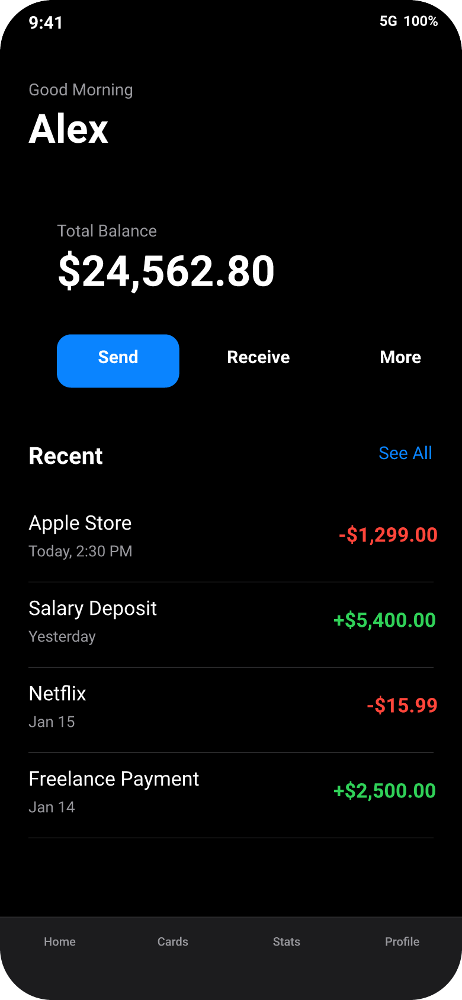
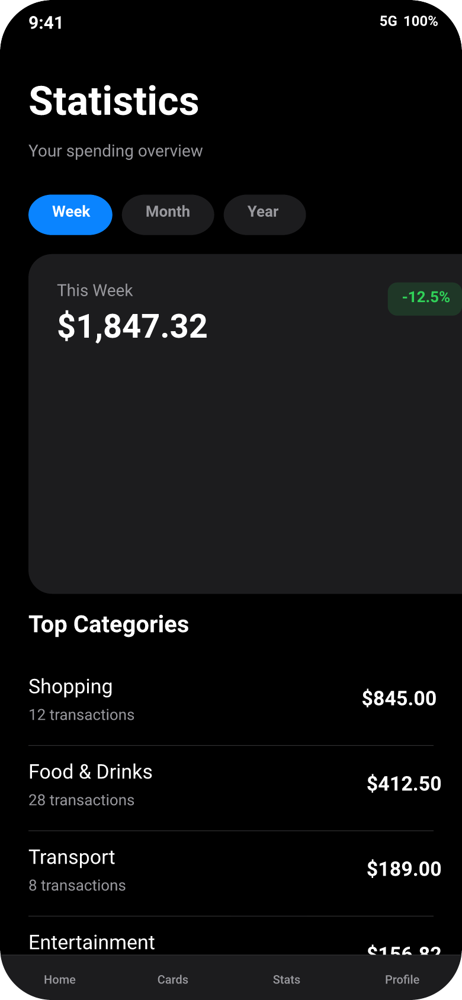

# Design Handover Document

## Overview

| Property | Value |
|----------|-------|
| Canvas | 390 x 844 |
| Theme | dark |
| Background | `#000000` |
| Default Font | `400 14px Inter` |
| Frames | 26 |
| Text Nodes | 28 |
| Edges | 0 |

## Design Tokens

| Token | Value |
|-------|-------|
| `$color.accent` | `#0a84ff` |
| `$color.bg` | `#000000` |
| `$color.card` | `#1c1c1e` |
| `$color.card-alt` | `#2c2c2e` |
| `$color.green` | `#30d158` |
| `$color.orange` | `#ff9f0a` |
| `$color.red` | `#ff453a` |
| `$color.separator` | `#38383a` |
| `$color.text` | `#ffffff` |
| `$color.text2` | `#98989d` |
| `$radius.card` | `20` |
| `$radius.lg` | `16` |
| `$radius.md` | `12` |
| `$radius.sm` | `8` |

### CSS Variables

```css
:root {
  --color-accent: #0a84ff;
  --color-bg: #000000;
  --color-card: #1c1c1e;
  --color-card-alt: #2c2c2e;
  --color-green: #30d158;
  --color-orange: #ff9f0a;
  --color-red: #ff453a;
  --color-separator: #38383a;
  --color-text: #ffffff;
  --color-text2: #98989d;
  --radius-card: 20;
  --radius-lg: 16;
  --radius-md: 12;
  --radius-sm: 8;
}
```

## Components

### `bottom-tab`

**Parameters:**

| Param | Default |
|-------|---------|
| `active` | `false` |
| `label` | `Tab` |

**Base CSS:**

```css
padding: 8px 0px;
gap: 4px;
```

### `list-item`

**Parameters:**

| Param | Default |
|-------|---------|
| `subtitle` | `` |
| `title` | `Item` |
| `value` | `` |
| `value-color` | `#ffffff` |

**Base CSS:**

```css
padding: 14px 0px;
gap: 12px;
```

### `status-bar`

**Base CSS:**

```css
padding: 12px 24px;
```

## Page: Home



## Component Tree

```
root (390 x 844 @ 0, 0)
  fill: #000000 | radius: 44px | clip: true
  css: { display: flex; flex-direction: column; background-color: #000000; border-radius: 44px; overflow: hidden; width: 390px; height: 844px; }
  |
+-- [status-bar] (390 x 45 @ 0, 0)
|       padding: 12px 24px | direction: row | justify: between
|       css: { display: flex; flex-direction: row; justify-content: space-between; padding: 12px 24px; }
|       |
|     +-- text "9:41" (25 x 21 @ 24, 12)
|     |       font: 600 15px SF Pro | color: white
|     +-- frame (46 x 21 @ 320, 12)
|             gap: 6px | direction: row
|             css: { display: flex; flex-direction: row; gap: 6px; }
|             |
|           +-- text "5G" (14 x 17 @ 0, 0)
|           |       font: 600 12px SF Pro | color: white
|           +-- text "100%" (26 x 17 @ 20, 0)
|                   font: 600 12px SF Pro | color: white
+-- frame#greeting (390 x 119 @ 0, 45)
|       padding: 24px | gap: 4px
|       css: { display: flex; flex-direction: column; gap: 4px; padding: 24px; }
|       |
|     +-- text "Good Morning" (342 x 20 @ 24, 24)
|     |       font: 400 14px SF Pro | color: #98989d
|     +-- text "Alex" (342 x 48 @ 24, 48)
|             font: 700 34px SF Pro | color: white
+-- frame#balance-card (390 x 187 @ 24, 164)
|       fill: gradient | padding: 24px | gap: 20px | radius: 20px | shadow: yes
|       css: { display: flex; flex-direction: column; gap: 20px; padding: 24px; background: linear-gradient(135deg, #1a1a2e 0%, #16213e 50%, #0f3460 100%); border-radius: 20px; box-shadow: 0px 8px 32px rgba(0,0,0,0.4); }
|       |
|     +-- frame (342 x 74 @ 24, 24)
|     |       gap: 4px
|     |       css: { display: flex; flex-direction: column; gap: 4px; }
|     |       |
|     |     +-- text "Total Balance" (342 x 20 @ 0, 0)
|     |     |       font: 400 14px SF Pro | color: #98989d
|     |     +-- text "$24,562.80" (342 x 50 @ 0, 24)
|     |             font: 700 36px SF Pro | color: white
|     +-- frame#actions (342 x 45 @ 24, 118)
|             gap: 16px | direction: row
|             css: { display: flex; flex-direction: row; gap: 16px; }
|             |
|           +-- frame (103 x 45 @ 0, 0)
|           |       fill: #0a84ff | padding: 12px 24px | align: center | radius: 12px | flex: 1
|           |       css: { display: flex; flex-direction: column; align-items: center; padding: 12px 24px; background-color: #0a84ff; border-radius: 12px; flex: 1; }
|           |       |
|           |     +-- text "Send" (34 x 21 @ 35, 12)
|           |             font: 600 15px SF Pro | color: white
|           +-- frame (103 x 45 @ 119, 0)
|           |       fill: #1c1c1e-alt | padding: 12px 24px | align: center | radius: 12px | flex: 1
|           |       css: { display: flex; flex-direction: column; align-items: center; padding: 12px 24px; background-color: #1c1c1e-alt; border-radius: 12px; flex: 1; }
|           |       |
|           |     +-- text "Receive" (55 x 21 @ 24, 12)
|           |             font: 600 15px SF Pro | color: white
|           +-- frame (103 x 45 @ 239, 0)
|                   fill: #1c1c1e-alt | padding: 12px 24px | align: center | radius: 12px | flex: 1
|                   css: { display: flex; flex-direction: column; align-items: center; padding: 12px 24px; background-color: #1c1c1e-alt; border-radius: 12px; flex: 1; }
|                   |
|                 +-- text "More" (36 x 21 @ 34, 12)
|                         font: 600 15px SF Pro | color: white
+-- frame#recent (390 x 380 @ 0, 351)
|       padding: 24px | gap: 16px | flex: 1
|       css: { display: flex; flex-direction: column; gap: 16px; padding: 24px; flex: 1; }
|       |
|     +-- frame (342 x 28 @ 24, 24)
|     |       direction: row | justify: between
|     |       css: { display: flex; flex-direction: row; justify-content: space-between; }
|     |       |
|     |     +-- text "Recent" (67 x 28 @ 0, 0)
|     |     |       font: 700 20px SF Pro | color: white
|     |     +-- text "See All" (46 x 21 @ 296, 0)
|     |             font: 400 15px SF Pro | color: #0a84ff
|     +-- frame#tx-list (342 x 288 @ 24, 68)
|             css: { display: flex; flex-direction: column; }
|             |
|           +-- [list-item] (342 x 72 @ 0, 0)
|           |       padding: 14px 0px | gap: 12px | direction: row | align: center
|           |       css: { display: flex; flex-direction: row; align-items: center; gap: 12px; padding: 14px 0px; }
|           |       |
|           |     +-- frame (250 x 44 @ 0, 14)
|           |     |       gap: 2px | flex: 1
|           |     |       css: { display: flex; flex-direction: column; gap: 2px; flex: 1; }
|           |     |       |
|           |     |     +-- text "Apple Store" (250 x 24 @ 0, 0)
|           |     |     |       font: 400 17px SF Pro | color: white
|           |     |     +-- text "Today, 2:30 PM" (250 x 18 @ 0, 26)
|           |     |             font: 400 13px SF Pro | color: #98989d
|           |     +-- text "-$1,299.00" (80 x 24 @ 262, 24)
|           |             font: 600 17px SF Pro | color: #ff453a
|           +-- [list-item] (342 x 72 @ 0, 72)
|           |       padding: 14px 0px | gap: 12px | direction: row | align: center
|           |       css: { display: flex; flex-direction: row; align-items: center; gap: 12px; padding: 14px 0px; }
|           |       |
|           |     +-- frame (246 x 44 @ 0, 14)
|           |     |       gap: 2px | flex: 1
|           |     |       css: { display: flex; flex-direction: column; gap: 2px; flex: 1; }
|           |     |       |
|           |     |     +-- text "Salary Deposit" (246 x 24 @ 0, 0)
|           |     |     |       font: 400 17px SF Pro | color: white
|           |     |     +-- text "Yesterday" (246 x 18 @ 0, 26)
|           |     |             font: 400 13px SF Pro | color: #98989d
|           |     +-- text "+$5,400.00" (84 x 24 @ 258, 24)
|           |             font: 600 17px SF Pro | color: #30d158
|           +-- [list-item] (342 x 72 @ 0, 144)
|           |       padding: 14px 0px | gap: 12px | direction: row | align: center
|           |       css: { display: flex; flex-direction: row; align-items: center; gap: 12px; padding: 14px 0px; }
|           |       |
|           |     +-- frame (273 x 44 @ 0, 14)
|           |     |       gap: 2px | flex: 1
|           |     |       css: { display: flex; flex-direction: column; gap: 2px; flex: 1; }
|           |     |       |
|           |     |     +-- text "Netflix" (273 x 24 @ 0, 0)
|           |     |     |       font: 400 17px SF Pro | color: white
|           |     |     +-- text "Jan 15" (273 x 18 @ 0, 26)
|           |     |             font: 400 13px SF Pro | color: #98989d
|           |     +-- text "-$15.99" (57 x 24 @ 285, 24)
|           |             font: 600 17px SF Pro | color: #ff453a
|           +-- [list-item] (342 x 72 @ 0, 216)
|                   padding: 14px 0px | gap: 12px | direction: row | align: center
|                   css: { display: flex; flex-direction: row; align-items: center; gap: 12px; padding: 14px 0px; }
|                   |
|                 +-- frame (246 x 44 @ 0, 14)
|                 |       gap: 2px | flex: 1
|                 |       css: { display: flex; flex-direction: column; gap: 2px; flex: 1; }
|                 |       |
|                 |     +-- text "Freelance Payment" (246 x 24 @ 0, 0)
|                 |     |       font: 400 17px SF Pro | color: white
|                 |     +-- text "Jan 14" (246 x 18 @ 0, 26)
|                 |             font: 400 13px SF Pro | color: #98989d
|                 +-- text "+$2,500.00" (84 x 24 @ 258, 24)
|                         font: 600 17px SF Pro | color: #30d158
+-- frame#tab-bar (390 x 70 @ 0, 774)
        fill: #1c1c1e | padding: 8px 0px 32px 0px | direction: row
        css: { display: flex; flex-direction: row; padding: 8px 0px 32px 0px; background-color: #1c1c1e; }
        |
      +-- [bottom-tab] (98 x 30 @ 0, 8)
      |       padding: 8px 0px | gap: 4px | align: center | flex: 1
      |       css: { display: flex; flex-direction: column; align-items: center; gap: 4px; padding: 8px 0px; flex: 1; }
      |       |
      |     +-- text "Home" (23 x 14 @ 37, 8)
      |             font: 500 10px SF Pro | color: #98989d
      +-- [bottom-tab] (98 x 30 @ 98, 8)
      |       padding: 8px 0px | gap: 4px | align: center | flex: 1
      |       css: { display: flex; flex-direction: column; align-items: center; gap: 4px; padding: 8px 0px; flex: 1; }
      |       |
      |     +-- text "Cards" (27 x 14 @ 35, 8)
      |             font: 500 10px SF Pro | color: #98989d
      +-- [bottom-tab] (98 x 30 @ 195, 8)
      |       padding: 8px 0px | gap: 4px | align: center | flex: 1
      |       css: { display: flex; flex-direction: column; align-items: center; gap: 4px; padding: 8px 0px; flex: 1; }
      |       |
      |     +-- text "Stats" (27 x 14 @ 35, 8)
      |             font: 500 10px SF Pro | color: #98989d
      +-- [bottom-tab] (98 x 30 @ 292, 8)
              padding: 8px 0px | gap: 4px | align: center | flex: 1
              css: { display: flex; flex-direction: column; align-items: center; gap: 4px; padding: 8px 0px; flex: 1; }
              |
            +-- text "Profile" (32 x 14 @ 32, 8)
                    font: 500 10px SF Pro | color: #98989d
```

## Page: Stats



## Component Tree

```
root (390 x 844 @ 0, 0)
  fill: #000000 | radius: 44px | clip: true
  css: { display: flex; flex-direction: column; background-color: #000000; border-radius: 44px; overflow: hidden; width: 390px; height: 844px; }
  |
+-- [status-bar] (390 x 45 @ 0, 0)
|       padding: 12px 24px | direction: row | justify: between
|       css: { display: flex; flex-direction: row; justify-content: space-between; padding: 12px 24px; }
|       |
|     +-- text "9:41" (25 x 21 @ 24, 12)
|     |       font: 600 15px SF Pro | color: white
|     +-- frame (46 x 21 @ 320, 12)
|             gap: 6px | direction: row
|             css: { display: flex; flex-direction: row; gap: 6px; }
|             |
|           +-- text "5G" (14 x 17 @ 0, 0)
|           |       font: 600 12px SF Pro | color: white
|           +-- text "100%" (26 x 17 @ 20, 0)
|                   font: 600 12px SF Pro | color: white
+-- frame (390 x 119 @ 0, 45)
|       padding: 24px | gap: 4px
|       css: { display: flex; flex-direction: column; gap: 4px; padding: 24px; }
|       |
|     +-- text "Statistics" (342 x 48 @ 24, 24)
|     |       font: 700 34px SF Pro | color: white
|     +-- text "Your spending overview" (342 x 20 @ 24, 76)
|             font: 400 14px SF Pro | color: #98989d
+-- frame#period (390 x 34 @ 0, 164)
|       padding: 0px 24px | gap: 8px | direction: row
|       css: { display: flex; flex-direction: row; gap: 8px; padding: 0px 24px; }
|       |
|     +-- frame (71 x 34 @ 24, 0)
|     |       fill: #0a84ff | padding: 8px 20px | radius: 20px
|     |       css: { display: flex; flex-direction: column; padding: 8px 20px; background-color: #0a84ff; border-radius: 20px; }
|     |       |
|     |     +-- text "Week" (31 x 18 @ 20, 8)
|     |             font: 600 13px SF Pro | color: white
|     +-- frame (78 x 34 @ 103, 0)
|     |       fill: #1c1c1e | padding: 8px 20px | radius: 20px
|     |       css: { display: flex; flex-direction: column; padding: 8px 20px; background-color: #1c1c1e; border-radius: 20px; }
|     |       |
|     |     +-- text "Month" (38 x 18 @ 20, 8)
|     |             font: 600 13px SF Pro | color: #98989d
|     +-- frame (69 x 34 @ 189, 0)
|             fill: #1c1c1e | padding: 8px 20px | radius: 20px
|             css: { display: flex; flex-direction: column; padding: 8px 20px; background-color: #1c1c1e; border-radius: 20px; }
|             |
|           +-- text "Year" (29 x 18 @ 20, 8)
|                   font: 600 13px SF Pro | color: #98989d
+-- frame#spending (390 x 287 @ 24, 214)
|       fill: #1c1c1e | padding: 24px | gap: 16px | radius: 20px
|       css: { display: flex; flex-direction: column; gap: 16px; padding: 24px; background-color: #1c1c1e; border-radius: 20px; }
|       |
|     +-- frame (342 x 63 @ 24, 24)
|     |       direction: row | justify: between
|     |       css: { display: flex; flex-direction: row; justify-content: space-between; }
|     |       |
|     |     +-- frame (117 x 63 @ 0, 0)
|     |     |       gap: 4px
|     |     |       css: { display: flex; flex-direction: column; gap: 4px; }
|     |     |       |
|     |     |     +-- text "This Week" (117 x 20 @ 0, 0)
|     |     |     |       font: 400 14px SF Pro | color: #98989d
|     |     |     +-- text "$1,847.32" (117 x 39 @ 0, 24)
|     |     |             font: 700 28px SF Pro | color: white
|     |     +-- frame (63 x 28 @ 279, 0)
|     |             fill: rgba(48,209,88,0.15) | padding: 6px 12px | justify: center | align: center | radius: 8px
|     |             css: { display: flex; flex-direction: column; justify-content: center; align-items: center; padding: 6px 12px; background-color: rgba(48,209,88,0.15); border-radius: 8px; height: 28px; }
|     |             |
|     |           +-- text "-12.5%" (39 x 18 @ 12, 6)
|     |                   font: 600 13px SF Pro | color: #30d158
|     +-- frame#chart (342 x 160 @ 24, 103)
|             fill: gradient | radius: 12px
|             css: { background: linear-gradient(180deg, rgba(10,132,255,0.15) 0%, rgba(10,132,255,0) 100%); border-radius: 12px; height: 160px; }
+-- frame#categories (390 x 328 @ 0, 517)
|       padding: 0px 24px | gap: 12px | flex: 1
|       css: { display: flex; flex-direction: column; gap: 12px; padding: 0px 24px; flex: 1; }
|       |
|     +-- text "Top Categories" (342 x 28 @ 24, 0)
|     |       font: 700 20px SF Pro | color: white
|     +-- frame#cat-list (342 x 288 @ 24, 40)
|             css: { display: flex; flex-direction: column; }
|             |
|           +-- [list-item] (342 x 72 @ 0, 0)
|           |       padding: 14px 0px | gap: 12px | direction: row | align: center
|           |       css: { display: flex; flex-direction: row; align-items: center; gap: 12px; padding: 14px 0px; }
|           |       |
|           |     +-- frame (269 x 44 @ 0, 14)
|           |     |       gap: 2px | flex: 1
|           |     |       css: { display: flex; flex-direction: column; gap: 2px; flex: 1; }
|           |     |       |
|           |     |     +-- text "Shopping" (269 x 24 @ 0, 0)
|           |     |     |       font: 400 17px SF Pro | color: white
|           |     |     +-- text "12 transactions" (269 x 18 @ 0, 26)
|           |     |             font: 400 13px SF Pro | color: #98989d
|           |     +-- text "$845.00" (61 x 24 @ 281, 24)
|           |             font: 600 17px SF Pro | color: #ffffff
|           +-- [list-item] (342 x 72 @ 0, 72)
|           |       padding: 14px 0px | gap: 12px | direction: row | align: center
|           |       css: { display: flex; flex-direction: row; align-items: center; gap: 12px; padding: 14px 0px; }
|           |       |
|           |     +-- frame (273 x 44 @ 0, 14)
|           |     |       gap: 2px | flex: 1
|           |     |       css: { display: flex; flex-direction: column; gap: 2px; flex: 1; }
|           |     |       |
|           |     |     +-- text "Food & Drinks" (273 x 24 @ 0, 0)
|           |     |     |       font: 400 17px SF Pro | color: white
|           |     |     +-- text "28 transactions" (273 x 18 @ 0, 26)
|           |     |             font: 400 13px SF Pro | color: #98989d
|           |     +-- text "$412.50" (57 x 24 @ 285, 24)
|           |             font: 600 17px SF Pro | color: #ffffff
|           +-- [list-item] (342 x 72 @ 0, 144)
|           |       padding: 14px 0px | gap: 12px | direction: row | align: center
|           |       css: { display: flex; flex-direction: row; align-items: center; gap: 12px; padding: 14px 0px; }
|           |       |
|           |     +-- frame (273 x 44 @ 0, 14)
|           |     |       gap: 2px | flex: 1
|           |     |       css: { display: flex; flex-direction: column; gap: 2px; flex: 1; }
|           |     |       |
|           |     |     +-- text "Transport" (273 x 24 @ 0, 0)
|           |     |     |       font: 400 17px SF Pro | color: white
|           |     |     +-- text "8 transactions" (273 x 18 @ 0, 26)
|           |     |             font: 400 13px SF Pro | color: #98989d
|           |     +-- text "$189.00" (57 x 24 @ 285, 24)
|           |             font: 600 17px SF Pro | color: #ffffff
|           +-- [list-item] (342 x 72 @ 0, 216)
|                   padding: 14px 0px | gap: 12px | direction: row | align: center
|                   css: { display: flex; flex-direction: row; align-items: center; gap: 12px; padding: 14px 0px; }
|                   |
|                 +-- frame (273 x 44 @ 0, 14)
|                 |       gap: 2px | flex: 1
|                 |       css: { display: flex; flex-direction: column; gap: 2px; flex: 1; }
|                 |       |
|                 |     +-- text "Entertainment" (273 x 24 @ 0, 0)
|                 |     |       font: 400 17px SF Pro | color: white
|                 |     +-- text "5 transactions" (273 x 18 @ 0, 26)
|                 |             font: 400 13px SF Pro | color: #98989d
|                 +-- text "$156.82" (57 x 24 @ 285, 24)
|                         font: 600 17px SF Pro | color: #ffffff
+-- frame (390 x 70 @ 0, 806)
        fill: #1c1c1e | padding: 8px 0px 32px 0px | direction: row
        css: { display: flex; flex-direction: row; padding: 8px 0px 32px 0px; background-color: #1c1c1e; }
        |
      +-- [bottom-tab] (98 x 30 @ 0, 8)
      |       padding: 8px 0px | gap: 4px | align: center | flex: 1
      |       css: { display: flex; flex-direction: column; align-items: center; gap: 4px; padding: 8px 0px; flex: 1; }
      |       |
      |     +-- text "Home" (23 x 14 @ 37, 8)
      |             font: 500 10px SF Pro | color: #98989d
      +-- [bottom-tab] (98 x 30 @ 98, 8)
      |       padding: 8px 0px | gap: 4px | align: center | flex: 1
      |       css: { display: flex; flex-direction: column; align-items: center; gap: 4px; padding: 8px 0px; flex: 1; }
      |       |
      |     +-- text "Cards" (27 x 14 @ 35, 8)
      |             font: 500 10px SF Pro | color: #98989d
      +-- [bottom-tab] (98 x 30 @ 195, 8)
      |       padding: 8px 0px | gap: 4px | align: center | flex: 1
      |       css: { display: flex; flex-direction: column; align-items: center; gap: 4px; padding: 8px 0px; flex: 1; }
      |       |
      |     +-- text "Stats" (27 x 14 @ 35, 8)
      |             font: 500 10px SF Pro | color: #98989d
      +-- [bottom-tab] (98 x 30 @ 292, 8)
              padding: 8px 0px | gap: 4px | align: center | flex: 1
              css: { display: flex; flex-direction: column; align-items: center; gap: 4px; padding: 8px 0px; flex: 1; }
              |
            +-- text "Profile" (32 x 14 @ 32, 8)
                    font: 500 10px SF Pro | color: #98989d
```

## Implementation Notes

### DSL → CSS Property Mapping

| DSL Property | CSS Equivalent |
|-------------|----------------|
| `direction: row` | `flex-direction: row` |
| `direction: column` | `flex-direction: column` |
| `justify: start` | `justify-content: flex-start` |
| `justify: center` | `justify-content: center` |
| `justify: end` | `justify-content: flex-end` |
| `justify: between` | `justify-content: space-between` |
| `justify: around` | `justify-content: space-around` |
| `align: start` | `align-items: flex-start` |
| `align: center` | `align-items: center` |
| `align: end` | `align-items: flex-end` |
| `align: stretch` | `align-items: stretch` |
| `layout: grid` + `columns: N` | `display: grid; grid-template-columns: repeat(N, 1fr)` |
| `fill: #color` | `background-color: #color` |
| `fill: linear-gradient(...)` | `background: linear-gradient(...)` |
| `border: W solid C` | `border: Wpx solid C` |
| `shadow: X Y B C` | `box-shadow: Xpx Ypx Bpx C` |
| `radius: N` | `border-radius: Npx` |
| `clip: true` | `overflow: hidden` |
| `truncate: true` | `overflow: hidden; text-overflow: ellipsis; white-space: nowrap` |
| `gap: N` | `gap: Npx` |
| `flex: N` | `flex: N` |
| `opacity: N` | `opacity: N` |

