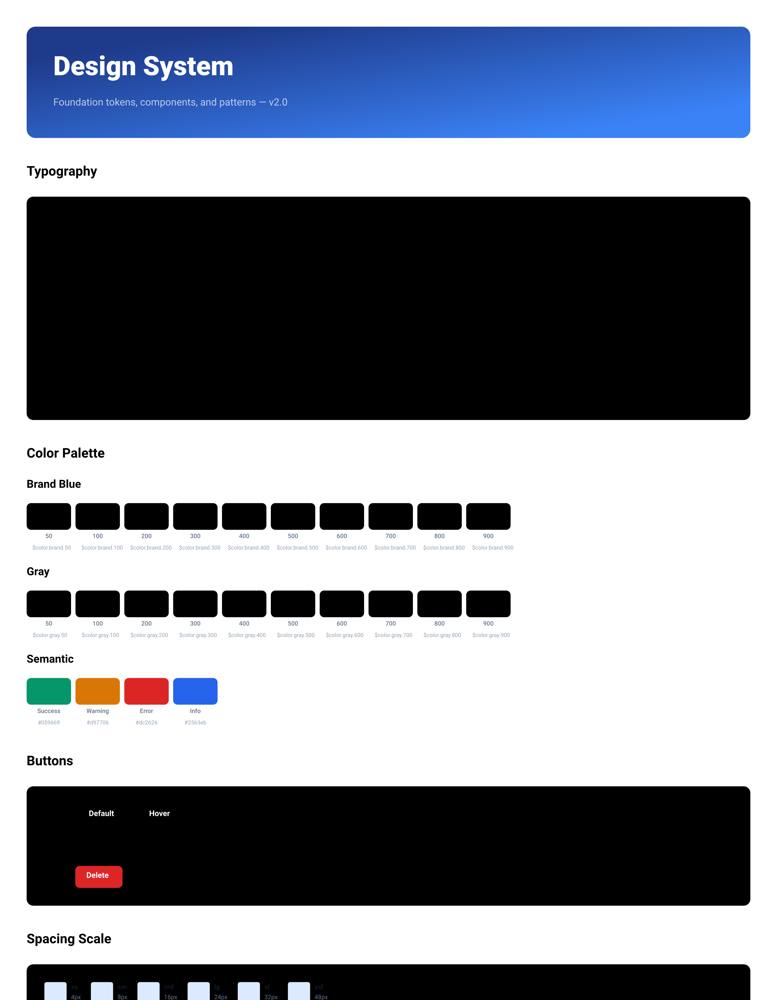

# Design Handover Document



## Overview

| Property | Value |
|----------|-------|
| Canvas | 1400 x 1800 |
| Theme | light |
| Background | `white` |
| Default Font | `400 14px Inter` |
| Frames | 114 |
| Text Nodes | 96 |
| Edges | 0 |

## Design Tokens

| Token | Value |
|-------|-------|
| `$color.brand` | `map[50:#eff6ff 100:#dbeafe 200:#bfdbfe 300:#93c5fd 400:#60a5fa 500:#3b82f6 600:#2563eb 700:#1d4ed8 800:#1e40af 900:#1e3a8a]` |
| `$color.gray` | `map[50:#f8fafc 100:#f1f5f9 200:#e2e8f0 300:#cbd5e1 400:#94a3b8 500:#64748b 600:#475569 700:#334155 800:#1e293b 900:#0f172a]` |
| `$color.semantic.error` | `#dc2626` |
| `$color.semantic.info` | `#2563eb` |
| `$color.semantic.success` | `#059669` |
| `$color.semantic.warning` | `#d97706` |
| `$font.body` | `400 16 Inter` |
| `$font.caption` | `500 12 Inter` |
| `$font.display` | `800 48 Inter` |
| `$font.h1` | `700 32 Inter` |
| `$font.h2` | `700 24 Inter` |
| `$font.h3` | `600 20 Inter` |
| `$font.mono` | `400 14 JetBrains Mono` |
| `$font.small` | `400 14 Inter` |
| `$radius.full` | `9999` |
| `$radius.lg` | `12` |
| `$radius.md` | `8` |
| `$radius.sm` | `4` |
| `$radius.xl` | `16` |
| `$spacing.lg` | `24` |
| `$spacing.md` | `16` |
| `$spacing.sm` | `8` |
| `$spacing.xl` | `32` |
| `$spacing.xs` | `4` |
| `$spacing.xxl` | `48` |

### CSS Variables

```css
:root {
  --color-brand: map[50:#eff6ff 100:#dbeafe 200:#bfdbfe 300:#93c5fd 400:#60a5fa 500:#3b82f6 600:#2563eb 700:#1d4ed8 800:#1e40af 900:#1e3a8a];
  --color-gray: map[50:#f8fafc 100:#f1f5f9 200:#e2e8f0 300:#cbd5e1 400:#94a3b8 500:#64748b 600:#475569 700:#334155 800:#1e293b 900:#0f172a];
  --color-semantic-error: #dc2626;
  --color-semantic-info: #2563eb;
  --color-semantic-success: #059669;
  --color-semantic-warning: #d97706;
  --font-body: 400 16 Inter;
  --font-caption: 500 12 Inter;
  --font-display: 800 48 Inter;
  --font-h1: 700 32 Inter;
  --font-h2: 700 24 Inter;
  --font-h3: 600 20 Inter;
  --font-mono: 400 14 JetBrains Mono;
  --font-small: 400 14 Inter;
  --radius-full: 9999;
  --radius-lg: 12;
  --radius-md: 8;
  --radius-sm: 4;
  --radius-xl: 16;
  --spacing-lg: 24;
  --spacing-md: 16;
  --spacing-sm: 8;
  --spacing-xl: 32;
  --spacing-xs: 4;
  --spacing-xxl: 48;
}
```

## Components

### `button-sample`

**Parameters:**

| Param | Default |
|-------|---------|
| `bg` | `#3b82f6` |
| `fg` | `white` |
| `label` | `Button` |
| `variant` | `filled` |

**Base CSS:**

```css
gap: 12px;
```

### `color-swatch`

**Parameters:**

| Param | Default |
|-------|---------|
| `color` | `#3b82f6` |
| `label` | `500` |

**Base CSS:**

```css
gap: 6px;
```

### `spacing-block`

**Parameters:**

| Param | Default |
|-------|---------|
| `label` | `md` |
| `size` | `16` |

**Base CSS:**

```css
gap: 8px;
```

## Component Tree

```
root (1400 x 1800 @ 0, 0)
  fill: white | padding: 48px | gap: 48px
  css: { display: flex; flex-direction: column; gap: 48px; padding: 48px; background-color: white; width: 1400px; height: 1800px; }
  |
+-- frame#ds-header (1304 x 200 @ 48, 48)
|       fill: gradient | padding: 48px | gap: 12px | radius: 16px
|       css: { display: flex; flex-direction: column; gap: 12px; padding: 48px; background: linear-gradient(135deg, #1e3a8a 0%, #3b82f6 100%); border-radius: 16px; }
|       |
|     +-- text "Design System" (1208 x 67 @ 48, 48)
|     |       font: 800 48px Inter | color: white
|     +-- text "Foundation tokens, components, and pa..." (1208 x 25 @ 48, 127)
|             font: 400 18px Inter | color: rgba(255,255,255,0.7)
+-- frame#typography (1304 x 460 @ 48, 296)
|       gap: 24px
|       css: { display: flex; flex-direction: column; gap: 24px; }
|       |
|     +-- text "Typography" (1304 x 34 @ 0, 0)
|     |       font: 700 24px Inter | color: $color.gray.900
|     +-- frame#type-samples (1304 x 402 @ 0, 58)
|             fill: $color.gray.50 | padding: 32px | gap: 20px | radius: 12px | border: 1px solid $color.gray.200
|             css: { display: flex; flex-direction: column; gap: 20px; padding: 32px; background-color: $color.gray.50; border-radius: 12px; border: 1px solid $color.gray.200; }
|             |
|           +-- frame (1240 x 67 @ 32, 32)
|           |       gap: 24px | direction: row | align: center
|           |       css: { display: flex; flex-direction: row; align-items: center; gap: 24px; }
|           |       |
|           |     +-- text "Display" (40 x 17 @ 0, 25)
|           |     |       font: 500 12px Inter | color: $color.gray.400
|           |     +-- text "The quick brown fox" (464 x 67 @ 64, 0)
|           |             font: 800 48px Inter | color: $color.gray.900
|           +-- frame (1240 x 45 @ 32, 119)
|           |       gap: 24px | direction: row | align: center
|           |       css: { display: flex; flex-direction: row; align-items: center; gap: 24px; }
|           |       |
|           |     +-- text "H1" (11 x 17 @ 0, 14)
|           |     |       font: 500 12px Inter | color: $color.gray.400
|           |     +-- text "The quick brown fox jumps" (404 x 45 @ 35, 0)
|           |             font: 700 32px Inter | color: $color.gray.900
|           +-- frame (1240 x 34 @ 32, 184)
|           |       gap: 24px | direction: row | align: center
|           |       css: { display: flex; flex-direction: row; align-items: center; gap: 24px; }
|           |       |
|           |     +-- text "H2" (13 x 17 @ 0, 8)
|           |     |       font: 500 12px Inter | color: $color.gray.400
|           |     +-- text "The quick brown fox jumps over" (363 x 34 @ 37, 0)
|           |             font: 700 24px Inter | color: $color.gray.900
|           +-- frame (1240 x 28 @ 32, 238)
|           |       gap: 24px | direction: row | align: center
|           |       css: { display: flex; flex-direction: row; align-items: center; gap: 24px; }
|           |       |
|           |     +-- text "H3" (13 x 17 @ 0, 6)
|           |     |       font: 500 12px Inter | color: $color.gray.400
|           |     +-- text "The quick brown fox jumps over the la..." (425 x 28 @ 37, 0)
|           |             font: 600 20px Inter | color: $color.gray.900
|           +-- frame (1240 x 45 @ 32, 286)
|           |       gap: 24px | direction: row | align: center
|           |       css: { display: flex; flex-direction: row; align-items: center; gap: 24px; }
|           |       |
|           |     +-- text "Body" (26 x 17 @ 0, 14)
|           |     |       font: 500 12px Inter | color: $color.gray.400
|           |     +-- text "The quick brown fox jumps over the la..." (600 x 45 @ 50, 0)
|           |             font: 400 16px Inter | color: $color.gray.700 | max-width: 600px
|           +-- frame (1240 x 20 @ 32, 350)
|                   gap: 24px | direction: row | align: center
|                   css: { display: flex; flex-direction: row; align-items: center; gap: 24px; }
|                   |
|                 +-- text "Mono" (27 x 17 @ 0, 1)
|                 |       font: 500 12px Inter | color: $color.gray.400
|                 +-- text "const x = await fetch('/api')" (244 x 20 @ 51, 0)
|                         font: 400 14px JetBrains Mono | color: $color.gray.700
+-- frame#colors (1304 x 506 @ 48, 804)
|       gap: 24px
|       css: { display: flex; flex-direction: column; gap: 24px; }
|       |
|     +-- text "Color Palette" (1304 x 34 @ 0, 0)
|     |       font: 700 24px Inter | color: $color.gray.900
|     +-- frame (1304 x 133 @ 0, 58)
|     |       gap: 16px
|     |       css: { display: flex; flex-direction: column; gap: 16px; }
|     |       |
|     |     +-- text "Brand Blue" (1304 x 28 @ 0, 0)
|     |     |       font: 600 20px Inter | color: $color.gray.700
|     |     +-- frame#brand-swatches (1304 x 89 @ 0, 44)
|     |             gap: 8px | direction: row
|     |             css: { display: flex; flex-direction: row; gap: 8px; }
|     |             |
|     |           +-- [color-swatch] (80 x 89 @ 0, 0)
|     |           |       gap: 6px | align: center
|     |           |       css: { display: flex; flex-direction: column; align-items: center; gap: 6px; width: 80px; }
|     |           |       |
|     |           |     +-- frame (80 x 48 @ 0, 0)
|     |           |     |       fill: $color.brand.50 | radius: 8px
|     |           |     |       css: { background-color: $color.brand.50; border-radius: 8px; width: 80px; height: 48px; }
|     |           |     +-- text "50" (11 x 15 @ 34, 54)
|     |           |     |       font: 500 11px Inter | color: #64748b | text-align: center
|     |           |     +-- text "$color.brand.50" (90 x 14 @ 0, 75)
|     |           |             font: 400 10px JetBrains Mono | color: #94a3b8 | text-align: center
|     |           +-- [color-swatch] (80 x 89 @ 88, 0)
|     |           |       gap: 6px | align: center
|     |           |       css: { display: flex; flex-direction: column; align-items: center; gap: 6px; width: 80px; }
|     |           |       |
|     |           |     +-- frame (80 x 48 @ 0, 0)
|     |           |     |       fill: $color.brand.100 | radius: 8px
|     |           |     |       css: { background-color: $color.brand.100; border-radius: 8px; width: 80px; height: 48px; }
|     |           |     +-- text "100" (15 x 15 @ 33, 54)
|     |           |     |       font: 500 11px Inter | color: #64748b | text-align: center
|     |           |     +-- text "$color.brand.100" (96 x 14 @ 0, 75)
|     |           |             font: 400 10px JetBrains Mono | color: #94a3b8 | text-align: center
|     |           +-- [color-swatch] (80 x 89 @ 176, 0)
|     |           |       gap: 6px | align: center
|     |           |       css: { display: flex; flex-direction: column; align-items: center; gap: 6px; width: 80px; }
|     |           |       |
|     |           |     +-- frame (80 x 48 @ 0, 0)
|     |           |     |       fill: $color.brand.200 | radius: 8px
|     |           |     |       css: { background-color: $color.brand.200; border-radius: 8px; width: 80px; height: 48px; }
|     |           |     +-- text "200" (17 x 15 @ 31, 54)
|     |           |     |       font: 500 11px Inter | color: #64748b | text-align: center
|     |           |     +-- text "$color.brand.200" (96 x 14 @ 0, 75)
|     |           |             font: 400 10px JetBrains Mono | color: #94a3b8 | text-align: center
|     |           +-- [color-swatch] (80 x 89 @ 264, 0)
|     |           |       gap: 6px | align: center
|     |           |       css: { display: flex; flex-direction: column; align-items: center; gap: 6px; width: 80px; }
|     |           |       |
|     |           |     +-- frame (80 x 48 @ 0, 0)
|     |           |     |       fill: $color.brand.300 | radius: 8px
|     |           |     |       css: { background-color: $color.brand.300; border-radius: 8px; width: 80px; height: 48px; }
|     |           |     +-- text "300" (17 x 15 @ 31, 54)
|     |           |     |       font: 500 11px Inter | color: #64748b | text-align: center
|     |           |     +-- text "$color.brand.300" (96 x 14 @ 0, 75)
|     |           |             font: 400 10px JetBrains Mono | color: #94a3b8 | text-align: center
|     |           +-- [color-swatch] (80 x 89 @ 352, 0)
|     |           |       gap: 6px | align: center
|     |           |       css: { display: flex; flex-direction: column; align-items: center; gap: 6px; width: 80px; }
|     |           |       |
|     |           |     +-- frame (80 x 48 @ 0, 0)
|     |           |     |       fill: $color.brand.400 | radius: 8px
|     |           |     |       css: { background-color: $color.brand.400; border-radius: 8px; width: 80px; height: 48px; }
|     |           |     +-- text "400" (17 x 15 @ 31, 54)
|     |           |     |       font: 500 11px Inter | color: #64748b | text-align: center
|     |           |     +-- text "$color.brand.400" (96 x 14 @ 0, 75)
|     |           |             font: 400 10px JetBrains Mono | color: #94a3b8 | text-align: center
|     |           +-- [color-swatch] (80 x 89 @ 440, 0)
|     |           |       gap: 6px | align: center
|     |           |       css: { display: flex; flex-direction: column; align-items: center; gap: 6px; width: 80px; }
|     |           |       |
|     |           |     +-- frame (80 x 48 @ 0, 0)
|     |           |     |       fill: $color.brand.500 | radius: 8px
|     |           |     |       css: { background-color: $color.brand.500; border-radius: 8px; width: 80px; height: 48px; }
|     |           |     +-- text "500" (17 x 15 @ 31, 54)
|     |           |     |       font: 500 11px Inter | color: #64748b | text-align: center
|     |           |     +-- text "$color.brand.500" (96 x 14 @ 0, 75)
|     |           |             font: 400 10px JetBrains Mono | color: #94a3b8 | text-align: center
|     |           +-- [color-swatch] (80 x 89 @ 528, 0)
|     |           |       gap: 6px | align: center
|     |           |       css: { display: flex; flex-direction: column; align-items: center; gap: 6px; width: 80px; }
|     |           |       |
|     |           |     +-- frame (80 x 48 @ 0, 0)
|     |           |     |       fill: $color.brand.600 | radius: 8px
|     |           |     |       css: { background-color: $color.brand.600; border-radius: 8px; width: 80px; height: 48px; }
|     |           |     +-- text "600" (17 x 15 @ 31, 54)
|     |           |     |       font: 500 11px Inter | color: #64748b | text-align: center
|     |           |     +-- text "$color.brand.600" (96 x 14 @ 0, 75)
|     |           |             font: 400 10px JetBrains Mono | color: #94a3b8 | text-align: center
|     |           +-- [color-swatch] (80 x 89 @ 616, 0)
|     |           |       gap: 6px | align: center
|     |           |       css: { display: flex; flex-direction: column; align-items: center; gap: 6px; width: 80px; }
|     |           |       |
|     |           |     +-- frame (80 x 48 @ 0, 0)
|     |           |     |       fill: $color.brand.700 | radius: 8px
|     |           |     |       css: { background-color: $color.brand.700; border-radius: 8px; width: 80px; height: 48px; }
|     |           |     +-- text "700" (17 x 15 @ 31, 54)
|     |           |     |       font: 500 11px Inter | color: #64748b | text-align: center
|     |           |     +-- text "$color.brand.700" (96 x 14 @ 0, 75)
|     |           |             font: 400 10px JetBrains Mono | color: #94a3b8 | text-align: center
|     |           +-- [color-swatch] (80 x 89 @ 704, 0)
|     |           |       gap: 6px | align: center
|     |           |       css: { display: flex; flex-direction: column; align-items: center; gap: 6px; width: 80px; }
|     |           |       |
|     |           |     +-- frame (80 x 48 @ 0, 0)
|     |           |     |       fill: $color.brand.800 | radius: 8px
|     |           |     |       css: { background-color: $color.brand.800; border-radius: 8px; width: 80px; height: 48px; }
|     |           |     +-- text "800" (17 x 15 @ 31, 54)
|     |           |     |       font: 500 11px Inter | color: #64748b | text-align: center
|     |           |     +-- text "$color.brand.800" (96 x 14 @ 0, 75)
|     |           |             font: 400 10px JetBrains Mono | color: #94a3b8 | text-align: center
|     |           +-- [color-swatch] (80 x 89 @ 792, 0)
|     |                   gap: 6px | align: center
|     |                   css: { display: flex; flex-direction: column; align-items: center; gap: 6px; width: 80px; }
|     |                   |
|     |                 +-- frame (80 x 48 @ 0, 0)
|     |                 |       fill: $color.brand.900 | radius: 8px
|     |                 |       css: { background-color: $color.brand.900; border-radius: 8px; width: 80px; height: 48px; }
|     |                 +-- text "900" (17 x 15 @ 31, 54)
|     |                 |       font: 500 11px Inter | color: #64748b | text-align: center
|     |                 +-- text "$color.brand.900" (96 x 14 @ 0, 75)
|     |                         font: 400 10px JetBrains Mono | color: #94a3b8 | text-align: center
|     +-- frame (1304 x 133 @ 0, 215)
|     |       gap: 16px
|     |       css: { display: flex; flex-direction: column; gap: 16px; }
|     |       |
|     |     +-- text "Gray" (1304 x 28 @ 0, 0)
|     |     |       font: 600 20px Inter | color: $color.gray.700
|     |     +-- frame#gray-swatches (1304 x 89 @ 0, 44)
|     |             gap: 8px | direction: row
|     |             css: { display: flex; flex-direction: row; gap: 8px; }
|     |             |
|     |           +-- [color-swatch] (80 x 89 @ 0, 0)
|     |           |       gap: 6px | align: center
|     |           |       css: { display: flex; flex-direction: column; align-items: center; gap: 6px; width: 80px; }
|     |           |       |
|     |           |     +-- frame (80 x 48 @ 0, 0)
|     |           |     |       fill: $color.gray.50 | radius: 8px
|     |           |     |       css: { background-color: $color.gray.50; border-radius: 8px; width: 80px; height: 48px; }
|     |           |     +-- text "50" (11 x 15 @ 34, 54)
|     |           |     |       font: 500 11px Inter | color: #64748b | text-align: center
|     |           |     +-- text "$color.gray.50" (84 x 14 @ 0, 75)
|     |           |             font: 400 10px JetBrains Mono | color: #94a3b8 | text-align: center
|     |           +-- [color-swatch] (80 x 89 @ 88, 0)
|     |           |       gap: 6px | align: center
|     |           |       css: { display: flex; flex-direction: column; align-items: center; gap: 6px; width: 80px; }
|     |           |       |
|     |           |     +-- frame (80 x 48 @ 0, 0)
|     |           |     |       fill: $color.gray.100 | radius: 8px
|     |           |     |       css: { background-color: $color.gray.100; border-radius: 8px; width: 80px; height: 48px; }
|     |           |     +-- text "100" (15 x 15 @ 33, 54)
|     |           |     |       font: 500 11px Inter | color: #64748b | text-align: center
|     |           |     +-- text "$color.gray.100" (90 x 14 @ 0, 75)
|     |           |             font: 400 10px JetBrains Mono | color: #94a3b8 | text-align: center
|     |           +-- [color-swatch] (80 x 89 @ 176, 0)
|     |           |       gap: 6px | align: center
|     |           |       css: { display: flex; flex-direction: column; align-items: center; gap: 6px; width: 80px; }
|     |           |       |
|     |           |     +-- frame (80 x 48 @ 0, 0)
|     |           |     |       fill: $color.gray.200 | radius: 8px
|     |           |     |       css: { background-color: $color.gray.200; border-radius: 8px; width: 80px; height: 48px; }
|     |           |     +-- text "200" (17 x 15 @ 31, 54)
|     |           |     |       font: 500 11px Inter | color: #64748b | text-align: center
|     |           |     +-- text "$color.gray.200" (90 x 14 @ 0, 75)
|     |           |             font: 400 10px JetBrains Mono | color: #94a3b8 | text-align: center
|     |           +-- [color-swatch] (80 x 89 @ 264, 0)
|     |           |       gap: 6px | align: center
|     |           |       css: { display: flex; flex-direction: column; align-items: center; gap: 6px; width: 80px; }
|     |           |       |
|     |           |     +-- frame (80 x 48 @ 0, 0)
|     |           |     |       fill: $color.gray.300 | radius: 8px
|     |           |     |       css: { background-color: $color.gray.300; border-radius: 8px; width: 80px; height: 48px; }
|     |           |     +-- text "300" (17 x 15 @ 31, 54)
|     |           |     |       font: 500 11px Inter | color: #64748b | text-align: center
|     |           |     +-- text "$color.gray.300" (90 x 14 @ 0, 75)
|     |           |             font: 400 10px JetBrains Mono | color: #94a3b8 | text-align: center
|     |           +-- [color-swatch] (80 x 89 @ 352, 0)
|     |           |       gap: 6px | align: center
|     |           |       css: { display: flex; flex-direction: column; align-items: center; gap: 6px; width: 80px; }
|     |           |       |
|     |           |     +-- frame (80 x 48 @ 0, 0)
|     |           |     |       fill: $color.gray.400 | radius: 8px
|     |           |     |       css: { background-color: $color.gray.400; border-radius: 8px; width: 80px; height: 48px; }
|     |           |     +-- text "400" (17 x 15 @ 31, 54)
|     |           |     |       font: 500 11px Inter | color: #64748b | text-align: center
|     |           |     +-- text "$color.gray.400" (90 x 14 @ 0, 75)
|     |           |             font: 400 10px JetBrains Mono | color: #94a3b8 | text-align: center
|     |           +-- [color-swatch] (80 x 89 @ 440, 0)
|     |           |       gap: 6px | align: center
|     |           |       css: { display: flex; flex-direction: column; align-items: center; gap: 6px; width: 80px; }
|     |           |       |
|     |           |     +-- frame (80 x 48 @ 0, 0)
|     |           |     |       fill: $color.gray.500 | radius: 8px
|     |           |     |       css: { background-color: $color.gray.500; border-radius: 8px; width: 80px; height: 48px; }
|     |           |     +-- text "500" (17 x 15 @ 31, 54)
|     |           |     |       font: 500 11px Inter | color: #64748b | text-align: center
|     |           |     +-- text "$color.gray.500" (90 x 14 @ 0, 75)
|     |           |             font: 400 10px JetBrains Mono | color: #94a3b8 | text-align: center
|     |           +-- [color-swatch] (80 x 89 @ 528, 0)
|     |           |       gap: 6px | align: center
|     |           |       css: { display: flex; flex-direction: column; align-items: center; gap: 6px; width: 80px; }
|     |           |       |
|     |           |     +-- frame (80 x 48 @ 0, 0)
|     |           |     |       fill: $color.gray.600 | radius: 8px
|     |           |     |       css: { background-color: $color.gray.600; border-radius: 8px; width: 80px; height: 48px; }
|     |           |     +-- text "600" (17 x 15 @ 31, 54)
|     |           |     |       font: 500 11px Inter | color: #64748b | text-align: center
|     |           |     +-- text "$color.gray.600" (90 x 14 @ 0, 75)
|     |           |             font: 400 10px JetBrains Mono | color: #94a3b8 | text-align: center
|     |           +-- [color-swatch] (80 x 89 @ 616, 0)
|     |           |       gap: 6px | align: center
|     |           |       css: { display: flex; flex-direction: column; align-items: center; gap: 6px; width: 80px; }
|     |           |       |
|     |           |     +-- frame (80 x 48 @ 0, 0)
|     |           |     |       fill: $color.gray.700 | radius: 8px
|     |           |     |       css: { background-color: $color.gray.700; border-radius: 8px; width: 80px; height: 48px; }
|     |           |     +-- text "700" (17 x 15 @ 31, 54)
|     |           |     |       font: 500 11px Inter | color: #64748b | text-align: center
|     |           |     +-- text "$color.gray.700" (90 x 14 @ 0, 75)
|     |           |             font: 400 10px JetBrains Mono | color: #94a3b8 | text-align: center
|     |           +-- [color-swatch] (80 x 89 @ 704, 0)
|     |           |       gap: 6px | align: center
|     |           |       css: { display: flex; flex-direction: column; align-items: center; gap: 6px; width: 80px; }
|     |           |       |
|     |           |     +-- frame (80 x 48 @ 0, 0)
|     |           |     |       fill: $color.gray.800 | radius: 8px
|     |           |     |       css: { background-color: $color.gray.800; border-radius: 8px; width: 80px; height: 48px; }
|     |           |     +-- text "800" (17 x 15 @ 31, 54)
|     |           |     |       font: 500 11px Inter | color: #64748b | text-align: center
|     |           |     +-- text "$color.gray.800" (90 x 14 @ 0, 75)
|     |           |             font: 400 10px JetBrains Mono | color: #94a3b8 | text-align: center
|     |           +-- [color-swatch] (80 x 89 @ 792, 0)
|     |                   gap: 6px | align: center
|     |                   css: { display: flex; flex-direction: column; align-items: center; gap: 6px; width: 80px; }
|     |                   |
|     |                 +-- frame (80 x 48 @ 0, 0)
|     |                 |       fill: $color.gray.900 | radius: 8px
|     |                 |       css: { background-color: $color.gray.900; border-radius: 8px; width: 80px; height: 48px; }
|     |                 +-- text "900" (17 x 15 @ 31, 54)
|     |                 |       font: 500 11px Inter | color: #64748b | text-align: center
|     |                 +-- text "$color.gray.900" (90 x 14 @ 0, 75)
|     |                         font: 400 10px JetBrains Mono | color: #94a3b8 | text-align: center
|     +-- frame (1304 x 133 @ 0, 372)
|             gap: 16px
|             css: { display: flex; flex-direction: column; gap: 16px; }
|             |
|           +-- text "Semantic" (1304 x 28 @ 0, 0)
|           |       font: 600 20px Inter | color: $color.gray.700
|           +-- frame#semantic-swatches (1304 x 89 @ 0, 44)
|                   gap: 8px | direction: row
|                   css: { display: flex; flex-direction: row; gap: 8px; }
|                   |
|                 +-- [color-swatch] (80 x 89 @ 0, 0)
|                 |       gap: 6px | align: center
|                 |       css: { display: flex; flex-direction: column; align-items: center; gap: 6px; width: 80px; }
|                 |       |
|                 |     +-- frame (80 x 48 @ 0, 0)
|                 |     |       fill: #059669 | radius: 8px
|                 |     |       css: { background-color: #059669; border-radius: 8px; width: 80px; height: 48px; }
|                 |     +-- text "Success" (41 x 15 @ 20, 54)
|                 |     |       font: 500 11px Inter | color: #64748b | text-align: center
|                 |     +-- text "#059669" (42 x 14 @ 19, 75)
|                 |             font: 400 10px JetBrains Mono | color: #94a3b8 | text-align: center
|                 +-- [color-swatch] (80 x 89 @ 88, 0)
|                 |       gap: 6px | align: center
|                 |       css: { display: flex; flex-direction: column; align-items: center; gap: 6px; width: 80px; }
|                 |       |
|                 |     +-- frame (80 x 48 @ 0, 0)
|                 |     |       fill: #d97706 | radius: 8px
|                 |     |       css: { background-color: #d97706; border-radius: 8px; width: 80px; height: 48px; }
|                 |     +-- text "Warning" (39 x 15 @ 20, 54)
|                 |     |       font: 500 11px Inter | color: #64748b | text-align: center
|                 |     +-- text "#d97706" (42 x 14 @ 19, 75)
|                 |             font: 400 10px JetBrains Mono | color: #94a3b8 | text-align: center
|                 +-- [color-swatch] (80 x 89 @ 176, 0)
|                 |       gap: 6px | align: center
|                 |       css: { display: flex; flex-direction: column; align-items: center; gap: 6px; width: 80px; }
|                 |       |
|                 |     +-- frame (80 x 48 @ 0, 0)
|                 |     |       fill: #dc2626 | radius: 8px
|                 |     |       css: { background-color: #dc2626; border-radius: 8px; width: 80px; height: 48px; }
|                 |     +-- text "Error" (29 x 15 @ 25, 54)
|                 |     |       font: 500 11px Inter | color: #64748b | text-align: center
|                 |     +-- text "#dc2626" (42 x 14 @ 19, 75)
|                 |             font: 400 10px JetBrains Mono | color: #94a3b8 | text-align: center
|                 +-- [color-swatch] (80 x 89 @ 264, 0)
|                         gap: 6px | align: center
|                         css: { display: flex; flex-direction: column; align-items: center; gap: 6px; width: 80px; }
|                         |
|                       +-- frame (80 x 48 @ 0, 0)
|                       |       fill: #2563eb | radius: 8px
|                       |       css: { background-color: #2563eb; border-radius: 8px; width: 80px; height: 48px; }
|                       +-- text "Info" (20 x 15 @ 30, 54)
|                       |       font: 500 11px Inter | color: #64748b | text-align: center
|                       +-- text "#2563eb" (42 x 14 @ 19, 75)
|                               font: 400 10px JetBrains Mono | color: #94a3b8 | text-align: center
+-- frame#buttons (1304 x 272 @ 48, 1358)
|       gap: 24px
|       css: { display: flex; flex-direction: column; gap: 24px; }
|       |
|     +-- text "Buttons" (1304 x 34 @ 0, 0)
|     |       font: 700 24px Inter | color: $color.gray.900
|     +-- frame#button-samples (1304 x 215 @ 0, 58)
|             fill: $color.gray.50 | padding: 32px | gap: 16px | radius: 12px | border: 1px solid $color.gray.200
|             css: { display: flex; flex-direction: column; gap: 16px; padding: 32px; background-color: $color.gray.50; border-radius: 12px; border: 1px solid $color.gray.200; }
|             |
|           +-- frame (1240 x 40 @ 32, 32)
|           |       gap: 16px | direction: row | align: center
|           |       css: { display: flex; flex-direction: row; align-items: center; gap: 16px; }
|           |       |
|           |     +-- text "Primary" (44 x 17 @ 0, 11)
|           |     |       font: 500 12px Inter | color: $color.gray.400
|           |     +-- [button-sample] (93 x 40 @ 60, 0)
|           |     |       gap: 12px | direction: row | align: center
|           |     |       css: { display: flex; flex-direction: row; align-items: center; gap: 12px; }
|           |     |       |
|           |     |     +-- frame (93 x 40 @ 0, 0)
|           |     |             fill: $color.brand.600 | padding: 10px 20px | align: center | radius: 8px
|           |     |             css: { display: flex; flex-direction: column; align-items: center; padding: 10px 20px; background-color: $color.brand.600; border-radius: 8px; }
|           |     |             |
|           |     |           +-- text "Default" (53 x 20 @ 20, 10)
|           |     |                   font: 600 14px Inter | color: white
|           |     +-- [button-sample] (79 x 40 @ 169, 0)
|           |     |       gap: 12px | direction: row | align: center
|           |     |       css: { display: flex; flex-direction: row; align-items: center; gap: 12px; }
|           |     |       |
|           |     |     +-- frame (79 x 40 @ 0, 0)
|           |     |             fill: $color.brand.700 | padding: 10px 20px | align: center | radius: 8px
|           |     |             css: { display: flex; flex-direction: column; align-items: center; padding: 10px 20px; background-color: $color.brand.700; border-radius: 8px; }
|           |     |             |
|           |     |           +-- text "Hover" (39 x 20 @ 20, 10)
|           |     |                   font: 600 14px Inter | color: white
|           |     +-- [button-sample] (97 x 40 @ 264, 0)
|           |             gap: 12px | direction: row | align: center
|           |             css: { display: flex; flex-direction: row; align-items: center; gap: 12px; }
|           |             |
|           |           +-- frame (97 x 40 @ 0, 0)
|           |                   fill: $color.gray.200 | padding: 10px 20px | align: center | radius: 8px
|           |                   css: { display: flex; flex-direction: column; align-items: center; padding: 10px 20px; background-color: $color.gray.200; border-radius: 8px; }
|           |                   |
|           |                 +-- text "Disabled" (57 x 20 @ 20, 10)
|           |                         font: 600 14px Inter | color: $color.gray.400
|           +-- frame (1240 x 40 @ 32, 88)
|           |       gap: 16px | direction: row | align: center
|           |       css: { display: flex; flex-direction: row; align-items: center; gap: 16px; }
|           |       |
|           |     +-- text "Secondary" (57 x 17 @ 0, 11)
|           |     |       font: 500 12px Inter | color: $color.gray.400
|           |     +-- [button-sample] (93 x 40 @ 73, 0)
|           |     |       gap: 12px | direction: row | align: center
|           |     |       css: { display: flex; flex-direction: row; align-items: center; gap: 12px; }
|           |     |       |
|           |     |     +-- frame (93 x 40 @ 0, 0)
|           |     |             fill: $color.gray.100 | padding: 10px 20px | align: center | radius: 8px
|           |     |             css: { display: flex; flex-direction: column; align-items: center; padding: 10px 20px; background-color: $color.gray.100; border-radius: 8px; }
|           |     |             |
|           |     |           +-- text "Default" (53 x 20 @ 20, 10)
|           |     |                   font: 600 14px Inter | color: $color.gray.800
|           |     +-- [button-sample] (79 x 40 @ 182, 0)
|           |             gap: 12px | direction: row | align: center
|           |             css: { display: flex; flex-direction: row; align-items: center; gap: 12px; }
|           |             |
|           |           +-- frame (79 x 40 @ 0, 0)
|           |                   fill: $color.gray.200 | padding: 10px 20px | align: center | radius: 8px
|           |                   css: { display: flex; flex-direction: column; align-items: center; padding: 10px 20px; background-color: $color.gray.200; border-radius: 8px; }
|           |                   |
|           |                 +-- text "Hover" (39 x 20 @ 20, 10)
|           |                         font: 600 14px Inter | color: $color.gray.800
|           +-- frame (1240 x 40 @ 32, 143)
|                   gap: 16px | direction: row | align: center
|                   css: { display: flex; flex-direction: row; align-items: center; gap: 16px; }
|                   |
|                 +-- text "Danger" (40 x 17 @ 0, 11)
|                 |       font: 500 12px Inter | color: $color.gray.400
|                 +-- [button-sample] (85 x 40 @ 56, 0)
|                         gap: 12px | direction: row | align: center
|                         css: { display: flex; flex-direction: row; align-items: center; gap: 12px; }
|                         |
|                       +-- frame (85 x 40 @ 0, 0)
|                               fill: #dc2626 | padding: 10px 20px | align: center | radius: 8px
|                               css: { display: flex; flex-direction: column; align-items: center; padding: 10px 20px; background-color: #dc2626; border-radius: 8px; }
|                               |
|                             +-- text "Delete" (45 x 20 @ 20, 10)
|                                     font: 600 14px Inter | color: white
+-- frame#spacing-section (1304 x 162 @ 48, 1678)
|       gap: 24px
|       css: { display: flex; flex-direction: column; gap: 24px; }
|       |
|     +-- text "Spacing Scale" (1304 x 34 @ 0, 0)
|     |       font: 700 24px Inter | color: $color.gray.900
|     +-- frame#spacing-samples (1304 x 104 @ 0, 58)
|             fill: $color.gray.50 | padding: 32px | gap: 16px | direction: row | radius: 12px | border: 1px solid $color.gray.200
|             css: { display: flex; flex-direction: row; gap: 16px; padding: 32px; background-color: $color.gray.50; border-radius: 12px; border: 1px solid $color.gray.200; }
|             |
|           +-- [spacing-block] (68 x 40 @ 32, 32)
|           |       gap: 8px | direction: row | align: center
|           |       css: { display: flex; flex-direction: row; align-items: center; gap: 8px; }
|           |       |
|           |     +-- frame (40 x 40 @ 0, 0)
|           |     |       fill: #dbeafe | radius: 4px
|           |     |       css: { background-color: #dbeafe; border-radius: 4px; width: 40px; height: 40px; }
|           |     +-- frame (20 x 34 @ 48, 3)
|           |             gap: 2px
|           |             css: { display: flex; flex-direction: column; gap: 2px; }
|           |             |
|           |           +-- text "xs" (20 x 17 @ 0, 0)
|           |           |       font: 600 12px Inter | color: #0f172a
|           |           +-- text "4px" (20 x 15 @ 0, 19)
|           |                   font: 400 11px JetBrains Mono | color: #64748b
|           +-- [spacing-block] (68 x 40 @ 116, 32)
|           |       gap: 8px | direction: row | align: center
|           |       css: { display: flex; flex-direction: row; align-items: center; gap: 8px; }
|           |       |
|           |     +-- frame (40 x 40 @ 0, 0)
|           |     |       fill: #dbeafe | radius: 4px
|           |     |       css: { background-color: #dbeafe; border-radius: 4px; width: 40px; height: 40px; }
|           |     +-- frame (20 x 34 @ 48, 3)
|           |             gap: 2px
|           |             css: { display: flex; flex-direction: column; gap: 2px; }
|           |             |
|           |           +-- text "sm" (20 x 17 @ 0, 0)
|           |           |       font: 600 12px Inter | color: #0f172a
|           |           +-- text "8px" (20 x 15 @ 0, 19)
|           |                   font: 400 11px JetBrains Mono | color: #64748b
|           +-- [spacing-block] (74 x 40 @ 200, 32)
|           |       gap: 8px | direction: row | align: center
|           |       css: { display: flex; flex-direction: row; align-items: center; gap: 8px; }
|           |       |
|           |     +-- frame (40 x 40 @ 0, 0)
|           |     |       fill: #dbeafe | radius: 4px
|           |     |       css: { background-color: #dbeafe; border-radius: 4px; width: 40px; height: 40px; }
|           |     +-- frame (26 x 34 @ 48, 3)
|           |             gap: 2px
|           |             css: { display: flex; flex-direction: column; gap: 2px; }
|           |             |
|           |           +-- text "md" (26 x 17 @ 0, 0)
|           |           |       font: 600 12px Inter | color: #0f172a
|           |           +-- text "16px" (26 x 15 @ 0, 19)
|           |                   font: 400 11px JetBrains Mono | color: #64748b
|           +-- [spacing-block] (74 x 40 @ 290, 32)
|           |       gap: 8px | direction: row | align: center
|           |       css: { display: flex; flex-direction: row; align-items: center; gap: 8px; }
|           |       |
|           |     +-- frame (40 x 40 @ 0, 0)
|           |     |       fill: #dbeafe | radius: 4px
|           |     |       css: { background-color: #dbeafe; border-radius: 4px; width: 40px; height: 40px; }
|           |     +-- frame (26 x 34 @ 48, 3)
|           |             gap: 2px
|           |             css: { display: flex; flex-direction: column; gap: 2px; }
|           |             |
|           |           +-- text "lg" (26 x 17 @ 0, 0)
|           |           |       font: 600 12px Inter | color: #0f172a
|           |           +-- text "24px" (26 x 15 @ 0, 19)
|           |                   font: 400 11px JetBrains Mono | color: #64748b
|           +-- [spacing-block] (74 x 40 @ 380, 32)
|           |       gap: 8px | direction: row | align: center
|           |       css: { display: flex; flex-direction: row; align-items: center; gap: 8px; }
|           |       |
|           |     +-- frame (40 x 40 @ 0, 0)
|           |     |       fill: #dbeafe | radius: 4px
|           |     |       css: { background-color: #dbeafe; border-radius: 4px; width: 40px; height: 40px; }
|           |     +-- frame (26 x 34 @ 48, 3)
|           |             gap: 2px
|           |             css: { display: flex; flex-direction: column; gap: 2px; }
|           |             |
|           |           +-- text "xl" (26 x 17 @ 0, 0)
|           |           |       font: 600 12px Inter | color: #0f172a
|           |           +-- text "32px" (26 x 15 @ 0, 19)
|           |                   font: 400 11px JetBrains Mono | color: #64748b
|           +-- [spacing-block] (74 x 40 @ 471, 32)
|                   gap: 8px | direction: row | align: center
|                   css: { display: flex; flex-direction: row; align-items: center; gap: 8px; }
|                   |
|                 +-- frame (40 x 40 @ 0, 0)
|                 |       fill: #dbeafe | radius: 4px
|                 |       css: { background-color: #dbeafe; border-radius: 4px; width: 40px; height: 40px; }
|                 +-- frame (26 x 34 @ 48, 3)
|                         gap: 2px
|                         css: { display: flex; flex-direction: column; gap: 2px; }
|                         |
|                       +-- text "xxl" (26 x 17 @ 0, 0)
|                       |       font: 600 12px Inter | color: #0f172a
|                       +-- text "48px" (26 x 15 @ 0, 19)
|                               font: 400 11px JetBrains Mono | color: #64748b
+-- frame#radius-section (1304 x 210 @ 48, 1888)
        gap: 24px
        css: { display: flex; flex-direction: column; gap: 24px; }
        |
      +-- text "Border Radius" (1304 x 34 @ 0, 0)
      |       font: 700 24px Inter | color: $color.gray.900
      +-- frame#radius-samples (1304 x 153 @ 0, 58)
              fill: $color.gray.50 | padding: 32px | gap: 16px | direction: row | radius: 12px | border: 1px solid $color.gray.200
              css: { display: flex; flex-direction: row; gap: 16px; padding: 32px; background-color: $color.gray.50; border-radius: 12px; border: 1px solid $color.gray.200; }
              |
            +-- frame (64 x 89 @ 32, 32)
            |       gap: 8px | align: center
            |       css: { display: flex; flex-direction: column; align-items: center; gap: 8px; }
            |       |
            |     +-- frame (64 x 64 @ 0, 0)
            |     |       fill: $color.brand.500 | radius: 4px
            |     |       css: { background-color: $color.brand.500; border-radius: 4px; width: 64px; height: 64px; }
            |     +-- text "sm (4)" (31 x 17 @ 16, 72)
            |             font: 500 12px Inter | color: $color.gray.500
            +-- frame (64 x 89 @ 112, 32)
            |       gap: 8px | align: center
            |       css: { display: flex; flex-direction: column; align-items: center; gap: 8px; }
            |       |
            |     +-- frame (64 x 64 @ 0, 0)
            |     |       fill: $color.brand.500 | radius: 8px
            |     |       css: { background-color: $color.brand.500; border-radius: 8px; width: 64px; height: 64px; }
            |     +-- text "md (8)" (31 x 17 @ 16, 72)
            |             font: 500 12px Inter | color: $color.gray.500
            +-- frame (64 x 89 @ 192, 32)
            |       gap: 8px | align: center
            |       css: { display: flex; flex-direction: column; align-items: center; gap: 8px; }
            |       |
            |     +-- frame (64 x 64 @ 0, 0)
            |     |       fill: $color.brand.500 | radius: 12px
            |     |       css: { background-color: $color.brand.500; border-radius: 12px; width: 64px; height: 64px; }
            |     +-- text "lg (12)" (30 x 17 @ 17, 72)
            |             font: 500 12px Inter | color: $color.gray.500
            +-- frame (64 x 89 @ 272, 32)
            |       gap: 8px | align: center
            |       css: { display: flex; flex-direction: column; align-items: center; gap: 8px; }
            |       |
            |     +-- frame (64 x 64 @ 0, 0)
            |     |       fill: $color.brand.500 | radius: 16px
            |     |       css: { background-color: $color.brand.500; border-radius: 16px; width: 64px; height: 64px; }
            |     +-- text "xl (16)" (30 x 17 @ 17, 72)
            |             font: 500 12px Inter | color: $color.gray.500
            +-- frame (64 x 89 @ 352, 32)
                    gap: 8px | align: center
                    css: { display: flex; flex-direction: column; align-items: center; gap: 8px; }
                    |
                  +-- frame (64 x 64 @ 0, 0)
                  |       fill: $color.brand.500 | radius: 9999px
                  |       css: { background-color: $color.brand.500; border-radius: 9999px; width: 64px; height: 64px; }
                  +-- text "full" (19 x 17 @ 22, 72)
                          font: 500 12px Inter | color: $color.gray.500
```

## Implementation Notes

### DSL → CSS Property Mapping

| DSL Property | CSS Equivalent |
|-------------|----------------|
| `direction: row` | `flex-direction: row` |
| `direction: column` | `flex-direction: column` |
| `justify: start` | `justify-content: flex-start` |
| `justify: center` | `justify-content: center` |
| `justify: end` | `justify-content: flex-end` |
| `justify: between` | `justify-content: space-between` |
| `justify: around` | `justify-content: space-around` |
| `align: start` | `align-items: flex-start` |
| `align: center` | `align-items: center` |
| `align: end` | `align-items: flex-end` |
| `align: stretch` | `align-items: stretch` |
| `layout: grid` + `columns: N` | `display: grid; grid-template-columns: repeat(N, 1fr)` |
| `fill: #color` | `background-color: #color` |
| `fill: linear-gradient(...)` | `background: linear-gradient(...)` |
| `border: W solid C` | `border: Wpx solid C` |
| `shadow: X Y B C` | `box-shadow: Xpx Ypx Bpx C` |
| `radius: N` | `border-radius: Npx` |
| `clip: true` | `overflow: hidden` |
| `truncate: true` | `overflow: hidden; text-overflow: ellipsis; white-space: nowrap` |
| `gap: N` | `gap: Npx` |
| `flex: N` | `flex: N` |
| `opacity: N` | `opacity: N` |

