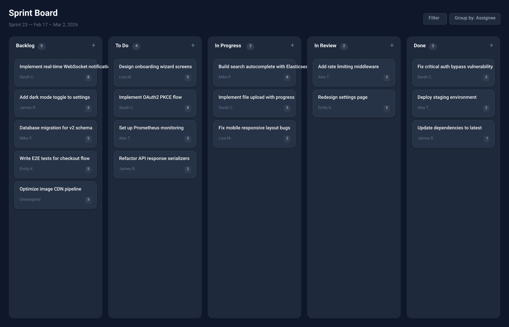

# Design Handover Document



## Overview

| Property | Value |
|----------|-------|
| Canvas | 1400 x 900 |
| Theme | dark |
| Background | `#0f172a` |
| Default Font | `400 14px Inter` |
| Frames | 78 |
| Text Nodes | 70 |
| Edges | 0 |

## Design Tokens

| Token | Value |
|-------|-------|
| `$color.bg` | `#0f172a` |
| `$color.border` | `#334155` |
| `$color.card` | `#263245` |
| `$color.column` | `#1e293b` |
| `$color.priority.critical` | `#ef4444` |
| `$color.priority.high` | `#f97316` |
| `$color.priority.low` | `#22c55e` |
| `$color.priority.medium` | `#eab308` |
| `$color.tag.backend` | `#8b5cf6` |
| `$color.tag.bug` | `#ef4444` |
| `$color.tag.design` | `#ec4899` |
| `$color.tag.devops` | `#06b6d4` |
| `$color.tag.frontend` | `#3b82f6` |
| `$color.text` | `#f8fafc` |
| `$color.text2` | `#94a3b8` |
| `$color.text3` | `#64748b` |
| `$radius.lg` | `14` |
| `$radius.md` | `10` |
| `$radius.sm` | `6` |

### CSS Variables

```css
:root {
  --color-bg: #0f172a;
  --color-border: #334155;
  --color-card: #263245;
  --color-column: #1e293b;
  --color-priority-critical: #ef4444;
  --color-priority-high: #f97316;
  --color-priority-low: #22c55e;
  --color-priority-medium: #eab308;
  --color-tag-backend: #8b5cf6;
  --color-tag-bug: #ef4444;
  --color-tag-design: #ec4899;
  --color-tag-devops: #06b6d4;
  --color-tag-frontend: #3b82f6;
  --color-text: #f8fafc;
  --color-text2: #94a3b8;
  --color-text3: #64748b;
  --radius-lg: 14;
  --radius-md: 10;
  --radius-sm: 6;
}
```

## Components

### `column-header`

**Parameters:**

| Param | Default |
|-------|---------|
| `count` | `0` |
| `title` | `Column` |

**Base CSS:**

```css
padding: 0px 4px 12px 4px;
```

### `priority-dot`

**Parameters:**

| Param | Default |
|-------|---------|
| `color` | `#22c55e` |

**Base CSS:**

```css
background-color: {{color}};
border-radius: 4px;
```

### `tag`

**Parameters:**

| Param | Default |
|-------|---------|
| `bg` | `rgba(59,130,246,0.15)` |
| `fg` | `#3b82f6` |
| `label` | `tag` |

**Base CSS:**

```css
border-radius: 4px;
padding: 3px 8px;
```

### `task-card`

**Parameters:**

| Param | Default |
|-------|---------|
| `assignee` | `Unassigned` |
| `points` | `-` |
| `title` | `Task` |

**Base CSS:**

```css
background-color: #263245;
border-radius: 10px;
padding: 14px;
gap: 10px;
border: 1px solid #334155;
```

## Component Tree

```
root (1400 x 900 @ 0, 0)
  fill: #0f172a | padding: 24px | gap: 20px
  css: { display: flex; flex-direction: column; gap: 20px; padding: 24px; background-color: #0f172a; width: 1400px; height: 900px; }
  |
+-- frame#topbar (1352 x 56 @ 24, 24)
|       direction: row | justify: between | align: center
|       css: { display: flex; flex-direction: row; justify-content: space-between; align-items: center; }
|       |
|     +-- frame (187 x 56 @ 0, 0)
|     |       gap: 4px
|     |       css: { display: flex; flex-direction: column; gap: 4px; }
|     |       |
|     |     +-- text "Sprint Board" (187 x 34 @ 0, 0)
|     |     |       font: 700 24px Inter | color: #f8fafc
|     |     +-- text "Sprint 23 — Feb 17 – Mar 2, 2026" (187 x 18 @ 0, 38)
|     |             font: 400 13px Inter | color: #64748b
|     +-- frame#filters (211 x 30 @ 1141, 13)
|             gap: 8px | direction: row
|             css: { display: flex; flex-direction: row; gap: 8px; }
|             |
|           +-- frame (63 x 30 @ 0, 0)
|           |       fill: #1e293b | padding: 6px 14px | radius: 6px | border: 1px solid #334155
|           |       css: { display: flex; flex-direction: column; padding: 6px 14px; background-color: #1e293b; border-radius: 6px; border: 1px solid #334155; }
|           |       |
|           |     +-- text "Filter" (35 x 18 @ 14, 6)
|           |             font: 500 13px Inter | color: #94a3b8
|           +-- frame (140 x 30 @ 71, 0)
|                   fill: #1e293b | padding: 6px 14px | radius: 6px | border: 1px solid #334155
|                   css: { display: flex; flex-direction: column; padding: 6px 14px; background-color: #1e293b; border-radius: 6px; border: 1px solid #334155; }
|                   |
|                 +-- text "Group by: Assignee" (112 x 18 @ 14, 6)
|                         font: 500 13px Inter | color: #94a3b8
+-- frame#board (1352 x 776 @ 24, 100)
        gap: 16px | direction: row | flex: 1
        css: { display: flex; flex-direction: row; gap: 16px; flex: 1; }
        |
      +-- frame#col-backlog (258 x 776 @ 0, 0)
      |       fill: #1e293b | padding: 16px | gap: 10px | radius: 14px | flex: 1
      |       css: { display: flex; flex-direction: column; gap: 10px; padding: 16px; background-color: #1e293b; border-radius: 14px; flex: 1; }
      |       |
      |     +-- [column-header] (226 x 37 @ 16, 16)
      |     |       padding: 0px 4px 12px 4px | direction: row | justify: between | align: center
      |     |       css: { display: flex; flex-direction: row; justify-content: space-between; align-items: center; padding: 0px 4px 12px 4px; }
      |     |       |
      |     |     +-- frame (81 x 20 @ 4, 3)
      |     |     |       gap: 8px | direction: row | align: center
      |     |     |       css: { display: flex; flex-direction: row; align-items: center; gap: 8px; }
      |     |     |       |
      |     |     |     +-- text "Backlog" (51 x 20 @ 0, 0)
      |     |     |     |       font: 700 14px Inter | color: #f8fafc
      |     |     |     +-- frame (22 x 19 @ 59, 0)
      |     |     |             fill: rgba(148,163,184,0.15) | padding: 2px 8px | radius: 10px
      |     |     |             css: { display: flex; flex-direction: column; padding: 2px 8px; background-color: rgba(148,163,184,0.15); border-radius: 10px; }
      |     |     |             |
      |     |     |           +-- text "5" (6 x 15 @ 8, 2)
      |     |     |                   font: 600 11px Inter | color: #94a3b8
      |     |     +-- text "+" (9 x 25 @ 212, 0)
      |     |             font: 500 18px Inter | color: #64748b
      |     +-- [task-card] (226 x 74 @ 16, 63)
      |     |       fill: #263245 | padding: 14px | gap: 10px | radius: 10px | border: 1px solid #334155 | shadow: yes
      |     |       css: { display: flex; flex-direction: column; gap: 10px; padding: 14px; background-color: #263245; border-radius: 10px; border: 1px solid #334155; box-shadow: 0px 2px 8px rgba(0,0,0,0.15); }
      |     |       |
      |     |     +-- text "Implement real-time WebSocket notific..." (271 x 18 @ 14, 14)
      |     |     |       font: 500 13px Inter | color: #f8fafc
      |     |     +-- frame (198 x 18 @ 14, 42)
      |     |             direction: row | justify: between | align: center
      |     |             css: { display: flex; flex-direction: row; justify-content: space-between; align-items: center; }
      |     |             |
      |     |           +-- text "Sarah C." (42 x 15 @ 0, 1)
      |     |           |       font: 400 11px Inter | color: #64748b
      |     |           +-- frame (17 x 18 @ 180, 0)
      |     |                   fill: rgba(148,163,184,0.1) | padding: 2px 6px | radius: 4px
      |     |                   css: { display: flex; flex-direction: column; padding: 2px 6px; background-color: rgba(148,163,184,0.1); border-radius: 4px; }
      |     |                   |
      |     |                 +-- text "8" (5 x 14 @ 6, 2)
      |     |                         font: 600 10px Inter | color: #94a3b8
      |     +-- [task-card] (226 x 74 @ 16, 147)
      |     |       fill: #263245 | padding: 14px | gap: 10px | radius: 10px | border: 1px solid #334155 | shadow: yes
      |     |       css: { display: flex; flex-direction: column; gap: 10px; padding: 14px; background-color: #263245; border-radius: 10px; border: 1px solid #334155; box-shadow: 0px 2px 8px rgba(0,0,0,0.15); }
      |     |       |
      |     |     +-- text "Add dark mode toggle to settings" (198 x 18 @ 14, 14)
      |     |     |       font: 500 13px Inter | color: #f8fafc
      |     |     +-- frame (198 x 18 @ 14, 42)
      |     |             direction: row | justify: between | align: center
      |     |             css: { display: flex; flex-direction: row; justify-content: space-between; align-items: center; }
      |     |             |
      |     |           +-- text "James R." (44 x 15 @ 0, 1)
      |     |           |       font: 400 11px Inter | color: #64748b
      |     |           +-- frame (17 x 18 @ 180, 0)
      |     |                   fill: rgba(148,163,184,0.1) | padding: 2px 6px | radius: 4px
      |     |                   css: { display: flex; flex-direction: column; padding: 2px 6px; background-color: rgba(148,163,184,0.1); border-radius: 4px; }
      |     |                   |
      |     |                 +-- text "3" (5 x 14 @ 6, 2)
      |     |                         font: 600 10px Inter | color: #94a3b8
      |     +-- [task-card] (226 x 74 @ 16, 232)
      |     |       fill: #263245 | padding: 14px | gap: 10px | radius: 10px | border: 1px solid #334155 | shadow: yes
      |     |       css: { display: flex; flex-direction: column; gap: 10px; padding: 14px; background-color: #263245; border-radius: 10px; border: 1px solid #334155; box-shadow: 0px 2px 8px rgba(0,0,0,0.15); }
      |     |       |
      |     |     +-- text "Database migration for v2 schema" (205 x 18 @ 14, 14)
      |     |     |       font: 500 13px Inter | color: #f8fafc
      |     |     +-- frame (198 x 18 @ 14, 42)
      |     |             direction: row | justify: between | align: center
      |     |             css: { display: flex; flex-direction: row; justify-content: space-between; align-items: center; }
      |     |             |
      |     |           +-- text "Mike P." (35 x 15 @ 0, 1)
      |     |           |       font: 400 11px Inter | color: #64748b
      |     |           +-- frame (17 x 18 @ 180, 0)
      |     |                   fill: rgba(148,163,184,0.1) | padding: 2px 6px | radius: 4px
      |     |                   css: { display: flex; flex-direction: column; padding: 2px 6px; background-color: rgba(148,163,184,0.1); border-radius: 4px; }
      |     |                   |
      |     |                 +-- text "5" (5 x 14 @ 6, 2)
      |     |                         font: 600 10px Inter | color: #94a3b8
      |     +-- [task-card] (226 x 74 @ 16, 316)
      |     |       fill: #263245 | padding: 14px | gap: 10px | radius: 10px | border: 1px solid #334155 | shadow: yes
      |     |       css: { display: flex; flex-direction: column; gap: 10px; padding: 14px; background-color: #263245; border-radius: 10px; border: 1px solid #334155; box-shadow: 0px 2px 8px rgba(0,0,0,0.15); }
      |     |       |
      |     |     +-- text "Write E2E tests for checkout flow" (209 x 18 @ 14, 14)
      |     |     |       font: 500 13px Inter | color: #f8fafc
      |     |     +-- frame (198 x 18 @ 14, 42)
      |     |             direction: row | justify: between | align: center
      |     |             css: { display: flex; flex-direction: row; justify-content: space-between; align-items: center; }
      |     |             |
      |     |           +-- text "Emily K." (39 x 15 @ 0, 1)
      |     |           |       font: 400 11px Inter | color: #64748b
      |     |           +-- frame (17 x 18 @ 180, 0)
      |     |                   fill: rgba(148,163,184,0.1) | padding: 2px 6px | radius: 4px
      |     |                   css: { display: flex; flex-direction: column; padding: 2px 6px; background-color: rgba(148,163,184,0.1); border-radius: 4px; }
      |     |                   |
      |     |                 +-- text "5" (5 x 14 @ 6, 2)
      |     |                         font: 600 10px Inter | color: #94a3b8
      |     +-- [task-card] (226 x 74 @ 16, 400)
      |             fill: #263245 | padding: 14px | gap: 10px | radius: 10px | border: 1px solid #334155 | shadow: yes
      |             css: { display: flex; flex-direction: column; gap: 10px; padding: 14px; background-color: #263245; border-radius: 10px; border: 1px solid #334155; box-shadow: 0px 2px 8px rgba(0,0,0,0.15); }
      |             |
      |           +-- text "Optimize image CDN pipeline" (198 x 18 @ 14, 14)
      |           |       font: 500 13px Inter | color: #f8fafc
      |           +-- frame (198 x 18 @ 14, 42)
      |                   direction: row | justify: between | align: center
      |                   css: { display: flex; flex-direction: row; justify-content: space-between; align-items: center; }
      |                   |
      |                 +-- text "Unassigned" (55 x 15 @ 0, 1)
      |                 |       font: 400 11px Inter | color: #64748b
      |                 +-- frame (17 x 18 @ 180, 0)
      |                         fill: rgba(148,163,184,0.1) | padding: 2px 6px | radius: 4px
      |                         css: { display: flex; flex-direction: column; padding: 2px 6px; background-color: rgba(148,163,184,0.1); border-radius: 4px; }
      |                         |
      |                       +-- text "3" (5 x 14 @ 6, 2)
      |                               font: 600 10px Inter | color: #94a3b8
      +-- frame#col-todo (258 x 776 @ 274, 0)
      |       fill: #1e293b | padding: 16px | gap: 10px | radius: 14px | flex: 1
      |       css: { display: flex; flex-direction: column; gap: 10px; padding: 16px; background-color: #1e293b; border-radius: 14px; flex: 1; }
      |       |
      |     +-- [column-header] (226 x 37 @ 16, 16)
      |     |       padding: 0px 4px 12px 4px | direction: row | justify: between | align: center
      |     |       css: { display: flex; flex-direction: row; justify-content: space-between; align-items: center; padding: 0px 4px 12px 4px; }
      |     |       |
      |     |     +-- frame (69 x 20 @ 4, 3)
      |     |     |       gap: 8px | direction: row | align: center
      |     |     |       css: { display: flex; flex-direction: row; align-items: center; gap: 8px; }
      |     |     |       |
      |     |     |     +-- text "To Do" (39 x 20 @ 0, 0)
      |     |     |     |       font: 700 14px Inter | color: #f8fafc
      |     |     |     +-- frame (22 x 19 @ 47, 0)
      |     |     |             fill: rgba(148,163,184,0.15) | padding: 2px 8px | radius: 10px
      |     |     |             css: { display: flex; flex-direction: column; padding: 2px 8px; background-color: rgba(148,163,184,0.15); border-radius: 10px; }
      |     |     |             |
      |     |     |           +-- text "4" (6 x 15 @ 8, 2)
      |     |     |                   font: 600 11px Inter | color: #94a3b8
      |     |     +-- text "+" (9 x 25 @ 212, 0)
      |     |             font: 500 18px Inter | color: #64748b
      |     +-- [task-card] (226 x 74 @ 16, 63)
      |     |       fill: #263245 | padding: 14px | gap: 10px | radius: 10px | border: 1px solid #334155 | shadow: yes
      |     |       css: { display: flex; flex-direction: column; gap: 10px; padding: 14px; background-color: #263245; border-radius: 10px; border: 1px solid #334155; box-shadow: 0px 2px 8px rgba(0,0,0,0.15); }
      |     |       |
      |     |     +-- text "Design onboarding wizard screens" (203 x 18 @ 14, 14)
      |     |     |       font: 500 13px Inter | color: #f8fafc
      |     |     +-- frame (198 x 18 @ 14, 42)
      |     |             direction: row | justify: between | align: center
      |     |             css: { display: flex; flex-direction: row; justify-content: space-between; align-items: center; }
      |     |             |
      |     |           +-- text "Lisa M." (35 x 15 @ 0, 1)
      |     |           |       font: 400 11px Inter | color: #64748b
      |     |           +-- frame (17 x 18 @ 180, 0)
      |     |                   fill: rgba(148,163,184,0.1) | padding: 2px 6px | radius: 4px
      |     |                   css: { display: flex; flex-direction: column; padding: 2px 6px; background-color: rgba(148,163,184,0.1); border-radius: 4px; }
      |     |                   |
      |     |                 +-- text "5" (5 x 14 @ 6, 2)
      |     |                         font: 600 10px Inter | color: #94a3b8
      |     +-- [task-card] (226 x 74 @ 16, 147)
      |     |       fill: #263245 | padding: 14px | gap: 10px | radius: 10px | border: 1px solid #334155 | shadow: yes
      |     |       css: { display: flex; flex-direction: column; gap: 10px; padding: 14px; background-color: #263245; border-radius: 10px; border: 1px solid #334155; box-shadow: 0px 2px 8px rgba(0,0,0,0.15); }
      |     |       |
      |     |     +-- text "Implement OAuth2 PKCE flow" (198 x 18 @ 14, 14)
      |     |     |       font: 500 13px Inter | color: #f8fafc
      |     |     +-- frame (198 x 18 @ 14, 42)
      |     |             direction: row | justify: between | align: center
      |     |             css: { display: flex; flex-direction: row; justify-content: space-between; align-items: center; }
      |     |             |
      |     |           +-- text "Sarah C." (42 x 15 @ 0, 1)
      |     |           |       font: 400 11px Inter | color: #64748b
      |     |           +-- frame (17 x 18 @ 180, 0)
      |     |                   fill: rgba(148,163,184,0.1) | padding: 2px 6px | radius: 4px
      |     |                   css: { display: flex; flex-direction: column; padding: 2px 6px; background-color: rgba(148,163,184,0.1); border-radius: 4px; }
      |     |                   |
      |     |                 +-- text "8" (5 x 14 @ 6, 2)
      |     |                         font: 600 10px Inter | color: #94a3b8
      |     +-- [task-card] (226 x 74 @ 16, 232)
      |     |       fill: #263245 | padding: 14px | gap: 10px | radius: 10px | border: 1px solid #334155 | shadow: yes
      |     |       css: { display: flex; flex-direction: column; gap: 10px; padding: 14px; background-color: #263245; border-radius: 10px; border: 1px solid #334155; box-shadow: 0px 2px 8px rgba(0,0,0,0.15); }
      |     |       |
      |     |     +-- text "Set up Prometheus monitoring" (198 x 18 @ 14, 14)
      |     |     |       font: 500 13px Inter | color: #f8fafc
      |     |     +-- frame (198 x 18 @ 14, 42)
      |     |             direction: row | justify: between | align: center
      |     |             css: { display: flex; flex-direction: row; justify-content: space-between; align-items: center; }
      |     |             |
      |     |           +-- text "Alex T." (34 x 15 @ 0, 1)
      |     |           |       font: 400 11px Inter | color: #64748b
      |     |           +-- frame (17 x 18 @ 180, 0)
      |     |                   fill: rgba(148,163,184,0.1) | padding: 2px 6px | radius: 4px
      |     |                   css: { display: flex; flex-direction: column; padding: 2px 6px; background-color: rgba(148,163,184,0.1); border-radius: 4px; }
      |     |                   |
      |     |                 +-- text "3" (5 x 14 @ 6, 2)
      |     |                         font: 600 10px Inter | color: #94a3b8
      |     +-- [task-card] (226 x 74 @ 16, 316)
      |             fill: #263245 | padding: 14px | gap: 10px | radius: 10px | border: 1px solid #334155 | shadow: yes
      |             css: { display: flex; flex-direction: column; gap: 10px; padding: 14px; background-color: #263245; border-radius: 10px; border: 1px solid #334155; box-shadow: 0px 2px 8px rgba(0,0,0,0.15); }
      |             |
      |           +-- text "Refactor API response serializers" (205 x 18 @ 14, 14)
      |           |       font: 500 13px Inter | color: #f8fafc
      |           +-- frame (198 x 18 @ 14, 42)
      |                   direction: row | justify: between | align: center
      |                   css: { display: flex; flex-direction: row; justify-content: space-between; align-items: center; }
      |                   |
      |                 +-- text "James R." (44 x 15 @ 0, 1)
      |                 |       font: 400 11px Inter | color: #64748b
      |                 +-- frame (17 x 18 @ 180, 0)
      |                         fill: rgba(148,163,184,0.1) | padding: 2px 6px | radius: 4px
      |                         css: { display: flex; flex-direction: column; padding: 2px 6px; background-color: rgba(148,163,184,0.1); border-radius: 4px; }
      |                         |
      |                       +-- text "2" (5 x 14 @ 6, 2)
      |                               font: 600 10px Inter | color: #94a3b8
      +-- frame#col-progress (258 x 776 @ 547, 0)
      |       fill: #1e293b | padding: 16px | gap: 10px | radius: 14px | flex: 1
      |       css: { display: flex; flex-direction: column; gap: 10px; padding: 16px; background-color: #1e293b; border-radius: 14px; flex: 1; }
      |       |
      |     +-- [column-header] (226 x 37 @ 16, 16)
      |     |       padding: 0px 4px 12px 4px | direction: row | justify: between | align: center
      |     |       css: { display: flex; flex-direction: row; justify-content: space-between; align-items: center; padding: 0px 4px 12px 4px; }
      |     |       |
      |     |     +-- frame (108 x 20 @ 4, 3)
      |     |     |       gap: 8px | direction: row | align: center
      |     |     |       css: { display: flex; flex-direction: row; align-items: center; gap: 8px; }
      |     |     |       |
      |     |     |     +-- text "In Progress" (78 x 20 @ 0, 0)
      |     |     |     |       font: 700 14px Inter | color: #f8fafc
      |     |     |     +-- frame (22 x 19 @ 86, 0)
      |     |     |             fill: rgba(148,163,184,0.15) | padding: 2px 8px | radius: 10px
      |     |     |             css: { display: flex; flex-direction: column; padding: 2px 8px; background-color: rgba(148,163,184,0.15); border-radius: 10px; }
      |     |     |             |
      |     |     |           +-- text "3" (6 x 15 @ 8, 2)
      |     |     |                   font: 600 11px Inter | color: #94a3b8
      |     |     +-- text "+" (9 x 25 @ 212, 0)
      |     |             font: 500 18px Inter | color: #64748b
      |     +-- [task-card] (226 x 74 @ 16, 63)
      |     |       fill: #263245 | padding: 14px | gap: 10px | radius: 10px | border: 1px solid #334155 | shadow: yes
      |     |       css: { display: flex; flex-direction: column; gap: 10px; padding: 14px; background-color: #263245; border-radius: 10px; border: 1px solid #334155; box-shadow: 0px 2px 8px rgba(0,0,0,0.15); }
      |     |       |
      |     |     +-- text "Build search autocomplete with Elasti..." (274 x 18 @ 14, 14)
      |     |     |       font: 500 13px Inter | color: #f8fafc
      |     |     +-- frame (198 x 18 @ 14, 42)
      |     |             direction: row | justify: between | align: center
      |     |             css: { display: flex; flex-direction: row; justify-content: space-between; align-items: center; }
      |     |             |
      |     |           +-- text "Mike P." (35 x 15 @ 0, 1)
      |     |           |       font: 400 11px Inter | color: #64748b
      |     |           +-- frame (17 x 18 @ 180, 0)
      |     |                   fill: rgba(148,163,184,0.1) | padding: 2px 6px | radius: 4px
      |     |                   css: { display: flex; flex-direction: column; padding: 2px 6px; background-color: rgba(148,163,184,0.1); border-radius: 4px; }
      |     |                   |
      |     |                 +-- text "8" (5 x 14 @ 6, 2)
      |     |                         font: 600 10px Inter | color: #94a3b8
      |     +-- [task-card] (226 x 74 @ 16, 147)
      |     |       fill: #263245 | padding: 14px | gap: 10px | radius: 10px | border: 1px solid #334155 | shadow: yes
      |     |       css: { display: flex; flex-direction: column; gap: 10px; padding: 14px; background-color: #263245; border-radius: 10px; border: 1px solid #334155; box-shadow: 0px 2px 8px rgba(0,0,0,0.15); }
      |     |       |
      |     |     +-- text "Implement file upload with progress" (213 x 18 @ 14, 14)
      |     |     |       font: 500 13px Inter | color: #f8fafc
      |     |     +-- frame (198 x 18 @ 14, 42)
      |     |             direction: row | justify: between | align: center
      |     |             css: { display: flex; flex-direction: row; justify-content: space-between; align-items: center; }
      |     |             |
      |     |           +-- text "Sarah C." (42 x 15 @ 0, 1)
      |     |           |       font: 400 11px Inter | color: #64748b
      |     |           +-- frame (17 x 18 @ 180, 0)
      |     |                   fill: rgba(148,163,184,0.1) | padding: 2px 6px | radius: 4px
      |     |                   css: { display: flex; flex-direction: column; padding: 2px 6px; background-color: rgba(148,163,184,0.1); border-radius: 4px; }
      |     |                   |
      |     |                 +-- text "5" (5 x 14 @ 6, 2)
      |     |                         font: 600 10px Inter | color: #94a3b8
      |     +-- [task-card] (226 x 74 @ 16, 232)
      |             fill: #263245 | padding: 14px | gap: 10px | radius: 10px | border: 1px solid #334155 | shadow: yes
      |             css: { display: flex; flex-direction: column; gap: 10px; padding: 14px; background-color: #263245; border-radius: 10px; border: 1px solid #334155; box-shadow: 0px 2px 8px rgba(0,0,0,0.15); }
      |             |
      |           +-- text "Fix mobile responsive layout bugs" (199 x 18 @ 14, 14)
      |           |       font: 500 13px Inter | color: #f8fafc
      |           +-- frame (198 x 18 @ 14, 42)
      |                   direction: row | justify: between | align: center
      |                   css: { display: flex; flex-direction: row; justify-content: space-between; align-items: center; }
      |                   |
      |                 +-- text "Lisa M." (35 x 15 @ 0, 1)
      |                 |       font: 400 11px Inter | color: #64748b
      |                 +-- frame (17 x 18 @ 180, 0)
      |                         fill: rgba(148,163,184,0.1) | padding: 2px 6px | radius: 4px
      |                         css: { display: flex; flex-direction: column; padding: 2px 6px; background-color: rgba(148,163,184,0.1); border-radius: 4px; }
      |                         |
      |                       +-- text "2" (5 x 14 @ 6, 2)
      |                               font: 600 10px Inter | color: #94a3b8
      +-- frame#col-review (258 x 776 @ 821, 0)
      |       fill: #1e293b | padding: 16px | gap: 10px | radius: 14px | flex: 1
      |       css: { display: flex; flex-direction: column; gap: 10px; padding: 16px; background-color: #1e293b; border-radius: 14px; flex: 1; }
      |       |
      |     +-- [column-header] (226 x 37 @ 16, 16)
      |     |       padding: 0px 4px 12px 4px | direction: row | justify: between | align: center
      |     |       css: { display: flex; flex-direction: row; justify-content: space-between; align-items: center; padding: 0px 4px 12px 4px; }
      |     |       |
      |     |     +-- frame (92 x 20 @ 4, 3)
      |     |     |       gap: 8px | direction: row | align: center
      |     |     |       css: { display: flex; flex-direction: row; align-items: center; gap: 8px; }
      |     |     |       |
      |     |     |     +-- text "In Review" (62 x 20 @ 0, 0)
      |     |     |     |       font: 700 14px Inter | color: #f8fafc
      |     |     |     +-- frame (22 x 19 @ 70, 0)
      |     |     |             fill: rgba(148,163,184,0.15) | padding: 2px 8px | radius: 10px
      |     |     |             css: { display: flex; flex-direction: column; padding: 2px 8px; background-color: rgba(148,163,184,0.15); border-radius: 10px; }
      |     |     |             |
      |     |     |           +-- text "2" (6 x 15 @ 8, 2)
      |     |     |                   font: 600 11px Inter | color: #94a3b8
      |     |     +-- text "+" (9 x 25 @ 212, 0)
      |     |             font: 500 18px Inter | color: #64748b
      |     +-- [task-card] (226 x 74 @ 16, 63)
      |     |       fill: #263245 | padding: 14px | gap: 10px | radius: 10px | border: 1px solid #334155 | shadow: yes
      |     |       css: { display: flex; flex-direction: column; gap: 10px; padding: 14px; background-color: #263245; border-radius: 10px; border: 1px solid #334155; box-shadow: 0px 2px 8px rgba(0,0,0,0.15); }
      |     |       |
      |     |     +-- text "Add rate limiting middleware" (198 x 18 @ 14, 14)
      |     |     |       font: 500 13px Inter | color: #f8fafc
      |     |     +-- frame (198 x 18 @ 14, 42)
      |     |             direction: row | justify: between | align: center
      |     |             css: { display: flex; flex-direction: row; justify-content: space-between; align-items: center; }
      |     |             |
      |     |           +-- text "Alex T." (34 x 15 @ 0, 1)
      |     |           |       font: 400 11px Inter | color: #64748b
      |     |           +-- frame (17 x 18 @ 180, 0)
      |     |                   fill: rgba(148,163,184,0.1) | padding: 2px 6px | radius: 4px
      |     |                   css: { display: flex; flex-direction: column; padding: 2px 6px; background-color: rgba(148,163,184,0.1); border-radius: 4px; }
      |     |                   |
      |     |                 +-- text "3" (5 x 14 @ 6, 2)
      |     |                         font: 600 10px Inter | color: #94a3b8
      |     +-- [task-card] (226 x 74 @ 16, 147)
      |             fill: #263245 | padding: 14px | gap: 10px | radius: 10px | border: 1px solid #334155 | shadow: yes
      |             css: { display: flex; flex-direction: column; gap: 10px; padding: 14px; background-color: #263245; border-radius: 10px; border: 1px solid #334155; box-shadow: 0px 2px 8px rgba(0,0,0,0.15); }
      |             |
      |           +-- text "Redesign settings page" (198 x 18 @ 14, 14)
      |           |       font: 500 13px Inter | color: #f8fafc
      |           +-- frame (198 x 18 @ 14, 42)
      |                   direction: row | justify: between | align: center
      |                   css: { display: flex; flex-direction: row; justify-content: space-between; align-items: center; }
      |                   |
      |                 +-- text "Emily K." (39 x 15 @ 0, 1)
      |                 |       font: 400 11px Inter | color: #64748b
      |                 +-- frame (17 x 18 @ 180, 0)
      |                         fill: rgba(148,163,184,0.1) | padding: 2px 6px | radius: 4px
      |                         css: { display: flex; flex-direction: column; padding: 2px 6px; background-color: rgba(148,163,184,0.1); border-radius: 4px; }
      |                         |
      |                       +-- text "5" (5 x 14 @ 6, 2)
      |                               font: 600 10px Inter | color: #94a3b8
      +-- frame#col-done (258 x 776 @ 1094, 0)
              fill: #1e293b | padding: 16px | gap: 10px | radius: 14px | flex: 1
              css: { display: flex; flex-direction: column; gap: 10px; padding: 16px; background-color: #1e293b; border-radius: 14px; flex: 1; }
              |
            +-- [column-header] (226 x 37 @ 16, 16)
            |       padding: 0px 4px 12px 4px | direction: row | justify: between | align: center
            |       css: { display: flex; flex-direction: row; justify-content: space-between; align-items: center; padding: 0px 4px 12px 4px; }
            |       |
            |     +-- frame (63 x 20 @ 4, 3)
            |     |       gap: 8px | direction: row | align: center
            |     |       css: { display: flex; flex-direction: row; align-items: center; gap: 8px; }
            |     |       |
            |     |     +-- text "Done" (33 x 20 @ 0, 0)
            |     |     |       font: 700 14px Inter | color: #f8fafc
            |     |     +-- frame (22 x 19 @ 41, 0)
            |     |             fill: rgba(148,163,184,0.15) | padding: 2px 8px | radius: 10px
            |     |             css: { display: flex; flex-direction: column; padding: 2px 8px; background-color: rgba(148,163,184,0.15); border-radius: 10px; }
            |     |             |
            |     |           +-- text "3" (6 x 15 @ 8, 2)
            |     |                   font: 600 11px Inter | color: #94a3b8
            |     +-- text "+" (9 x 25 @ 212, 0)
            |             font: 500 18px Inter | color: #64748b
            +-- [task-card] (226 x 74 @ 16, 63)
            |       fill: #263245 | padding: 14px | gap: 10px | radius: 10px | border: 1px solid #334155 | shadow: yes
            |       css: { display: flex; flex-direction: column; gap: 10px; padding: 14px; background-color: #263245; border-radius: 10px; border: 1px solid #334155; box-shadow: 0px 2px 8px rgba(0,0,0,0.15); }
            |       |
            |     +-- text "Fix critical auth bypass vulnerability" (221 x 18 @ 14, 14)
            |     |       font: 500 13px Inter | color: #f8fafc
            |     +-- frame (198 x 18 @ 14, 42)
            |             direction: row | justify: between | align: center
            |             css: { display: flex; flex-direction: row; justify-content: space-between; align-items: center; }
            |             |
            |           +-- text "Sarah C." (42 x 15 @ 0, 1)
            |           |       font: 400 11px Inter | color: #64748b
            |           +-- frame (17 x 18 @ 180, 0)
            |                   fill: rgba(148,163,184,0.1) | padding: 2px 6px | radius: 4px
            |                   css: { display: flex; flex-direction: column; padding: 2px 6px; background-color: rgba(148,163,184,0.1); border-radius: 4px; }
            |                   |
            |                 +-- text "3" (5 x 14 @ 6, 2)
            |                         font: 600 10px Inter | color: #94a3b8
            +-- [task-card] (226 x 74 @ 16, 147)
            |       fill: #263245 | padding: 14px | gap: 10px | radius: 10px | border: 1px solid #334155 | shadow: yes
            |       css: { display: flex; flex-direction: column; gap: 10px; padding: 14px; background-color: #263245; border-radius: 10px; border: 1px solid #334155; box-shadow: 0px 2px 8px rgba(0,0,0,0.15); }
            |       |
            |     +-- text "Deploy staging environment" (198 x 18 @ 14, 14)
            |     |       font: 500 13px Inter | color: #f8fafc
            |     +-- frame (198 x 18 @ 14, 42)
            |             direction: row | justify: between | align: center
            |             css: { display: flex; flex-direction: row; justify-content: space-between; align-items: center; }
            |             |
            |           +-- text "Alex T." (34 x 15 @ 0, 1)
            |           |       font: 400 11px Inter | color: #64748b
            |           +-- frame (17 x 18 @ 180, 0)
            |                   fill: rgba(148,163,184,0.1) | padding: 2px 6px | radius: 4px
            |                   css: { display: flex; flex-direction: column; padding: 2px 6px; background-color: rgba(148,163,184,0.1); border-radius: 4px; }
            |                   |
            |                 +-- text "2" (5 x 14 @ 6, 2)
            |                         font: 600 10px Inter | color: #94a3b8
            +-- [task-card] (226 x 74 @ 16, 232)
                    fill: #263245 | padding: 14px | gap: 10px | radius: 10px | border: 1px solid #334155 | shadow: yes
                    css: { display: flex; flex-direction: column; gap: 10px; padding: 14px; background-color: #263245; border-radius: 10px; border: 1px solid #334155; box-shadow: 0px 2px 8px rgba(0,0,0,0.15); }
                    |
                  +-- text "Update dependencies to latest" (198 x 18 @ 14, 14)
                  |       font: 500 13px Inter | color: #f8fafc
                  +-- frame (198 x 18 @ 14, 42)
                          direction: row | justify: between | align: center
                          css: { display: flex; flex-direction: row; justify-content: space-between; align-items: center; }
                          |
                        +-- text "James R." (44 x 15 @ 0, 1)
                        |       font: 400 11px Inter | color: #64748b
                        +-- frame (15 x 18 @ 183, 0)
                                fill: rgba(148,163,184,0.1) | padding: 2px 6px | radius: 4px
                                css: { display: flex; flex-direction: column; padding: 2px 6px; background-color: rgba(148,163,184,0.1); border-radius: 4px; }
                                |
                              +-- text "1" (3 x 14 @ 6, 2)
                                      font: 600 10px Inter | color: #94a3b8
```

## Implementation Notes

### DSL → CSS Property Mapping

| DSL Property | CSS Equivalent |
|-------------|----------------|
| `direction: row` | `flex-direction: row` |
| `direction: column` | `flex-direction: column` |
| `justify: start` | `justify-content: flex-start` |
| `justify: center` | `justify-content: center` |
| `justify: end` | `justify-content: flex-end` |
| `justify: between` | `justify-content: space-between` |
| `justify: around` | `justify-content: space-around` |
| `align: start` | `align-items: flex-start` |
| `align: center` | `align-items: center` |
| `align: end` | `align-items: flex-end` |
| `align: stretch` | `align-items: stretch` |
| `layout: grid` + `columns: N` | `display: grid; grid-template-columns: repeat(N, 1fr)` |
| `fill: #color` | `background-color: #color` |
| `fill: linear-gradient(...)` | `background: linear-gradient(...)` |
| `border: W solid C` | `border: Wpx solid C` |
| `shadow: X Y B C` | `box-shadow: Xpx Ypx Bpx C` |
| `radius: N` | `border-radius: Npx` |
| `clip: true` | `overflow: hidden` |
| `truncate: true` | `overflow: hidden; text-overflow: ellipsis; white-space: nowrap` |
| `gap: N` | `gap: Npx` |
| `flex: N` | `flex: N` |
| `opacity: N` | `opacity: N` |

