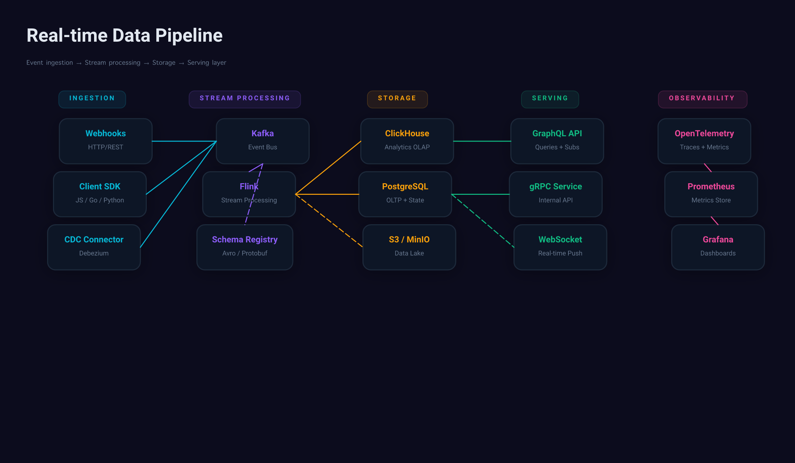

# Design Handover Document



## Overview

| Property | Value |
|----------|-------|
| Canvas | 1200 x 700 |
| Theme | custom |
| Background | `#0c0c1d` |
| Default Font | `400 14px Inter` |
| Frames | 33 |
| Text Nodes | 37 |
| Edges | 13 |

## Design Tokens

| Token | Value |
|-------|-------|
| `$color.ingest` | `#06b6d4` |
| `$color.monitor` | `#ec4899` |
| `$color.node` | `#111827` |
| `$color.process` | `#8b5cf6` |
| `$color.serve` | `#10b981` |
| `$color.store` | `#f59e0b` |

### CSS Variables

```css
:root {
  --color-ingest: #06b6d4;
  --color-monitor: #ec4899;
  --color-node: #111827;
  --color-process: #8b5cf6;
  --color-serve: #10b981;
  --color-store: #f59e0b;
}
```

## Components

### `pipeline-node`

**Parameters:**

| Param | Default |
|-------|---------|
| `color` | `#22d3ee` |
| `detail` | `` |
| `name` | `Node` |

**Base CSS:**

```css
background-color: #111827;
border-radius: 12px;
padding: 16px 20px;
gap: 4px;
border: 1.5px solid #1e293b;
```

## Component Tree

```
root (1200 x 700 @ 0, 0)
  fill: #0c0c1d | padding: 40px | gap: 32px
  css: { display: flex; flex-direction: column; gap: 32px; padding: 40px; background-color: #0c0c1d; width: 1200px; height: 700px; }
  |
+-- frame#title (1120 x 65 @ 40, 40)
|       gap: 8px
|       css: { display: flex; flex-direction: column; gap: 8px; }
|       |
|     +-- text "Real-time Data Pipeline" (1120 x 39 @ 0, 0)
|     |       font: 700 28px Inter | color: #e2e8f0
|     +-- text "Event ingestion → Stream processing..." (1120 x 18 @ 0, 47)
|             font: 400 13px Inter | color: #64748b
+-- frame#pipeline (1120 x 271 @ 40, 137)
        gap: 32px | direction: row | align: start | flex: 1
        css: { display: flex; flex-direction: row; align-items: flex-start; gap: 32px; flex: 1; }
        |
      +-- frame#stage-ingest (198 x 271 @ 0, 0)
      |       gap: 16px | align: center | flex: 1
      |       css: { display: flex; flex-direction: column; align-items: center; gap: 16px; flex: 1; }
      |       |
      |     +-- frame (101 x 26 @ 49, 0)
      |     |       fill: rgba(6,182,212,0.1) | padding: 6px 16px | radius: 8px | border: 1px solid rgba(6,182,212,0.2)
      |     |       css: { display: flex; flex-direction: column; padding: 6px 16px; background-color: rgba(6,182,212,0.1); border-radius: 8px; border: 1px solid rgba(6,182,212,0.2); }
      |     |       |
      |     |     +-- text "INGESTION" (69 x 14 @ 16, 6)
      |     |             font: 700 10px Inter | color: #06b6d4
      |     +-- frame (135 x 229 @ 32, 42)
      |             gap: 12px | align: center
      |             css: { display: flex; flex-direction: column; align-items: center; gap: 12px; }
      |             |
      |           +-- [pipeline-node]#webhooks (140 x 68 @ 18, 0)
      |           |       fill: #111827 | padding: 16px 20px | gap: 4px | align: center | radius: 12px | border: 1.5px solid #1e293b | shadow: yes
      |           |       css: { display: flex; flex-direction: column; align-items: center; gap: 4px; padding: 16px 20px; background-color: #111827; border-radius: 12px; border: 1.5px solid #1e293b; box-shadow: 0px 4px 24px rgba(0,0,0,0.3); }
      |           |       |
      |           |     +-- text "Webhooks" (59 x 18 @ 40, 16)
      |           |     |       font: 600 13px Inter | color: #06b6d4 | text-align: center
      |           |     +-- text "HTTP/REST" (53 x 14 @ 43, 38)
      |           |             font: 400 10px Inter | color: #64748b | text-align: center
      |           +-- [pipeline-node]#sdk (140 x 68 @ 9, 80)
      |           |       fill: #111827 | padding: 16px 20px | gap: 4px | align: center | radius: 12px | border: 1.5px solid #1e293b | shadow: yes
      |           |       css: { display: flex; flex-direction: column; align-items: center; gap: 4px; padding: 16px 20px; background-color: #111827; border-radius: 12px; border: 1.5px solid #1e293b; box-shadow: 0px 4px 24px rgba(0,0,0,0.3); }
      |           |       |
      |           |     +-- text "Client SDK" (67 x 18 @ 36, 16)
      |           |     |       font: 600 13px Inter | color: #06b6d4 | text-align: center
      |           |     +-- text "JS / Go / Python" (77 x 14 @ 32, 38)
      |           |             font: 400 10px Inter | color: #64748b | text-align: center
      |           +-- [pipeline-node]#cdc (140 x 68 @ 0, 160)
      |                   fill: #111827 | padding: 16px 20px | gap: 4px | align: center | radius: 12px | border: 1.5px solid #1e293b | shadow: yes
      |                   css: { display: flex; flex-direction: column; align-items: center; gap: 4px; padding: 16px 20px; background-color: #111827; border-radius: 12px; border: 1.5px solid #1e293b; box-shadow: 0px 4px 24px rgba(0,0,0,0.3); }
      |                   |
      |                 +-- text "CDC Connector" (95 x 18 @ 23, 16)
      |                 |       font: 600 13px Inter | color: #06b6d4 | text-align: center
      |                 +-- text "Debezium" (43 x 14 @ 49, 38)
      |                         font: 400 10px Inter | color: #64748b | text-align: center
      +-- frame#stage-stream (198 x 271 @ 230, 0)
      |       gap: 16px | align: center | flex: 1
      |       css: { display: flex; flex-direction: column; align-items: center; gap: 16px; flex: 1; }
      |       |
      |     +-- frame (168 x 26 @ 15, 0)
      |     |       fill: rgba(139,92,246,0.1) | padding: 6px 16px | radius: 8px | border: 1px solid rgba(139,92,246,0.2)
      |     |       css: { display: flex; flex-direction: column; padding: 6px 16px; background-color: rgba(139,92,246,0.1); border-radius: 8px; border: 1px solid rgba(139,92,246,0.2); }
      |     |       |
      |     |     +-- text "STREAM PROCESSING" (136 x 14 @ 16, 6)
      |     |             font: 700 10px Inter | color: #8b5cf6
      |     +-- frame (145 x 229 @ 27, 42)
      |             gap: 12px | align: center
      |             css: { display: flex; flex-direction: column; align-items: center; gap: 12px; }
      |             |
      |           +-- [pipeline-node]#kafka (140 x 68 @ 29, 0)
      |           |       fill: #111827 | padding: 16px 20px | gap: 4px | align: center | radius: 12px | border: 1.5px solid #1e293b | shadow: yes
      |           |       css: { display: flex; flex-direction: column; align-items: center; gap: 4px; padding: 16px 20px; background-color: #111827; border-radius: 12px; border: 1.5px solid #1e293b; box-shadow: 0px 4px 24px rgba(0,0,0,0.3); }
      |           |       |
      |           |     +-- text "Kafka" (37 x 18 @ 52, 16)
      |           |     |       font: 600 13px Inter | color: #8b5cf6 | text-align: center
      |           |     +-- text "Event Bus" (46 x 14 @ 47, 38)
      |           |             font: 400 10px Inter | color: #64748b | text-align: center
      |           +-- [pipeline-node]#flink (140 x 68 @ 9, 80)
      |           |       fill: #111827 | padding: 16px 20px | gap: 4px | align: center | radius: 12px | border: 1.5px solid #1e293b | shadow: yes
      |           |       css: { display: flex; flex-direction: column; align-items: center; gap: 4px; padding: 16px 20px; background-color: #111827; border-radius: 12px; border: 1.5px solid #1e293b; box-shadow: 0px 4px 24px rgba(0,0,0,0.3); }
      |           |       |
      |           |     +-- text "Flink" (30 x 18 @ 55, 16)
      |           |     |       font: 600 13px Inter | color: #8b5cf6 | text-align: center
      |           |     +-- text "Stream Processing" (87 x 14 @ 26, 38)
      |           |             font: 400 10px Inter | color: #64748b | text-align: center
      |           +-- [pipeline-node]#schema (145 x 68 @ 0, 160)
      |                   fill: #111827 | padding: 16px 20px | gap: 4px | align: center | radius: 12px | border: 1.5px solid #1e293b | shadow: yes
      |                   css: { display: flex; flex-direction: column; align-items: center; gap: 4px; padding: 16px 20px; background-color: #111827; border-radius: 12px; border: 1.5px solid #1e293b; box-shadow: 0px 4px 24px rgba(0,0,0,0.3); }
      |                   |
      |                 +-- text "Schema Registry" (105 x 18 @ 20, 16)
      |                 |       font: 600 13px Inter | color: #8b5cf6 | text-align: center
      |                 +-- text "Avro / Protobuf" (75 x 14 @ 35, 38)
      |                         font: 400 10px Inter | color: #64748b | text-align: center
      +-- frame#stage-store (198 x 271 @ 461, 0)
      |       gap: 16px | align: center | flex: 1
      |       css: { display: flex; flex-direction: column; align-items: center; gap: 16px; flex: 1; }
      |       |
      |     +-- frame (91 x 26 @ 54, 0)
      |     |       fill: rgba(245,158,11,0.1) | padding: 6px 16px | radius: 8px | border: 1px solid rgba(245,158,11,0.2)
      |     |       css: { display: flex; flex-direction: column; padding: 6px 16px; background-color: rgba(245,158,11,0.1); border-radius: 8px; border: 1px solid rgba(245,158,11,0.2); }
      |     |       |
      |     |     +-- text "STORAGE" (59 x 14 @ 16, 6)
      |     |             font: 700 10px Inter | color: #f59e0b
      |     +-- frame (117 x 229 @ 41, 42)
      |             gap: 12px | align: center
      |             css: { display: flex; flex-direction: column; align-items: center; gap: 12px; }
      |             |
      |           +-- [pipeline-node]#clickhouse (140 x 68 @ 3, 0)
      |           |       fill: #111827 | padding: 16px 20px | gap: 4px | align: center | radius: 12px | border: 1.5px solid #1e293b | shadow: yes
      |           |       css: { display: flex; flex-direction: column; align-items: center; gap: 4px; padding: 16px 20px; background-color: #111827; border-radius: 12px; border: 1.5px solid #1e293b; box-shadow: 0px 4px 24px rgba(0,0,0,0.3); }
      |           |       |
      |           |     +-- text "ClickHouse" (67 x 18 @ 37, 16)
      |           |     |       font: 600 13px Inter | color: #f59e0b | text-align: center
      |           |     +-- text "Analytics OLAP" (71 x 14 @ 35, 38)
      |           |             font: 400 10px Inter | color: #64748b | text-align: center
      |           +-- [pipeline-node]#postgres (140 x 68 @ 0, 80)
      |           |       fill: #111827 | padding: 16px 20px | gap: 4px | align: center | radius: 12px | border: 1.5px solid #1e293b | shadow: yes
      |           |       css: { display: flex; flex-direction: column; align-items: center; gap: 4px; padding: 16px 20px; background-color: #111827; border-radius: 12px; border: 1.5px solid #1e293b; box-shadow: 0px 4px 24px rgba(0,0,0,0.3); }
      |           |       |
      |           |     +-- text "PostgreSQL" (77 x 18 @ 32, 16)
      |           |     |       font: 600 13px Inter | color: #f59e0b | text-align: center
      |           |     +-- text "OLTP + State" (63 x 14 @ 39, 38)
      |           |             font: 400 10px Inter | color: #64748b | text-align: center
      |           +-- [pipeline-node]#s3 (140 x 68 @ 6, 160)
      |                   fill: #111827 | padding: 16px 20px | gap: 4px | align: center | radius: 12px | border: 1.5px solid #1e293b | shadow: yes
      |                   css: { display: flex; flex-direction: column; align-items: center; gap: 4px; padding: 16px 20px; background-color: #111827; border-radius: 12px; border: 1.5px solid #1e293b; box-shadow: 0px 4px 24px rgba(0,0,0,0.3); }
      |                   |
      |                 +-- text "S3 / MinIO" (64 x 18 @ 38, 16)
      |                 |       font: 600 13px Inter | color: #f59e0b | text-align: center
      |                 +-- text "Data Lake" (47 x 14 @ 46, 38)
      |                         font: 400 10px Inter | color: #64748b | text-align: center
      +-- frame#stage-serve (198 x 271 @ 691, 0)
      |       gap: 16px | align: center | flex: 1
      |       css: { display: flex; flex-direction: column; align-items: center; gap: 16px; flex: 1; }
      |       |
      |     +-- frame (87 x 26 @ 56, 0)
      |     |       fill: rgba(16,185,129,0.1) | padding: 6px 16px | radius: 8px | border: 1px solid rgba(16,185,129,0.2)
      |     |       css: { display: flex; flex-direction: column; padding: 6px 16px; background-color: rgba(16,185,129,0.1); border-radius: 8px; border: 1px solid rgba(16,185,129,0.2); }
      |     |       |
      |     |     +-- text "SERVING" (55 x 14 @ 16, 6)
      |     |             font: 700 10px Inter | color: #10b981
      |     +-- frame (123 x 229 @ 38, 42)
      |             gap: 12px | align: center
      |             css: { display: flex; flex-direction: column; align-items: center; gap: 12px; }
      |             |
      |           +-- [pipeline-node]#graphql (140 x 68 @ 2, 0)
      |           |       fill: #111827 | padding: 16px 20px | gap: 4px | align: center | radius: 12px | border: 1.5px solid #1e293b | shadow: yes
      |           |       css: { display: flex; flex-direction: column; align-items: center; gap: 4px; padding: 16px 20px; background-color: #111827; border-radius: 12px; border: 1.5px solid #1e293b; box-shadow: 0px 4px 24px rgba(0,0,0,0.3); }
      |           |       |
      |           |     +-- text "GraphQL API" (78 x 18 @ 31, 16)
      |           |     |       font: 600 13px Inter | color: #10b981 | text-align: center
      |           |     +-- text "Queries + Subs" (68 x 14 @ 36, 38)
      |           |             font: 400 10px Inter | color: #64748b | text-align: center
      |           +-- [pipeline-node]#grpc (140 x 68 @ 0, 80)
      |           |       fill: #111827 | padding: 16px 20px | gap: 4px | align: center | radius: 12px | border: 1.5px solid #1e293b | shadow: yes
      |           |       css: { display: flex; flex-direction: column; align-items: center; gap: 4px; padding: 16px 20px; background-color: #111827; border-radius: 12px; border: 1.5px solid #1e293b; box-shadow: 0px 4px 24px rgba(0,0,0,0.3); }
      |           |       |
      |           |     +-- text "gRPC Service" (83 x 18 @ 28, 16)
      |           |     |       font: 600 13px Inter | color: #10b981 | text-align: center
      |           |     +-- text "Internal API" (55 x 14 @ 43, 38)
      |           |             font: 400 10px Inter | color: #64748b | text-align: center
      |           +-- [pipeline-node]#ws (140 x 68 @ 7, 160)
      |                   fill: #111827 | padding: 16px 20px | gap: 4px | align: center | radius: 12px | border: 1.5px solid #1e293b | shadow: yes
      |                   css: { display: flex; flex-direction: column; align-items: center; gap: 4px; padding: 16px 20px; background-color: #111827; border-radius: 12px; border: 1.5px solid #1e293b; box-shadow: 0px 4px 24px rgba(0,0,0,0.3); }
      |                   |
      |                 +-- text "WebSocket" (67 x 18 @ 36, 16)
      |                 |       font: 600 13px Inter | color: #10b981 | text-align: center
      |                 +-- text "Real-time Push" (69 x 14 @ 35, 38)
      |                         font: 400 10px Inter | color: #64748b | text-align: center
      +-- frame#stage-monitor (198 x 271 @ 922, 0)
              gap: 16px | align: center | flex: 1
              css: { display: flex; flex-direction: column; align-items: center; gap: 16px; flex: 1; }
              |
            +-- frame (134 x 26 @ 32, 0)
            |       fill: rgba(236,72,153,0.1) | padding: 6px 16px | radius: 8px | border: 1px solid rgba(236,72,153,0.2)
            |       css: { display: flex; flex-direction: column; padding: 6px 16px; background-color: rgba(236,72,153,0.1); border-radius: 8px; border: 1px solid rgba(236,72,153,0.2); }
            |       |
            |     +-- text "OBSERVABILITY" (102 x 14 @ 16, 6)
            |             font: 700 10px Inter | color: #ec4899
            +-- frame (135 x 229 @ 32, 42)
                    gap: 12px | align: center
                    css: { display: flex; flex-direction: column; align-items: center; gap: 12px; }
                    |
                  +-- [pipeline-node]#otel (140 x 68 @ 0, 0)
                  |       fill: #111827 | padding: 16px 20px | gap: 4px | align: center | radius: 12px | border: 1.5px solid #1e293b | shadow: yes
                  |       css: { display: flex; flex-direction: column; align-items: center; gap: 4px; padding: 16px 20px; background-color: #111827; border-radius: 12px; border: 1.5px solid #1e293b; box-shadow: 0px 4px 24px rgba(0,0,0,0.3); }
                  |       |
                  |     +-- text "OpenTelemetry" (95 x 18 @ 22, 16)
                  |     |       font: 600 13px Inter | color: #ec4899 | text-align: center
                  |     +-- text "Traces + Metrics" (79 x 14 @ 31, 38)
                  |             font: 400 10px Inter | color: #64748b | text-align: center
                  +-- [pipeline-node]#prom (140 x 68 @ 10, 80)
                  |       fill: #111827 | padding: 16px 20px | gap: 4px | align: center | radius: 12px | border: 1.5px solid #1e293b | shadow: yes
                  |       css: { display: flex; flex-direction: column; align-items: center; gap: 4px; padding: 16px 20px; background-color: #111827; border-radius: 12px; border: 1.5px solid #1e293b; box-shadow: 0px 4px 24px rgba(0,0,0,0.3); }
                  |       |
                  |     +-- text "Prometheus" (75 x 18 @ 33, 16)
                  |     |       font: 600 13px Inter | color: #ec4899 | text-align: center
                  |     +-- text "Metrics Store" (66 x 14 @ 37, 38)
                  |             font: 400 10px Inter | color: #64748b | text-align: center
                  +-- [pipeline-node]#grafana (140 x 68 @ 21, 160)
                          fill: #111827 | padding: 16px 20px | gap: 4px | align: center | radius: 12px | border: 1.5px solid #1e293b | shadow: yes
                          css: { display: flex; flex-direction: column; align-items: center; gap: 4px; padding: 16px 20px; background-color: #111827; border-radius: 12px; border: 1.5px solid #1e293b; box-shadow: 0px 4px 24px rgba(0,0,0,0.3); }
                          |
                        +-- text "Grafana" (51 x 18 @ 45, 16)
                        |       font: 600 13px Inter | color: #ec4899 | text-align: center
                        +-- text "Dashboards" (54 x 14 @ 43, 38)
                                font: 400 10px Inter | color: #64748b | text-align: center
```

## Edges

| From | To | Style | Arrow | Curve | Label |
|------|----|-------|-------|-------|-------|
| `webhooks` | `kafka` | solid | end | straight | - |
| `sdk` | `kafka` | solid | end | straight | - |
| `cdc` | `kafka` | solid | end | straight | - |
| `kafka` | `flink` | solid | end | straight | - |
| `kafka` | `schema` | dashed | end | straight | - |
| `flink` | `clickhouse` | solid | end | straight | - |
| `flink` | `postgres` | solid | end | straight | - |
| `flink` | `s3` | dashed | end | straight | - |
| `clickhouse` | `graphql` | solid | end | straight | - |
| `postgres` | `grpc` | solid | end | straight | - |
| `postgres` | `ws` | dashed | end | straight | - |
| `otel` | `prom` | solid | end | straight | - |
| `prom` | `grafana` | solid | end | straight | - |

### Edge Paths

**webhooks → kafka**
- Stroke: `#06b6d4` 1.5px solid
- Path: (230, 213) → (327, 213)

**sdk → kafka**
- Stroke: `#06b6d4` 1.5px solid
- Path: (221, 294) → (327, 213)

**cdc → kafka**
- Stroke: `#06b6d4` 1.5px solid
- Path: (212, 374) → (327, 213)

**kafka → flink**
- Stroke: `#8b5cf6` 1.5px solid
- Path: (397, 248) → (376, 260)

**kafka → schema**
- Stroke: `#8b5cf6` 1.5px dashed
- Path: (397, 248) → (370, 340)

**flink → clickhouse**
- Stroke: `#f59e0b` 1.5px solid
- Path: (446, 294) → (545, 213)

**flink → postgres**
- Stroke: `#f59e0b` 1.5px solid
- Path: (446, 294) → (542, 294)

**flink → s3**
- Stroke: `#f59e0b` 1.5px dashed
- Path: (446, 294) → (548, 374)

**clickhouse → graphql**
- Stroke: `#10b981` 1.5px solid
- Path: (685, 213) → (771, 213)

**postgres → grpc**
- Stroke: `#10b981` 1.5px solid
- Path: (682, 294) → (769, 294)

**postgres → ws**
- Stroke: `#10b981` 1.5px dashed
- Path: (682, 294) → (776, 374)

**otel → prom**
- Stroke: `#ec4899` 1.5px solid
- Path: (1063, 248) → (1074, 260)

**prom → grafana**
- Stroke: `#ec4899` 1.5px solid
- Path: (1074, 328) → (1084, 340)

## Implementation Notes

### DSL → CSS Property Mapping

| DSL Property | CSS Equivalent |
|-------------|----------------|
| `direction: row` | `flex-direction: row` |
| `direction: column` | `flex-direction: column` |
| `justify: start` | `justify-content: flex-start` |
| `justify: center` | `justify-content: center` |
| `justify: end` | `justify-content: flex-end` |
| `justify: between` | `justify-content: space-between` |
| `justify: around` | `justify-content: space-around` |
| `align: start` | `align-items: flex-start` |
| `align: center` | `align-items: center` |
| `align: end` | `align-items: flex-end` |
| `align: stretch` | `align-items: stretch` |
| `layout: grid` + `columns: N` | `display: grid; grid-template-columns: repeat(N, 1fr)` |
| `fill: #color` | `background-color: #color` |
| `fill: linear-gradient(...)` | `background: linear-gradient(...)` |
| `border: W solid C` | `border: Wpx solid C` |
| `shadow: X Y B C` | `box-shadow: Xpx Ypx Bpx C` |
| `radius: N` | `border-radius: Npx` |
| `clip: true` | `overflow: hidden` |
| `truncate: true` | `overflow: hidden; text-overflow: ellipsis; white-space: nowrap` |
| `gap: N` | `gap: Npx` |
| `flex: N` | `flex: N` |
| `opacity: N` | `opacity: N` |

