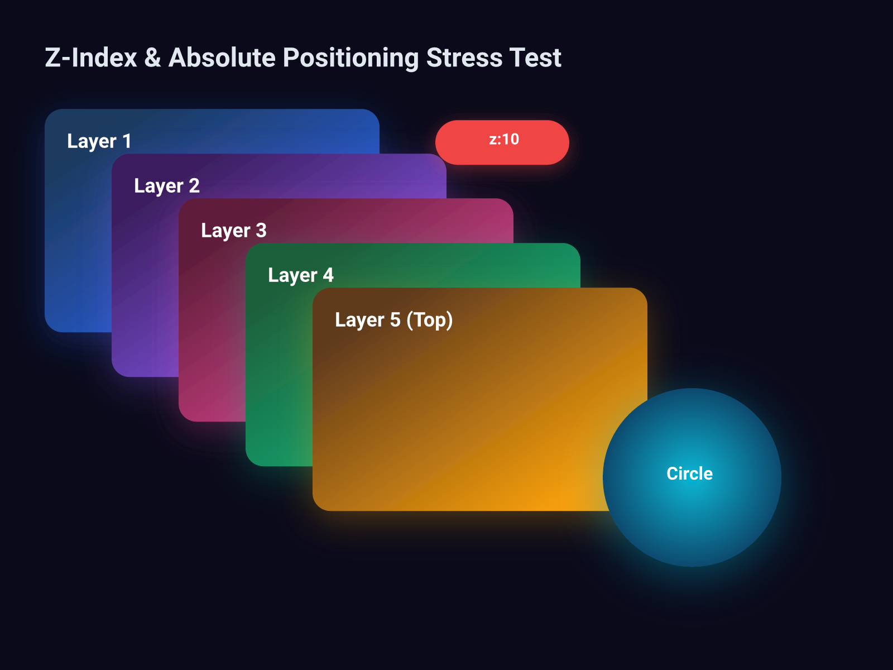

# Design Handover Document



## Overview

| Property | Value |
|----------|-------|
| Canvas | 800 x 600 |
| Theme | dark |
| Background | `#0a0a1a` |
| Default Font | `400 14px Inter` |
| Frames | 9 |
| Text Nodes | 8 |
| Edges | 0 |

## Design Tokens

| Token | Value |
|-------|-------|
| `$color.bg` | `#0a0a1a` |
| `$color.card1` | `#1e3a5f` |
| `$color.card2` | `#3b1e5f` |
| `$color.card3` | `#5f1e3a` |
| `$color.card4` | `#1e5f3a` |
| `$color.card5` | `#5f3a1e` |

### CSS Variables

```css
:root {
  --color-bg: #0a0a1a;
  --color-card1: #1e3a5f;
  --color-card2: #3b1e5f;
  --color-card3: #5f1e3a;
  --color-card4: #1e5f3a;
  --color-card5: #5f3a1e;
}
```

## Component Tree

```
root (800 x 600 @ 0, 0)
  fill: #0a0a1a | padding: 40px | gap: 24px
  css: { display: flex; flex-direction: column; gap: 24px; padding: 40px; background-color: #0a0a1a; width: 800px; height: 600px; }
  |
+-- text "Z-Index & Absolute Positioning Stress..." (720 x 34 @ 40, 40)
|       font: 700 24px Inter | color: #e2e8f0
+-- frame#canvas (720 x 462 @ 40, 98)
        flex: 1
        css: { display: flex; flex-direction: column; flex: 1; }
        |
      +-- frame (300 x 200 @ 0, 0)
      |       fill: gradient | padding: 20px | radius: 16px | shadow: yes | position: absolute
      |       css: { display: flex; flex-direction: column; padding: 20px; background: linear-gradient(135deg, #1e3a5f 0%, #2563eb 100%); border-radius: 16px; box-shadow: 0px 8px 32px rgba(37,99,235,0.3); width: 300px; height: 200px; position: absolute; left: 0px; top: 0px; }
      |       |
      |     +-- text "Layer 1" (260 x 25 @ 20, 20)
      |             font: 700 18px Inter | color: white
      +-- frame (300 x 200 @ 60, 40)
      |       fill: gradient | padding: 20px | radius: 16px | shadow: yes | position: absolute
      |       css: { display: flex; flex-direction: column; padding: 20px; background: linear-gradient(135deg, #3b1e5f 0%, #8b5cf6 100%); border-radius: 16px; box-shadow: 0px 8px 32px rgba(139,92,246,0.3); width: 300px; height: 200px; position: absolute; left: 60px; top: 40px; }
      |       |
      |     +-- text "Layer 2" (260 x 25 @ 20, 20)
      |             font: 700 18px Inter | color: white
      +-- frame (300 x 200 @ 120, 80)
      |       fill: gradient | padding: 20px | radius: 16px | shadow: yes | position: absolute
      |       css: { display: flex; flex-direction: column; padding: 20px; background: linear-gradient(135deg, #5f1e3a 0%, #ec4899 100%); border-radius: 16px; box-shadow: 0px 8px 32px rgba(236,72,153,0.3); width: 300px; height: 200px; position: absolute; left: 120px; top: 80px; }
      |       |
      |     +-- text "Layer 3" (260 x 25 @ 20, 20)
      |             font: 700 18px Inter | color: white
      +-- frame (300 x 200 @ 180, 120)
      |       fill: gradient | padding: 20px | radius: 16px | shadow: yes | position: absolute
      |       css: { display: flex; flex-direction: column; padding: 20px; background: linear-gradient(135deg, #1e5f3a 0%, #10b981 100%); border-radius: 16px; box-shadow: 0px 8px 32px rgba(16,185,129,0.3); width: 300px; height: 200px; position: absolute; left: 180px; top: 120px; }
      |       |
      |     +-- text "Layer 4" (260 x 25 @ 20, 20)
      |             font: 700 18px Inter | color: white
      +-- frame (300 x 200 @ 240, 160)
      |       fill: gradient | padding: 20px | radius: 16px | shadow: yes | position: absolute
      |       css: { display: flex; flex-direction: column; padding: 20px; background: linear-gradient(135deg, #5f3a1e 0%, #f59e0b 100%); border-radius: 16px; box-shadow: 0px 8px 32px rgba(245,158,11,0.3); width: 300px; height: 200px; position: absolute; left: 240px; top: 160px; }
      |       |
      |     +-- text "Layer 5 (Top)" (260 x 25 @ 20, 20)
      |             font: 700 18px Inter | color: white
      +-- frame (120 x 40 @ 350, 10)
      |       fill: #ef4444 | justify: center | align: center | radius: 20px | shadow: yes | position: absolute
      |       css: { display: flex; flex-direction: column; justify-content: center; align-items: center; background-color: #ef4444; border-radius: 20px; box-shadow: 0px 4px 16px rgba(239,68,68,0.4); width: 120px; height: 40px; position: absolute; left: 350px; top: 10px; }
      |       |
      |     +-- text "z:10" (24 x 20 @ 48, 10)
      |             font: 700 14px Inter | color: white
      +-- frame (160 x 160 @ 500, 250)
              fill: gradient | justify: center | align: center | radius: 80px | shadow: yes | position: absolute
              css: { display: flex; flex-direction: column; justify-content: center; align-items: center; background: radial-gradient(circle, #06b6d4 0%, #0c4a6e 100%); border-radius: 80px; box-shadow: 0px 8px 40px rgba(6,182,212,0.4); width: 160px; height: 160px; position: absolute; left: 500px; top: 250px; }
              |
            +-- text "Circle" (46 x 22 @ 57, 69)
                    font: 700 16px Inter | color: white
```

## Implementation Notes

### DSL → CSS Property Mapping

| DSL Property | CSS Equivalent |
|-------------|----------------|
| `direction: row` | `flex-direction: row` |
| `direction: column` | `flex-direction: column` |
| `justify: start` | `justify-content: flex-start` |
| `justify: center` | `justify-content: center` |
| `justify: end` | `justify-content: flex-end` |
| `justify: between` | `justify-content: space-between` |
| `justify: around` | `justify-content: space-around` |
| `align: start` | `align-items: flex-start` |
| `align: center` | `align-items: center` |
| `align: end` | `align-items: flex-end` |
| `align: stretch` | `align-items: stretch` |
| `layout: grid` + `columns: N` | `display: grid; grid-template-columns: repeat(N, 1fr)` |
| `fill: #color` | `background-color: #color` |
| `fill: linear-gradient(...)` | `background: linear-gradient(...)` |
| `border: W solid C` | `border: Wpx solid C` |
| `shadow: X Y B C` | `box-shadow: Xpx Ypx Bpx C` |
| `radius: N` | `border-radius: Npx` |
| `clip: true` | `overflow: hidden` |
| `truncate: true` | `overflow: hidden; text-overflow: ellipsis; white-space: nowrap` |
| `gap: N` | `gap: Npx` |
| `flex: N` | `flex: N` |
| `opacity: N` | `opacity: N` |

