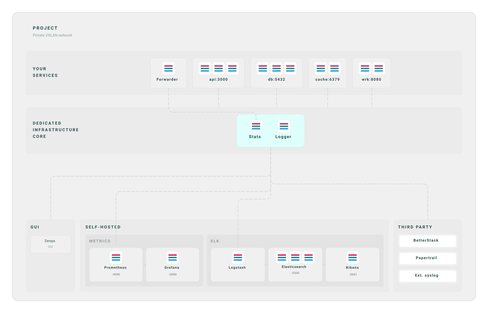

# Design Handover Document



## Overview

| Property | Value |
|----------|-------|
| Canvas | 1280 x 822 |
| Theme | light |
| Background | `white` |
| Default Font | `400 14px Inter` |
| Frames | 124 |
| Text Nodes | 33 |
| Edges | 12 |

## Components

### `bar-icon`

**Base CSS:**

```css
background-color: #fff;
border-radius: 6px;
padding: 6px 5px;
gap: 3px;
```

### `bar-icon-gray`

**Base CSS:**

```css
background-color: #fff;
border-radius: 4px;
padding: 5px 4px;
gap: 2px;
```

## Component Tree

```
root (1280 x 822 @ 0, 0)
  fill: white | padding: 32px
  css: { display: flex; flex-direction: column; padding: 32px; background-color: white; width: 1280px; }
  |
+-- frame#project (1216 x 758 @ 32, 32)
        fill: #F0F0F0 | padding: 36px 36px 24px 36px | gap: 32px | radius: 16px | border: 1px solid #D8D7D7
        css: { display: flex; flex-direction: column; gap: 32px; padding: 36px 36px 24px 36px; background-color: #F0F0F0; border-radius: 16px; border: 1px solid #D8D7D7; }
        |
      +-- frame (1144 x 34 @ 36, 36)
      |       padding: 0px 0px 0px 18px | gap: 3px
      |       css: { display: flex; flex-direction: column; gap: 3px; padding: 0px 0px 0px 18px; }
      |       |
      |     +-- text "PROJECT" (1126 x 17 @ 18, 0)
      |     |       font: 600 12px Geologica | color: #254E4A
      |     +-- text "Private VXLAN network" (1126 x 14 @ 18, 20)
      |             font: 400 10px Roboto Mono | color: #254E4A
      +-- frame#services-zone (1144 x 116 @ 36, 102)
      |       fill: #EBEBEB | padding: 18px | direction: row | align: center | radius: 6px
      |       css: { display: flex; flex-direction: row; align-items: center; padding: 18px; background-color: #EBEBEB; border-radius: 6px; }
      |       |
      |     +-- frame (140 x 33 @ 18, 42)
      |     |       padding: 0px 16px 0px 0px | gap: 2px
      |     |       css: { display: flex; flex-direction: column; gap: 2px; padding: 0px 16px 0px 0px; width: 140px; }
      |     |       |
      |     |     +-- text "YOUR" (124 x 15 @ 0, 0)
      |     |     |       font: 600 11px Geologica | color: #254E4A
      |     |     +-- text "SERVICES" (124 x 15 @ 0, 17)
      |     |             font: 600 11px Geologica | color: #254E4A
      |     +-- frame (968 x 80 @ 158, 18)
      |             gap: 16px | direction: row | justify: center | flex: 1
      |             css: { display: flex; flex-direction: row; justify-content: center; gap: 16px; flex: 1; }
      |             |
      |           +-- frame#forwarder (95 x 80 @ 169, 0)
      |           |       fill: #F0F0F0 | padding: 12px 16px 14px 16px | gap: 8px | align: center | radius: 8px | border: 0.5px solid #D8D7D7
      |           |       css: { display: flex; flex-direction: column; align-items: center; gap: 8px; padding: 12px 16px 14px 16px; background-color: #F0F0F0; border-radius: 8px; border: 0.5px solid #D8D7D7; }
      |           |       |
      |           |     +-- frame (32 x 32 @ 31, 12)
      |           |     |       gap: 4px | direction: row
      |           |     |       css: { display: flex; flex-direction: row; gap: 4px; }
      |           |     |       |
      |           |     |     +-- [bar-icon] (32 x 32 @ 0, 0)
      |           |     |             fill: #fff | padding: 6px 5px | gap: 3px | justify: center | radius: 6px
      |           |     |             css: { display: flex; flex-direction: column; justify-content: center; gap: 3px; padding: 6px 5px; background-color: #fff; border-radius: 6px; width: 32px; height: 32px; }
      |           |     |             |
      |           |     |           +-- frame (22 x 4 @ 5, 8)
      |           |     |           |       fill: #e91e63 | radius: 1.5px
      |           |     |           |       css: { background-color: #e91e63; border-radius: 1.5px; height: 3.5px; }
      |           |     |           +-- frame (22 x 4 @ 5, 14)
      |           |     |           |       fill: #009688 | radius: 1.5px
      |           |     |           |       css: { background-color: #009688; border-radius: 1.5px; height: 3.5px; }
      |           |     |           +-- frame (22 x 4 @ 5, 21)
      |           |     |                   fill: #2196f3 | radius: 1.5px
      |           |     |                   css: { background-color: #2196f3; border-radius: 1.5px; height: 3.5px; }
      |           |     +-- text "Forwarder" (63 x 14 @ 16, 52)
      |           |             font: 600 10px Geologica | color: #254E4A
      |           +-- frame#api (136 x 80 @ 279, 0)
      |           |       fill: #F0F0F0 | padding: 12px 16px 14px 16px | gap: 8px | align: center | radius: 8px | border: 0.5px solid #D8D7D7
      |           |       css: { display: flex; flex-direction: column; align-items: center; gap: 8px; padding: 12px 16px 14px 16px; background-color: #F0F0F0; border-radius: 8px; border: 0.5px solid #D8D7D7; }
      |           |       |
      |           |     +-- frame (104 x 32 @ 16, 12)
      |           |     |       gap: 4px | direction: row
      |           |     |       css: { display: flex; flex-direction: row; gap: 4px; }
      |           |     |       |
      |           |     |     +-- [bar-icon] (32 x 32 @ 0, 0)
      |           |     |     |       fill: #fff | padding: 6px 5px | gap: 3px | justify: center | radius: 6px
      |           |     |     |       css: { display: flex; flex-direction: column; justify-content: center; gap: 3px; padding: 6px 5px; background-color: #fff; border-radius: 6px; width: 32px; height: 32px; }
      |           |     |     |       |
      |           |     |     |     +-- frame (22 x 4 @ 5, 8)
      |           |     |     |     |       fill: #e91e63 | radius: 1.5px
      |           |     |     |     |       css: { background-color: #e91e63; border-radius: 1.5px; height: 3.5px; }
      |           |     |     |     +-- frame (22 x 4 @ 5, 14)
      |           |     |     |     |       fill: #009688 | radius: 1.5px
      |           |     |     |     |       css: { background-color: #009688; border-radius: 1.5px; height: 3.5px; }
      |           |     |     |     +-- frame (22 x 4 @ 5, 21)
      |           |     |     |             fill: #2196f3 | radius: 1.5px
      |           |     |     |             css: { background-color: #2196f3; border-radius: 1.5px; height: 3.5px; }
      |           |     |     +-- [bar-icon] (32 x 32 @ 36, 0)
      |           |     |     |       fill: #fff | padding: 6px 5px | gap: 3px | justify: center | radius: 6px
      |           |     |     |       css: { display: flex; flex-direction: column; justify-content: center; gap: 3px; padding: 6px 5px; background-color: #fff; border-radius: 6px; width: 32px; height: 32px; }
      |           |     |     |       |
      |           |     |     |     +-- frame (22 x 4 @ 5, 8)
      |           |     |     |     |       fill: #e91e63 | radius: 1.5px
      |           |     |     |     |       css: { background-color: #e91e63; border-radius: 1.5px; height: 3.5px; }
      |           |     |     |     +-- frame (22 x 4 @ 5, 14)
      |           |     |     |     |       fill: #009688 | radius: 1.5px
      |           |     |     |     |       css: { background-color: #009688; border-radius: 1.5px; height: 3.5px; }
      |           |     |     |     +-- frame (22 x 4 @ 5, 21)
      |           |     |     |             fill: #2196f3 | radius: 1.5px
      |           |     |     |             css: { background-color: #2196f3; border-radius: 1.5px; height: 3.5px; }
      |           |     |     +-- [bar-icon] (32 x 32 @ 72, 0)
      |           |     |             fill: #fff | padding: 6px 5px | gap: 3px | justify: center | radius: 6px
      |           |     |             css: { display: flex; flex-direction: column; justify-content: center; gap: 3px; padding: 6px 5px; background-color: #fff; border-radius: 6px; width: 32px; height: 32px; }
      |           |     |             |
      |           |     |           +-- frame (22 x 4 @ 5, 8)
      |           |     |           |       fill: #e91e63 | radius: 1.5px
      |           |     |           |       css: { background-color: #e91e63; border-radius: 1.5px; height: 3.5px; }
      |           |     |           +-- frame (22 x 4 @ 5, 14)
      |           |     |           |       fill: #009688 | radius: 1.5px
      |           |     |           |       css: { background-color: #009688; border-radius: 1.5px; height: 3.5px; }
      |           |     |           +-- frame (22 x 4 @ 5, 21)
      |           |     |                   fill: #2196f3 | radius: 1.5px
      |           |     |                   css: { background-color: #2196f3; border-radius: 1.5px; height: 3.5px; }
      |           |     +-- text "api:3000" (48 x 14 @ 44, 52)
      |           |             font: 600 10px Geologica | color: #254E4A
      |           +-- frame#db (136 x 80 @ 431, 0)
      |           |       fill: #F0F0F0 | padding: 12px 16px 14px 16px | gap: 8px | align: center | radius: 8px | border: 0.5px solid #D8D7D7
      |           |       css: { display: flex; flex-direction: column; align-items: center; gap: 8px; padding: 12px 16px 14px 16px; background-color: #F0F0F0; border-radius: 8px; border: 0.5px solid #D8D7D7; }
      |           |       |
      |           |     +-- frame (104 x 32 @ 16, 12)
      |           |     |       gap: 4px | direction: row
      |           |     |       css: { display: flex; flex-direction: row; gap: 4px; }
      |           |     |       |
      |           |     |     +-- [bar-icon] (32 x 32 @ 0, 0)
      |           |     |     |       fill: #fff | padding: 6px 5px | gap: 3px | justify: center | radius: 6px
      |           |     |     |       css: { display: flex; flex-direction: column; justify-content: center; gap: 3px; padding: 6px 5px; background-color: #fff; border-radius: 6px; width: 32px; height: 32px; }
      |           |     |     |       |
      |           |     |     |     +-- frame (22 x 4 @ 5, 8)
      |           |     |     |     |       fill: #e91e63 | radius: 1.5px
      |           |     |     |     |       css: { background-color: #e91e63; border-radius: 1.5px; height: 3.5px; }
      |           |     |     |     +-- frame (22 x 4 @ 5, 14)
      |           |     |     |     |       fill: #009688 | radius: 1.5px
      |           |     |     |     |       css: { background-color: #009688; border-radius: 1.5px; height: 3.5px; }
      |           |     |     |     +-- frame (22 x 4 @ 5, 21)
      |           |     |     |             fill: #2196f3 | radius: 1.5px
      |           |     |     |             css: { background-color: #2196f3; border-radius: 1.5px; height: 3.5px; }
      |           |     |     +-- [bar-icon] (32 x 32 @ 36, 0)
      |           |     |     |       fill: #fff | padding: 6px 5px | gap: 3px | justify: center | radius: 6px
      |           |     |     |       css: { display: flex; flex-direction: column; justify-content: center; gap: 3px; padding: 6px 5px; background-color: #fff; border-radius: 6px; width: 32px; height: 32px; }
      |           |     |     |       |
      |           |     |     |     +-- frame (22 x 4 @ 5, 8)
      |           |     |     |     |       fill: #e91e63 | radius: 1.5px
      |           |     |     |     |       css: { background-color: #e91e63; border-radius: 1.5px; height: 3.5px; }
      |           |     |     |     +-- frame (22 x 4 @ 5, 14)
      |           |     |     |     |       fill: #009688 | radius: 1.5px
      |           |     |     |     |       css: { background-color: #009688; border-radius: 1.5px; height: 3.5px; }
      |           |     |     |     +-- frame (22 x 4 @ 5, 21)
      |           |     |     |             fill: #2196f3 | radius: 1.5px
      |           |     |     |             css: { background-color: #2196f3; border-radius: 1.5px; height: 3.5px; }
      |           |     |     +-- [bar-icon] (32 x 32 @ 72, 0)
      |           |     |             fill: #fff | padding: 6px 5px | gap: 3px | justify: center | radius: 6px
      |           |     |             css: { display: flex; flex-direction: column; justify-content: center; gap: 3px; padding: 6px 5px; background-color: #fff; border-radius: 6px; width: 32px; height: 32px; }
      |           |     |             |
      |           |     |           +-- frame (22 x 4 @ 5, 8)
      |           |     |           |       fill: #e91e63 | radius: 1.5px
      |           |     |           |       css: { background-color: #e91e63; border-radius: 1.5px; height: 3.5px; }
      |           |     |           +-- frame (22 x 4 @ 5, 14)
      |           |     |           |       fill: #009688 | radius: 1.5px
      |           |     |           |       css: { background-color: #009688; border-radius: 1.5px; height: 3.5px; }
      |           |     |           +-- frame (22 x 4 @ 5, 21)
      |           |     |                   fill: #2196f3 | radius: 1.5px
      |           |     |                   css: { background-color: #2196f3; border-radius: 1.5px; height: 3.5px; }
      |           |     +-- text "db:5432" (44 x 14 @ 46, 52)
      |           |             font: 600 10px Geologica | color: #254E4A
      |           +-- frame#cache (100 x 80 @ 583, 0)
      |           |       fill: #F0F0F0 | padding: 12px 16px 14px 16px | gap: 8px | align: center | radius: 8px | border: 0.5px solid #D8D7D7
      |           |       css: { display: flex; flex-direction: column; align-items: center; gap: 8px; padding: 12px 16px 14px 16px; background-color: #F0F0F0; border-radius: 8px; border: 0.5px solid #D8D7D7; }
      |           |       |
      |           |     +-- frame (68 x 32 @ 16, 12)
      |           |     |       gap: 4px | direction: row
      |           |     |       css: { display: flex; flex-direction: row; gap: 4px; }
      |           |     |       |
      |           |     |     +-- [bar-icon] (32 x 32 @ 0, 0)
      |           |     |     |       fill: #fff | padding: 6px 5px | gap: 3px | justify: center | radius: 6px
      |           |     |     |       css: { display: flex; flex-direction: column; justify-content: center; gap: 3px; padding: 6px 5px; background-color: #fff; border-radius: 6px; width: 32px; height: 32px; }
      |           |     |     |       |
      |           |     |     |     +-- frame (22 x 4 @ 5, 8)
      |           |     |     |     |       fill: #e91e63 | radius: 1.5px
      |           |     |     |     |       css: { background-color: #e91e63; border-radius: 1.5px; height: 3.5px; }
      |           |     |     |     +-- frame (22 x 4 @ 5, 14)
      |           |     |     |     |       fill: #009688 | radius: 1.5px
      |           |     |     |     |       css: { background-color: #009688; border-radius: 1.5px; height: 3.5px; }
      |           |     |     |     +-- frame (22 x 4 @ 5, 21)
      |           |     |     |             fill: #2196f3 | radius: 1.5px
      |           |     |     |             css: { background-color: #2196f3; border-radius: 1.5px; height: 3.5px; }
      |           |     |     +-- [bar-icon] (32 x 32 @ 36, 0)
      |           |     |             fill: #fff | padding: 6px 5px | gap: 3px | justify: center | radius: 6px
      |           |     |             css: { display: flex; flex-direction: column; justify-content: center; gap: 3px; padding: 6px 5px; background-color: #fff; border-radius: 6px; width: 32px; height: 32px; }
      |           |     |             |
      |           |     |           +-- frame (22 x 4 @ 5, 8)
      |           |     |           |       fill: #e91e63 | radius: 1.5px
      |           |     |           |       css: { background-color: #e91e63; border-radius: 1.5px; height: 3.5px; }
      |           |     |           +-- frame (22 x 4 @ 5, 14)
      |           |     |           |       fill: #009688 | radius: 1.5px
      |           |     |           |       css: { background-color: #009688; border-radius: 1.5px; height: 3.5px; }
      |           |     |           +-- frame (22 x 4 @ 5, 21)
      |           |     |                   fill: #2196f3 | radius: 1.5px
      |           |     |                   css: { background-color: #2196f3; border-radius: 1.5px; height: 3.5px; }
      |           |     +-- text "cache:6379" (64 x 14 @ 18, 52)
      |           |             font: 600 10px Geologica | color: #254E4A
      |           +-- frame#wrk (100 x 80 @ 699, 0)
      |                   fill: #F0F0F0 | padding: 12px 16px 14px 16px | gap: 8px | align: center | radius: 8px | border: 0.5px solid #D8D7D7
      |                   css: { display: flex; flex-direction: column; align-items: center; gap: 8px; padding: 12px 16px 14px 16px; background-color: #F0F0F0; border-radius: 8px; border: 0.5px solid #D8D7D7; }
      |                   |
      |                 +-- frame (68 x 32 @ 16, 12)
      |                 |       gap: 4px | direction: row
      |                 |       css: { display: flex; flex-direction: row; gap: 4px; }
      |                 |       |
      |                 |     +-- [bar-icon] (32 x 32 @ 0, 0)
      |                 |     |       fill: #fff | padding: 6px 5px | gap: 3px | justify: center | radius: 6px
      |                 |     |       css: { display: flex; flex-direction: column; justify-content: center; gap: 3px; padding: 6px 5px; background-color: #fff; border-radius: 6px; width: 32px; height: 32px; }
      |                 |     |       |
      |                 |     |     +-- frame (22 x 4 @ 5, 8)
      |                 |     |     |       fill: #e91e63 | radius: 1.5px
      |                 |     |     |       css: { background-color: #e91e63; border-radius: 1.5px; height: 3.5px; }
      |                 |     |     +-- frame (22 x 4 @ 5, 14)
      |                 |     |     |       fill: #009688 | radius: 1.5px
      |                 |     |     |       css: { background-color: #009688; border-radius: 1.5px; height: 3.5px; }
      |                 |     |     +-- frame (22 x 4 @ 5, 21)
      |                 |     |             fill: #2196f3 | radius: 1.5px
      |                 |     |             css: { background-color: #2196f3; border-radius: 1.5px; height: 3.5px; }
      |                 |     +-- [bar-icon] (32 x 32 @ 36, 0)
      |                 |             fill: #fff | padding: 6px 5px | gap: 3px | justify: center | radius: 6px
      |                 |             css: { display: flex; flex-direction: column; justify-content: center; gap: 3px; padding: 6px 5px; background-color: #fff; border-radius: 6px; width: 32px; height: 32px; }
      |                 |             |
      |                 |           +-- frame (22 x 4 @ 5, 8)
      |                 |           |       fill: #e91e63 | radius: 1.5px
      |                 |           |       css: { background-color: #e91e63; border-radius: 1.5px; height: 3.5px; }
      |                 |           +-- frame (22 x 4 @ 5, 14)
      |                 |           |       fill: #009688 | radius: 1.5px
      |                 |           |       css: { background-color: #009688; border-radius: 1.5px; height: 3.5px; }
      |                 |           +-- frame (22 x 4 @ 5, 21)
      |                 |                   fill: #2196f3 | radius: 1.5px
      |                 |                   css: { background-color: #2196f3; border-radius: 1.5px; height: 3.5px; }
      |                 +-- text "wrk:8080" (53 x 14 @ 24, 52)
      |                         font: 600 10px Geologica | color: #254E4A
      +-- frame#infra (1144 x 123 @ 36, 250)
      |       fill: #EBEBEB | padding: 18px | direction: row | align: center | radius: 6px
      |       css: { display: flex; flex-direction: row; align-items: center; padding: 18px; background-color: #EBEBEB; border-radius: 6px; }
      |       |
      |     +-- frame (140 x 50 @ 18, 37)
      |     |       padding: 0px 16px 0px 0px | gap: 2px
      |     |       css: { display: flex; flex-direction: column; gap: 2px; padding: 0px 16px 0px 0px; width: 140px; }
      |     |       |
      |     |     +-- text "DEDICATED" (124 x 15 @ 0, 0)
      |     |     |       font: 600 11px Geologica | color: #254E4A
      |     |     +-- text "INFRASTRUCTURE" (124 x 15 @ 0, 17)
      |     |     |       font: 600 11px Geologica | color: #254E4A
      |     |     +-- text "CORE" (124 x 15 @ 0, 35)
      |     |             font: 600 11px Geologica | color: #254E4A
      |     +-- frame (968 x 87 @ 158, 18)
      |             direction: row | justify: center | flex: 1
      |             css: { display: flex; flex-direction: row; justify-content: center; flex: 1; }
      |             |
      |           +-- frame#teal-card (178 x 87 @ 395, 0)
      |                   fill: #DFFFFC | padding: 16px 32px 18px 32px | gap: 32px | direction: row | justify: center | align: start | radius: 10px | border: 0.5px solid #D8D7D7
      |                   css: { display: flex; flex-direction: row; justify-content: center; align-items: flex-start; gap: 32px; padding: 16px 32px 18px 32px; background-color: #DFFFFC; border-radius: 10px; border: 0.5px solid #D8D7D7; }
      |                   |
      |                 +-- frame#stats (37 x 53 @ 32, 16)
      |                 |       gap: 6px | align: center
      |                 |       css: { display: flex; flex-direction: column; align-items: center; gap: 6px; }
      |                 |       |
      |                 |     +-- [bar-icon] (32 x 32 @ 3, 0)
      |                 |     |       fill: #fff | padding: 6px 5px | gap: 3px | justify: center | radius: 6px
      |                 |     |       css: { display: flex; flex-direction: column; justify-content: center; gap: 3px; padding: 6px 5px; background-color: #fff; border-radius: 6px; width: 32px; height: 32px; }
      |                 |     |       |
      |                 |     |     +-- frame (22 x 4 @ 5, 8)
      |                 |     |     |       fill: #e91e63 | radius: 1.5px
      |                 |     |     |       css: { background-color: #e91e63; border-radius: 1.5px; height: 3.5px; }
      |                 |     |     +-- frame (22 x 4 @ 5, 14)
      |                 |     |     |       fill: #009688 | radius: 1.5px
      |                 |     |     |       css: { background-color: #009688; border-radius: 1.5px; height: 3.5px; }
      |                 |     |     +-- frame (22 x 4 @ 5, 21)
      |                 |     |             fill: #2196f3 | radius: 1.5px
      |                 |     |             css: { background-color: #2196f3; border-radius: 1.5px; height: 3.5px; }
      |                 |     +-- text "Stats" (37 x 15 @ 0, 38)
      |                 |             font: 600 11px Geologica | color: #254E4A
      |                 +-- frame#logger (45 x 53 @ 101, 16)
      |                         gap: 6px | align: center
      |                         css: { display: flex; flex-direction: column; align-items: center; gap: 6px; }
      |                         |
      |                       +-- [bar-icon] (32 x 32 @ 6, 0)
      |                       |       fill: #fff | padding: 6px 5px | gap: 3px | justify: center | radius: 6px
      |                       |       css: { display: flex; flex-direction: column; justify-content: center; gap: 3px; padding: 6px 5px; background-color: #fff; border-radius: 6px; width: 32px; height: 32px; }
      |                       |       |
      |                       |     +-- frame (22 x 4 @ 5, 8)
      |                       |     |       fill: #e91e63 | radius: 1.5px
      |                       |     |       css: { background-color: #e91e63; border-radius: 1.5px; height: 3.5px; }
      |                       |     +-- frame (22 x 4 @ 5, 14)
      |                       |     |       fill: #009688 | radius: 1.5px
      |                       |     |       css: { background-color: #009688; border-radius: 1.5px; height: 3.5px; }
      |                       |     +-- frame (22 x 4 @ 5, 21)
      |                       |             fill: #2196f3 | radius: 1.5px
      |                       |             css: { background-color: #2196f3; border-radius: 1.5px; height: 3.5px; }
      |                       +-- text "Logger" (45 x 15 @ 0, 38)
      |                               font: 600 11px Geologica | color: #254E4A
      +-- frame (1144 x 189 @ 36, 545)
              gap: 12px | direction: row
              css: { display: flex; flex-direction: row; gap: 12px; }
              |
            +-- frame#gui (130 x 189 @ 0, 0)
            |       fill: #EBEBEB | padding: 14px 12px | gap: 12px | radius: 6px
            |       css: { display: flex; flex-direction: column; gap: 12px; padding: 14px 12px; background-color: #EBEBEB; border-radius: 6px; width: 130px; }
            |       |
            |     +-- text "GUI" (106 x 15 @ 12, 14)
            |     |       font: 600 11px Geologica | color: #254E4A
            |     +-- frame (106 x 47 @ 12, 41)
            |             fill: #F0F0F0 | padding: 10px | gap: 3px | align: center | radius: 8px | border: 0.5px solid #D8D7D7
            |             css: { display: flex; flex-direction: column; align-items: center; gap: 3px; padding: 10px; background-color: #F0F0F0; border-radius: 8px; border: 0.5px solid #D8D7D7; }
            |             |
            |           +-- text "Zerops" (32 x 13 @ 37, 10)
            |           |       font: 400 9px Roboto Mono | color: #254E4A
            |           +-- text "GUI" (14 x 11 @ 46, 26)
            |                   font: 400 8px Roboto Mono | color: #254E4A
            +-- frame (810 x 189 @ 142, 0)
            |       fill: #EBEBEB | padding: 14px | gap: 10px | radius: 6px | flex: 1
            |       css: { display: flex; flex-direction: column; gap: 10px; padding: 14px; background-color: #EBEBEB; border-radius: 6px; flex: 1; }
            |       |
            |     +-- text "SELF-HOSTED" (782 x 15 @ 14, 14)
            |     |       font: 600 11px Geologica | color: #254E4A
            |     +-- frame (782 x 136 @ 14, 39)
            |             gap: 10px | direction: row
            |             css: { display: flex; flex-direction: row; gap: 10px; }
            |             |
            |           +-- frame (309 x 136 @ 0, 0)
            |           |       fill: #E4E3E3 | padding: 12px 10px | gap: 8px | radius: 6px | flex: 2
            |           |       css: { display: flex; flex-direction: column; gap: 8px; padding: 12px 10px; background-color: #E4E3E3; border-radius: 6px; flex: 2; }
            |           |       |
            |           |     +-- text "METRICS" (289 x 14 @ 10, 12)
            |           |     |       font: 600 10px Geologica | color: #254E4A
            |           |     +-- frame (289 x 90 @ 10, 34)
            |           |             gap: 8px | direction: row
            |           |             css: { display: flex; flex-direction: row; gap: 8px; }
            |           |             |
            |           |           +-- frame#prometheus (140 x 90 @ 0, 0)
            |           |           |       fill: #F0F0F0 | padding: 10px 10px 12px 10px | gap: 6px | align: center | radius: 8px | border: 0.5px solid #D8D7D7 | flex: 1
            |           |           |       css: { display: flex; flex-direction: column; align-items: center; gap: 6px; padding: 10px 10px 12px 10px; background-color: #F0F0F0; border-radius: 8px; border: 0.5px solid #D8D7D7; flex: 1; }
            |           |           |       |
            |           |           |     +-- [bar-icon] (32 x 32 @ 54, 10)
            |           |           |     |       fill: #fff | padding: 6px 5px | gap: 3px | justify: center | radius: 6px
            |           |           |     |       css: { display: flex; flex-direction: column; justify-content: center; gap: 3px; padding: 6px 5px; background-color: #fff; border-radius: 6px; width: 32px; height: 32px; }
            |           |           |     |       |
            |           |           |     |     +-- frame (22 x 4 @ 5, 8)
            |           |           |     |     |       fill: #e91e63 | radius: 1.5px
            |           |           |     |     |       css: { background-color: #e91e63; border-radius: 1.5px; height: 3.5px; }
            |           |           |     |     +-- frame (22 x 4 @ 5, 14)
            |           |           |     |     |       fill: #009688 | radius: 1.5px
            |           |           |     |     |       css: { background-color: #009688; border-radius: 1.5px; height: 3.5px; }
            |           |           |     |     +-- frame (22 x 4 @ 5, 21)
            |           |           |     |             fill: #2196f3 | radius: 1.5px
            |           |           |     |             css: { background-color: #2196f3; border-radius: 1.5px; height: 3.5px; }
            |           |           |     +-- text "Prometheus" (62 x 13 @ 39, 48)
            |           |           |     |       font: 600 9px Geologica | color: #254E4A
            |           |           |     +-- text ":9090" (20 x 11 @ 60, 67)
            |           |           |             font: 600 8px Geologica | color: #254E4A
            |           |           +-- frame#grafana (140 x 90 @ 148, 0)
            |           |                   fill: #F0F0F0 | padding: 10px 10px 12px 10px | gap: 6px | align: center | radius: 8px | border: 0.5px solid #D8D7D7 | flex: 1
            |           |                   css: { display: flex; flex-direction: column; align-items: center; gap: 6px; padding: 10px 10px 12px 10px; background-color: #F0F0F0; border-radius: 8px; border: 0.5px solid #D8D7D7; flex: 1; }
            |           |                   |
            |           |                 +-- [bar-icon] (32 x 32 @ 54, 10)
            |           |                 |       fill: #fff | padding: 6px 5px | gap: 3px | justify: center | radius: 6px
            |           |                 |       css: { display: flex; flex-direction: column; justify-content: center; gap: 3px; padding: 6px 5px; background-color: #fff; border-radius: 6px; width: 32px; height: 32px; }
            |           |                 |       |
            |           |                 |     +-- frame (22 x 4 @ 5, 8)
            |           |                 |     |       fill: #e91e63 | radius: 1.5px
            |           |                 |     |       css: { background-color: #e91e63; border-radius: 1.5px; height: 3.5px; }
            |           |                 |     +-- frame (22 x 4 @ 5, 14)
            |           |                 |     |       fill: #009688 | radius: 1.5px
            |           |                 |     |       css: { background-color: #009688; border-radius: 1.5px; height: 3.5px; }
            |           |                 |     +-- frame (22 x 4 @ 5, 21)
            |           |                 |             fill: #2196f3 | radius: 1.5px
            |           |                 |             css: { background-color: #2196f3; border-radius: 1.5px; height: 3.5px; }
            |           |                 +-- text "Grafana" (42 x 13 @ 49, 48)
            |           |                 |       font: 600 9px Geologica | color: #254E4A
            |           |                 +-- text ":3000" (20 x 11 @ 60, 67)
            |           |                         font: 600 8px Geologica | color: #254E4A
            |           +-- frame (463 x 136 @ 319, 0)
            |                   fill: #E4E3E3 | padding: 12px 10px | gap: 8px | radius: 6px | flex: 3
            |                   css: { display: flex; flex-direction: column; gap: 8px; padding: 12px 10px; background-color: #E4E3E3; border-radius: 6px; flex: 3; }
            |                   |
            |                 +-- text "ELK" (443 x 14 @ 10, 12)
            |                 |       font: 600 10px Geologica | color: #254E4A
            |                 +-- frame (443 x 90 @ 10, 34)
            |                         gap: 8px | direction: row
            |                         css: { display: flex; flex-direction: row; gap: 8px; }
            |                         |
            |                       +-- frame#logstash (142 x 90 @ 0, 0)
            |                       |       fill: #F0F0F0 | padding: 10px 10px 12px 10px | gap: 6px | align: center | radius: 8px | border: 0.5px solid #D8D7D7 | flex: 1
            |                       |       css: { display: flex; flex-direction: column; align-items: center; gap: 6px; padding: 10px 10px 12px 10px; background-color: #F0F0F0; border-radius: 8px; border: 0.5px solid #D8D7D7; flex: 1; }
            |                       |       |
            |                       |     +-- [bar-icon] (32 x 32 @ 55, 10)
            |                       |     |       fill: #fff | padding: 6px 5px | gap: 3px | justify: center | radius: 6px
            |                       |     |       css: { display: flex; flex-direction: column; justify-content: center; gap: 3px; padding: 6px 5px; background-color: #fff; border-radius: 6px; width: 32px; height: 32px; }
            |                       |     |       |
            |                       |     |     +-- frame (22 x 4 @ 5, 8)
            |                       |     |     |       fill: #e91e63 | radius: 1.5px
            |                       |     |     |       css: { background-color: #e91e63; border-radius: 1.5px; height: 3.5px; }
            |                       |     |     +-- frame (22 x 4 @ 5, 14)
            |                       |     |     |       fill: #009688 | radius: 1.5px
            |                       |     |     |       css: { background-color: #009688; border-radius: 1.5px; height: 3.5px; }
            |                       |     |     +-- frame (22 x 4 @ 5, 21)
            |                       |     |             fill: #2196f3 | radius: 1.5px
            |                       |     |             css: { background-color: #2196f3; border-radius: 1.5px; height: 3.5px; }
            |                       |     +-- text "Logstash" (48 x 13 @ 47, 48)
            |                       |             font: 600 9px Geologica | color: #254E4A
            |                       +-- frame#elasticsearch (142 x 90 @ 150, 0)
            |                       |       fill: #F0F0F0 | padding: 10px 8px 12px 8px | gap: 4px | align: center | radius: 8px | border: 0.5px solid #D8D7D7 | flex: 1
            |                       |       css: { display: flex; flex-direction: column; align-items: center; gap: 4px; padding: 10px 8px 12px 8px; background-color: #F0F0F0; border-radius: 8px; border: 0.5px solid #D8D7D7; flex: 1; }
            |                       |       |
            |                       |     +-- frame (102 x 32 @ 20, 10)
            |                       |     |       gap: 3px | direction: row
            |                       |     |       css: { display: flex; flex-direction: row; gap: 3px; }
            |                       |     |       |
            |                       |     |     +-- [bar-icon] (32 x 32 @ 0, 0)
            |                       |     |     |       fill: #fff | padding: 6px 5px | gap: 3px | justify: center | radius: 6px
            |                       |     |     |       css: { display: flex; flex-direction: column; justify-content: center; gap: 3px; padding: 6px 5px; background-color: #fff; border-radius: 6px; width: 32px; height: 32px; }
            |                       |     |     |       |
            |                       |     |     |     +-- frame (22 x 4 @ 5, 8)
            |                       |     |     |     |       fill: #e91e63 | radius: 1.5px
            |                       |     |     |     |       css: { background-color: #e91e63; border-radius: 1.5px; height: 3.5px; }
            |                       |     |     |     +-- frame (22 x 4 @ 5, 14)
            |                       |     |     |     |       fill: #009688 | radius: 1.5px
            |                       |     |     |     |       css: { background-color: #009688; border-radius: 1.5px; height: 3.5px; }
            |                       |     |     |     +-- frame (22 x 4 @ 5, 21)
            |                       |     |     |             fill: #2196f3 | radius: 1.5px
            |                       |     |     |             css: { background-color: #2196f3; border-radius: 1.5px; height: 3.5px; }
            |                       |     |     +-- [bar-icon] (32 x 32 @ 35, 0)
            |                       |     |     |       fill: #fff | padding: 6px 5px | gap: 3px | justify: center | radius: 6px
            |                       |     |     |       css: { display: flex; flex-direction: column; justify-content: center; gap: 3px; padding: 6px 5px; background-color: #fff; border-radius: 6px; width: 32px; height: 32px; }
            |                       |     |     |       |
            |                       |     |     |     +-- frame (22 x 4 @ 5, 8)
            |                       |     |     |     |       fill: #e91e63 | radius: 1.5px
            |                       |     |     |     |       css: { background-color: #e91e63; border-radius: 1.5px; height: 3.5px; }
            |                       |     |     |     +-- frame (22 x 4 @ 5, 14)
            |                       |     |     |     |       fill: #009688 | radius: 1.5px
            |                       |     |     |     |       css: { background-color: #009688; border-radius: 1.5px; height: 3.5px; }
            |                       |     |     |     +-- frame (22 x 4 @ 5, 21)
            |                       |     |     |             fill: #2196f3 | radius: 1.5px
            |                       |     |     |             css: { background-color: #2196f3; border-radius: 1.5px; height: 3.5px; }
            |                       |     |     +-- [bar-icon] (32 x 32 @ 70, 0)
            |                       |     |             fill: #fff | padding: 6px 5px | gap: 3px | justify: center | radius: 6px
            |                       |     |             css: { display: flex; flex-direction: column; justify-content: center; gap: 3px; padding: 6px 5px; background-color: #fff; border-radius: 6px; width: 32px; height: 32px; }
            |                       |     |             |
            |                       |     |           +-- frame (22 x 4 @ 5, 8)
            |                       |     |           |       fill: #e91e63 | radius: 1.5px
            |                       |     |           |       css: { background-color: #e91e63; border-radius: 1.5px; height: 3.5px; }
            |                       |     |           +-- frame (22 x 4 @ 5, 14)
            |                       |     |           |       fill: #009688 | radius: 1.5px
            |                       |     |           |       css: { background-color: #009688; border-radius: 1.5px; height: 3.5px; }
            |                       |     |           +-- frame (22 x 4 @ 5, 21)
            |                       |     |                   fill: #2196f3 | radius: 1.5px
            |                       |     |                   css: { background-color: #2196f3; border-radius: 1.5px; height: 3.5px; }
            |                       |     +-- text "Elasticsearch" (71 x 13 @ 36, 46)
            |                       |     |       font: 600 9px Geologica | color: #254E4A
            |                       |     +-- text ":9200" (20 x 11 @ 61, 63)
            |                       |             font: 600 8px Geologica | color: #254E4A
            |                       +-- frame#kibana (142 x 90 @ 301, 0)
            |                               fill: #F0F0F0 | padding: 10px 10px 12px 10px | gap: 6px | align: center | radius: 8px | border: 0.5px solid #D8D7D7 | flex: 1
            |                               css: { display: flex; flex-direction: column; align-items: center; gap: 6px; padding: 10px 10px 12px 10px; background-color: #F0F0F0; border-radius: 8px; border: 0.5px solid #D8D7D7; flex: 1; }
            |                               |
            |                             +-- [bar-icon] (32 x 32 @ 55, 10)
            |                             |       fill: #fff | padding: 6px 5px | gap: 3px | justify: center | radius: 6px
            |                             |       css: { display: flex; flex-direction: column; justify-content: center; gap: 3px; padding: 6px 5px; background-color: #fff; border-radius: 6px; width: 32px; height: 32px; }
            |                             |       |
            |                             |     +-- frame (22 x 4 @ 5, 8)
            |                             |     |       fill: #e91e63 | radius: 1.5px
            |                             |     |       css: { background-color: #e91e63; border-radius: 1.5px; height: 3.5px; }
            |                             |     +-- frame (22 x 4 @ 5, 14)
            |                             |     |       fill: #009688 | radius: 1.5px
            |                             |     |       css: { background-color: #009688; border-radius: 1.5px; height: 3.5px; }
            |                             |     +-- frame (22 x 4 @ 5, 21)
            |                             |             fill: #2196f3 | radius: 1.5px
            |                             |             css: { background-color: #2196f3; border-radius: 1.5px; height: 3.5px; }
            |                             +-- text "Kibana" (34 x 13 @ 54, 48)
            |                             |       font: 600 9px Geologica | color: #254E4A
            |                             +-- text ":5601" (18 x 11 @ 62, 67)
            |                                     font: 600 8px Geologica | color: #254E4A
            +-- frame#thirdparty (180 x 189 @ 964, 0)
                    fill: #EBEBEB | padding: 14px 12px | gap: 8px | radius: 6px
                    css: { display: flex; flex-direction: column; gap: 8px; padding: 14px 12px; background-color: #EBEBEB; border-radius: 6px; width: 180px; }
                    |
                  +-- text "THIRD PARTY" (156 x 15 @ 12, 14)
                  |       font: 600 11px Geologica | color: #254E4A
                  +-- frame (156 x 38 @ 12, 37)
                  |       fill: #F0F0F0 | padding: 4px | radius: 5px
                  |       css: { display: flex; flex-direction: column; padding: 4px; background-color: #F0F0F0; border-radius: 5px; }
                  |       |
                  |     +-- frame (148 x 30 @ 4, 4)
                  |             fill: #fff | padding: 8px 12px | justify: center | align: center | radius: 4px
                  |             css: { display: flex; flex-direction: column; justify-content: center; align-items: center; padding: 8px 12px; background-color: #fff; border-radius: 4px; }
                  |             |
                  |           +-- text "BetterStack" (75 x 14 @ 37, 8)
                  |                   font: 600 10px Geologica | color: #254E4A
                  +-- frame (156 x 38 @ 12, 83)
                  |       fill: #F0F0F0 | padding: 4px | radius: 5px
                  |       css: { display: flex; flex-direction: column; padding: 4px; background-color: #F0F0F0; border-radius: 5px; }
                  |       |
                  |     +-- frame (148 x 30 @ 4, 4)
                  |             fill: #fff | padding: 8px 12px | justify: center | align: center | radius: 4px
                  |             css: { display: flex; flex-direction: column; justify-content: center; align-items: center; padding: 8px 12px; background-color: #fff; border-radius: 4px; }
                  |             |
                  |           +-- text "Papertrail" (63 x 14 @ 43, 8)
                  |                   font: 600 10px Geologica | color: #254E4A
                  +-- frame (156 x 38 @ 12, 129)
                          fill: #F0F0F0 | padding: 4px | radius: 5px
                          css: { display: flex; flex-direction: column; padding: 4px; background-color: #F0F0F0; border-radius: 5px; }
                          |
                        +-- frame (148 x 30 @ 4, 4)
                                fill: #fff | padding: 8px 12px | justify: center | align: center | radius: 4px
                                css: { display: flex; flex-direction: column; justify-content: center; align-items: center; padding: 8px 12px; background-color: #fff; border-radius: 4px; }
                                |
                              +-- text "Ext. syslog" (67 x 14 @ 41, 8)
                                      font: 600 10px Geologica | color: #254E4A
```

## Edges

| From | To | Style | Arrow | Curve | Label |
|------|----|-------|-------|-------|-------|
| `forwarder` | `stats` | dashed | none | bus | - |
| `teal-card` | `gui` | dashed | none | bus | - |
| `teal-card` | `prometheus` | dashed | none | bus | - |
| `teal-card` | `logstash` | dashed | none | bus | - |
| `teal-card` | `thirdparty` | dashed | none | bus | - |
| `prometheus` | `grafana` | dashed | none | straight | - |
| `logstash` | `elasticsearch` | dashed | none | straight | - |
| `elasticsearch` | `kibana` | dashed | none | straight | - |
| `api` | `infra` | dashed | none | vertical | - |
| `db` | `infra` | dashed | none | vertical | - |
| `cache` | `infra` | dashed | none | vertical | - |
| `wrk` | `infra` | dashed | none | vertical | - |

### Edge Paths

**forwarder → stats**
- Stroke: `#D8D7D7` 1.5px dashed
- Path: (442, 232) → (442, 295) → (672, 295) → (672, 316)

**teal-card → gui**
- Stroke: `#D8D7D7` 1.5px dashed
- Path: (710, 387) → (710, 463) → (133, 463) → (133, 577)

**teal-card → prometheus**
- Stroke: `#D8D7D7` 1.5px dashed
- Path: (710, 387) → (710, 503) → (304, 503) → (304, 651)

**teal-card → logstash**
- Stroke: `#D8D7D7` 1.5px dashed
- Path: (710, 387) → (710, 523) → (624, 523) → (624, 651)

**teal-card → thirdparty**
- Stroke: `#D8D7D7` 1.5px dashed
- Path: (710, 387) → (710, 483) → (1122, 483) → (1122, 577)

**prometheus → grafana**
- Stroke: `#D8D7D7` 1.5px dashed
- Path: (374, 696) → (382, 696)

**logstash → elasticsearch**
- Stroke: `#D8D7D7` 1.5px dashed
- Path: (695, 696) → (703, 696)

**elasticsearch → kibana**
- Stroke: `#D8D7D7` 1.5px dashed
- Path: (846, 696) → (854, 696)

**api → infra**
- Stroke: `#D8D7D7` 1.5px dashed
- Path: (573, 232) → (573, 282)

**db → infra**
- Stroke: `#D8D7D7` 1.5px dashed
- Path: (725, 232) → (725, 282)

**cache → infra**
- Stroke: `#D8D7D7` 1.5px dashed
- Path: (859, 232) → (859, 282)

**wrk → infra**
- Stroke: `#D8D7D7` 1.5px dashed
- Path: (975, 232) → (975, 282)

## Implementation Notes

### DSL → CSS Property Mapping

| DSL Property | CSS Equivalent |
|-------------|----------------|
| `direction: row` | `flex-direction: row` |
| `direction: column` | `flex-direction: column` |
| `justify: start` | `justify-content: flex-start` |
| `justify: center` | `justify-content: center` |
| `justify: end` | `justify-content: flex-end` |
| `justify: between` | `justify-content: space-between` |
| `justify: around` | `justify-content: space-around` |
| `align: start` | `align-items: flex-start` |
| `align: center` | `align-items: center` |
| `align: end` | `align-items: flex-end` |
| `align: stretch` | `align-items: stretch` |
| `layout: grid` + `columns: N` | `display: grid; grid-template-columns: repeat(N, 1fr)` |
| `fill: #color` | `background-color: #color` |
| `fill: linear-gradient(...)` | `background: linear-gradient(...)` |
| `border: W solid C` | `border: Wpx solid C` |
| `shadow: X Y B C` | `box-shadow: Xpx Ypx Bpx C` |
| `radius: N` | `border-radius: Npx` |
| `clip: true` | `overflow: hidden` |
| `truncate: true` | `overflow: hidden; text-overflow: ellipsis; white-space: nowrap` |
| `gap: N` | `gap: Npx` |
| `flex: N` | `flex: N` |
| `opacity: N` | `opacity: N` |

